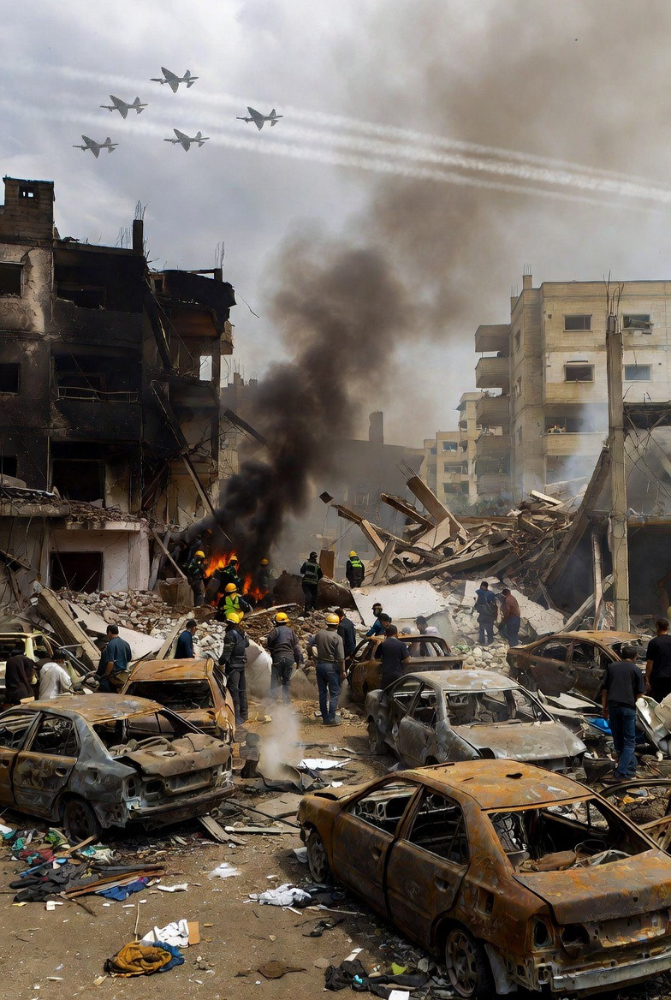

# Gencatan Senjata Parsial dan Eskalasi Selektif: Analisis Strategi Israel dalam Konflik Iran–Lebanon 2026

*Ilustrasi kondisi Lebanon usai serangan Israel (pic: Grok AI).*

  
***Israel memanfaatkan ambiguitas perjanjian untuk melanjutkan operasi terhadap Hezbollah di Lebanon***
  

Artikel ini menganalisis fenomena berlanjutnya serangan Israel di Lebanon meskipun terdapat gencatan senjata antara Amerika Serikat dan Iran pada Maret–April 2026. 

Dengan menggunakan kerangka limited war dan strategic compartmentalization, tulisan ini menunjukkan bahwa gencatan senjata tidak bersifat menyeluruh, melainkan parsial dan selektif. 

Temuan utama mengindikasikan bahwa Israel memanfaatkan ruang abu-abu dalam perjanjian untuk melanjutkan operasi militer terhadap aktor non-negara seperti Hezbollah, tanpa secara formal melanggar kesepakatan utama.

## Pendahuluan

Pada awal April 2026, tercapai kesepakatan gencatan senjata antara AS dan Iran. 

Namun, dalam waktu hampir bersamaan:

•	Israel tetap melakukan serangan besar-besaran di Lebanon

•	korban sipil meningkat drastis

•	Hezbollah tetap menjadi target utama

Bahkan, serangan besar terjadi hanya beberapa jam setelah gencatan diumumkan  

Pertanyaan kunci: Apakah ini pelanggaran, atau memang desain dari gencatan senjata itu sendiri?

## Limited War

Perang tidak bertujuan total, melainkan:

•	dibatasi secara geografis

•	dibatasi secara aktor

•	tetap memungkinkan eskalasi di area lain

## Strategic Compartmentalization

Negara memisahkan konflik menjadi beberapa “kompartemen”:
	
  •	Iran ≠ Hezbollah
	
  •	negara ≠ proxy

👉 sehingga bisa:
	
  •	damai di satu sisi
	
  •	perang di sisi lain

## Ambiguitas Diplomatik

Kesepakatan sengaja dibuat tidak sepenuhnya jelas:

•	untuk fleksibilitas

•	untuk menghindari komitmen penuh

## Bukti Empiris

1. Lebanon tidak termasuk secara eksplisit

Pernyataan pejabat:

•	Israel: Lebanon tidak termasuk dalam ceasefire  

•	AS: Lebanon dianggap “terpisah”  

👉 ini kunci utama

2. Serangan tetap berlangsung (bahkan meningkat)

•	lebih dari 100 serangan udara dalam satu gelombang  

•	ratusan korban sipil dalam waktu singkat  

👉 ini bukan “sisa perang”

👉 ini operasi aktif

3. Iran justru menuntut Lebanon dimasukkan

Iran secara eksplisit:

•	meminta Lebanon termasuk dalam gencatan senjata

•	menganggap serangan ke Hezbollah sebagai pelanggaran

4. Israel tetap lanjutkan operasi

Israel menyatakan:

•	serangan ke Hezbollah akan terus dilakukan

•	keamanan nasional menjadi justifikasi

## Analisis

1. Apakah ini “akal-akalan”?

Jawaban akademiknya:

👉 bukan sepenuhnya tipu

👉 tapi jelas eksploitasi celah perjanjian

2. Logika Israel

Dari perspektif Israel:

•	Hezbollah = ancaman langsung

•	Iran = ancaman strategis

👉 jadi:

•	deal dengan Iran

•	tetap hajar proxy-nya

3. Efek praktis di lapangan

Hasilnya:

•	Israel bisa fokus ke Lebanon

•	tekanan terhadap Hezbollah meningkat

•	risiko eskalasi regional tetap tinggi

4. Tentang cluster bomb Iran

Data menunjukkan:

•	Iran memang pernah menggunakan cluster munition dalam konflik ini

•	senjata ini bersifat indiscriminatif dan kontroversial  

Namun:

👉 tidak ada bukti kuat bahwa “Iran berhenti total → Israel langsung bebas menyerang Lebanon”

Yang terjadi lebih kompleks:

•	intensitas Iran bisa berubah

•	tapi keputusan Israel di Lebanon tidak bergantung tunggal pada itu

Fenomena ini menunjukkan: perang modern tidak lagi hitam-putih (perang vs damai).

Tapi:
	
  •	damai parsial
	
  •	perang parsial
	
  •	berlangsung bersamaan.

Gencatan senjata AS–Iran 2026 bukanlah penghentian konflik total, melainkan restrukturisasi konflik. 

Israel memanfaatkan ambiguitas perjanjian untuk melanjutkan operasi terhadap Hezbollah di Lebanon. 

Hal ini bukan sekadar pelanggaran, melainkan bagian dari strategi limited war yang memungkinkan perang tetap berjalan dalam batas tertentu.

  
**Referensi**

•	Cohen, A. (1998). Israel and the Bomb. New York: Columbia University Press.

•	Cohen, A. (2010). The Worst-Kept Secret: Israel’s Bargain with the Bomb. Columbia University Press.

•	Stockholm International Peace Research Institute. (2024). SIPRI Yearbook 2024: Armaments, Disarmament and International Security.

•	International Atomic Energy Agency. (2023–2026). Verification and Monitoring in the Islamic Republic of Iran.

•	Congressional Research Service. (2024). Iran’s Nuclear Program: Status and Outlook.

•	Fitzpatrick, M. (2019). The Iranian Nuclear Crisis: Avoiding Worst-Case Outcomes. Routledge.

•	Herz, J. H. (1950). Idealist Internationalism and the Security Dilemma. World Politics.

•	Jervis, R. (1978). Cooperation Under the Security Dilemma. World Politics.

•	Waltz, K. N. (1979). Theory of International Politics. McGraw-Hill.

•	United Nations Office for the Coordination of Humanitarian Affairs. (2023–2026). Occupied Palestinian Territory Reports.

•	Human Rights Watch. (2024–2026). Israel/Palestine Country Reports.

•	Amnesty International. (2024). Israel’s Apartheid Against Palestinians.

•	BBC. (2023–2026). Israel–Hamas War Coverage.

•	Reuters. (2023–2026). Middle East Conflict Reports.

•	Al Jazeera. (2023–2026). Gaza War Analysis.

•	United States Holocaust Memorial Museum. (2023). Holocaust Encyclopedia.

•	Yad Vashem. (2023). Historical Archives.

•	International Committee of the Red Cross. (1949/updated). Geneva Conventions.

•	United Nations. (1968). Non-Proliferation Treaty.
