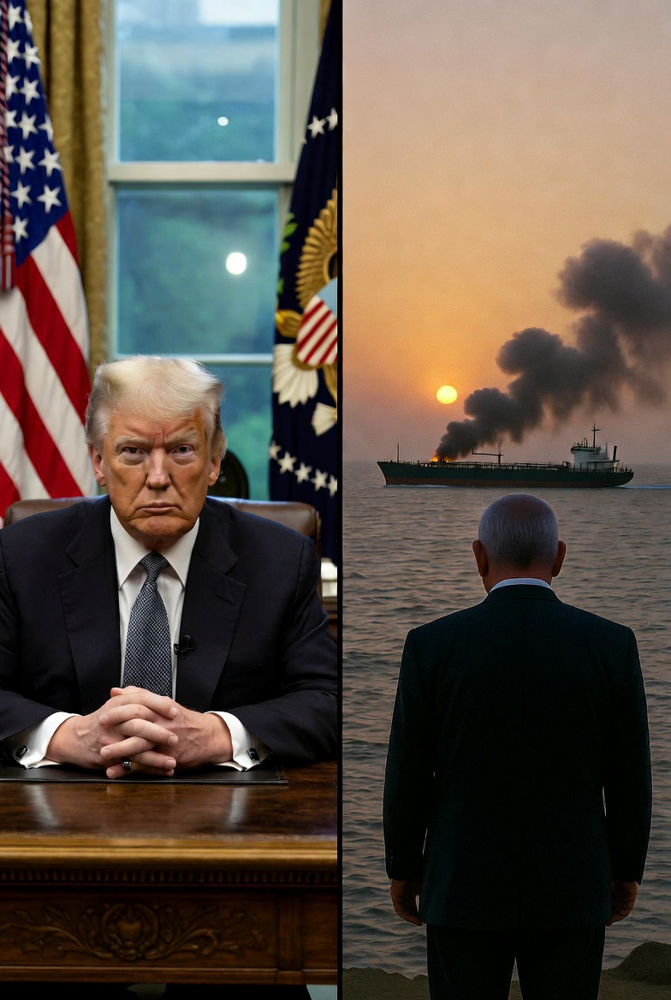

# Gencatan Senjata Sementara di Teluk Persia: Analisis Strategis dan Politik (April 2026)

*Ilustrasi gencatan senjata (pic: Grok AI).*

  
***Gencatan senjata bersifat rapuh karena ketergantungan pada kepatuhan Israel sebagai aktor agresor serta rentannya dinamika politik domestik AS***
  

Pada 8 April 2026, ancaman eskalasi militer antara Amerika Serikat (AS) dan Iran mereda sementara melalui kesepakatan gencatan senjata dua minggu, dimediasi oleh Pakistan. 

Tulisan ini menganalisis dasar politik, mekanisme negosiasi, serta risiko keruntuhan gencatan senjata. 

Fokusnya adalah interaksi diplomasi pragmatis, kepentingan militer, dan strategi geopolitik regional, serta implikasi bagi keamanan maritim di Teluk Persia. 

Artikel ini menggunakan pendekatan politik internasional dan teori keamanan multilevel untuk memahami dinamika rapuh dari gencatan senjata sementara.

## Pendahuluan

Ketegangan AS-Iran di Teluk Persia telah menjadi titik panas geopolitik global sejak krisis nuklir dan konflik proxy regional. 

Ancaman eskalasi langsung antara kekuatan nuklir regional (Iran) dan kekuatan militer global (AS) menimbulkan risiko keamanan maritim dan ekonomi dunia, mengingat jalur laut strategis yang vital. 

Gencatan senjata sementara, seperti yang diumumkan pada 8 April 2026, menawarkan peluang diplomatis namun tetap rapuh, karena keberlangsungan bergantung pada kepatuhan masing-masing pihak, khususnya Israel dan AS sebagai agresor regional yang memiliki riwayat intervensi unilateral.

## Metodologi

Analisis ini menggunakan:

1.	Pendekatan kualitatif: review laporan diplomatik, pernyataan resmi, dan media internasional.

2.	Pendekatan sistemik: mengkaji interaksi multilevel antara aktor negara (AS, Iran, Israel, Pakistan) dan aktor non-negara (kapal dagang, militer regional).

3.	Analisis risiko politik: menilai kemungkinan pelanggaran gencatan senjata berdasarkan sejarah konflik dan kepentingan strategis masing-masing pihak.

## Diplomasi Mediasi Pakistan

•	Pakistan berperan sebagai third-party mediator, menegaskan kapasitas negara non-superpower untuk menengahi konflik regional.

•	Strategi ini mengacu pada teori diplomasi preventif, di mana pihak ketiga menurunkan risiko eskalasi langsung melalui kesepakatan sementara.

## Gencatan Senjata Sementara (Double-Sided Ceasefire)

•	Konsep double-sided ceasefire berarti kedua pihak menghentikan serangan sebagai syarat awal negosiasi lebih panjang.

•	Keberhasilan jangka pendek: Iran setuju memberikan safe passage maritim selama dua minggu. AS dan Israel menghentikan serangan sementara.

•	Kerentanan: Bergantung pada kepatuhan semua pihak. Potensi pelanggaran oleh Israel atau aktor proksi dapat segera meruntuhkan gencatan senjata.

## Basis Negosiasi 10 Poin Iran

Dihargai oleh AS sebagai workable basis, menunjukkan:

•	Iran bersedia kompromi dalam hal jalur maritim dan operasi militer.

•	Negosiasi jangka panjang masih terbuka, tetapi rapuh secara politik.

## Analisis Politik dan Strategis

1.	Peran AS

•	Menggunakan gencatan senjata untuk menunda eskalasi sebelum tekanan domestik atau internasional memuncak.

•	Strategi ini meminimalkan risiko kerugian militer dan ekonomi global.

2.	Peran Israel

•	Sejarah agresi unilateral membuat stabilitas gencatan senjata rapuh.

•	Israel sebagai agresor potensial tetap menjadi faktor kritis.

3.	Iran

•	Menunjukkan fleksibilitas diplomatis sambil mempertahankan kedaulatan.

•	Kesediaan memberikan safe passage menunjukkan kombinasi pertahanan pragmatis dan politik simbolik.

4.	Keamanan Maritim

•	Jalur laut Teluk Persia vital bagi ekspor minyak dan perdagangan global.

•	Gencatan senjata mencegah interupsi sementara, tetapi risiko tetap tinggi.

Gencatan senjata dua minggu antara AS dan Iran merupakan langkah pragmatis untuk menghindari eskalasi langsung, dengan Pakistan sebagai mediator. 

Meskipun memberikan jeda strategis, gencatan senjata bersifat rapuh karena:

1.	Ketergantungan pada kepatuhan Israel sebagai aktor agresor.

2.	Rentannya dinamika politik domestik AS.

3.	Sifat sementara dan terbatas dari kesepakatan.

Gencatan senjata ini bukan akhir konflik, tetapi jendela diplomatik untuk negosiasi jangka panjang. 

Keberhasilannya bergantung pada kesadaran strategis, kepatuhan aktor, dan tekanan diplomatik multilateral.

  
**Referensi**

1.	Al Jazeera. (2026, April 8). US-Iran agree to two-week ceasefire mediated by Pakistan. Al Jazeera. https://www.aljazeera.com/news/2026/4/8

2.	BBC News. (2026, April 8). Temporary ceasefire in Gulf region avoids escalation. BBC. https://www.bbc.com/news/world-middle-east-2026

3.	Reuters. (2026, April 8). Iran allows safe passage for ships during ceasefire. Reuters. https://www.reuters.com/world/middle-east/iran-ceasefire-2026

4.	Haidar, R. (2025). Geopolitical tensions and maritime security in the Gulf. Middle East Policy Journal, 32(4), 45–62.

5.	Kahl, C. (2024). Preventive diplomacy in high-risk regions: Lessons from the Gulf. International Security Review, 29(2), 101–124.
