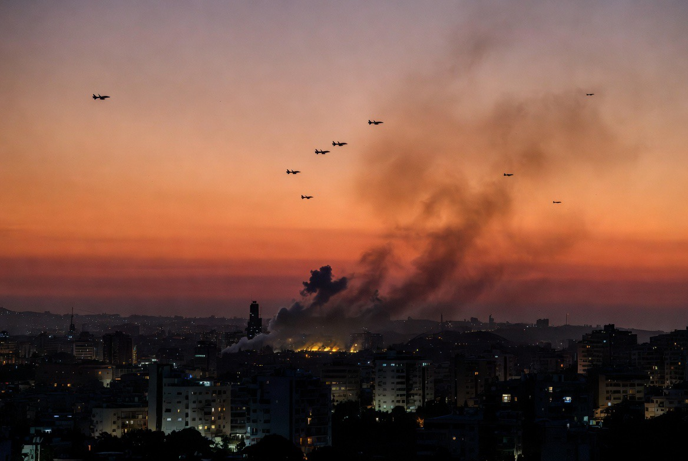

# Gencatan Senjata tetapi Beirut Tetap Diserang? Apakah AS Gagal Menahan Israel?

*Ilustrasi (pic: Grok AI).*

  
***Gencatan senjata memiliki kelemahan mendasar, aktor bersenjata yang paling menentukan di lapangan yaitu Hezbollah tidak menjadi pihak yang menandatangani***
  

Sekilas memang terlihat kontradiktif: “Kalau ada gencatan senjata yang dimediasi AS, kenapa Israel masih menyerang Beirut?”

Jawabannya adalah: Karena gencatan senjata itu bukan berarti semua operasi militer berhenti tanpa syarat.

## Memang Ada Gencatan Senjata?

Ya. Pada Juni 2026, dengan mediasi Amerika Serikat, Israel dan Lebanon menyepakati kerangka (framework agreement) sebagai langkah awal menuju penghentian konflik yang lebih permanen.  

Tetapi dokumen itu memiliki syarat penting, yaitu Israel menyatakan tetap berhak melakukan operasi terhadap infrastruktur Hezbollah, komandan Hezbollah, serta ancaman yang dianggap “imminent” (segera mengancam).

Hezbollah sendiri bukan penandatangan perjanjian tersebut dan menolak dilucuti.  

## Jadi Kenapa Beirut Bisa Dibom?

Karena menurut Israel, serangan tersebut bukan dianggap pelanggaran gencatan senjata, melainkanoperasi pencegahan terhadap target Hezbollah.

Inilah perbedaan tafsir yang menjadi sumber hampir seluruh kontroversi.

Bagi Israel: “Kami tidak menyerang Lebanon sebagai negara.” tetapi “Kami menyerang Hezbollah.”

Sementara bagi Lebanon, bom yang jatuh tetap menghantam wilayah Lebanon. Akibatnya, bagi warga sipil, perbedaan istilah itu sering kali tidak mengubah kenyataan di lapangan.

## Bukankah Ini Pernah Terjadi Sebelumnya?

Justru iya. Pada Mei 2026, Israel juga melancarkan serangan ke Beirut yang disebut sebagai serangan pertama sejak gencatan senjata sebelumnya. Israel mengatakan sasarannya adalah seorang komandan Hezbollah. 

Serangan itu langsung memunculkan kekhawatiran bahwa proses perdamaian yang lebih luas, termasuk pembicaraan AS-Iran, dapat terganggu. Artinya, pola ini sudah berulang.

## AS Gagal?

Belum tentu. Diplomasi sering kali tidak menghasilkan: “tidak ada lagi bom.” Melainkan “lebih sedikit bom dibanding sebelumnya.”

Kedengarannya sinis. Tetapi memang begitu kenyataan banyak gencatan senjata modern.

AS berhasil membuka jalur diplomasi. Namun AS tidak selalu mampu mengendalikan setiap keputusan militer Israel, apalagi ketika pemerintah Israel menyatakan ancaman dari Hezbollah masih berlangsung.  

## Analisis

Gencatan senjata ini sebenarnya memiliki kelemahan mendasar. Ia dibuat antara Amerika Serikat, Israel, dan Pemerintah Lebanon.

Tetapi aktor bersenjata yang paling menentukan di lapangan yaitu Hezbollah tidak menjadi pihak yang menandatangani. 

Akibatnya muncul paradoks, Pemerintah Lebanon bisa berkata: “Kami ingin damai.” Tetapi bila Hezbollah tetap aktif, Israel akan berkata: “Ancamannya belum selesai.” Siklus itu terus berulang.

Situasi ini disebut sebagai ceasefire with exceptions. Secara hukum masih disebut gencatan senjata, namun secara militer rudal masih terbang.

Di sinilah kritik keras terhadap model gencatan senjata seperti ini muncul. Kalau satu pihak tetap mempertahankan hak melakukan serangan “pencegahan”, sementara pihak lain menganggap setiap serangan sebagai pelanggaran, maka gencatan senjata menjadi sangat rapuh.

Ini bukan garis akhir perang, tetapi lebih menyerupai jeda yang sewaktu-waktu bisa pecah kembali.

Memang ada kerangka gencatan senjata dan kesepakatan awal yang dimediasi AS, namun kesepakatan itu bukan larangan absolut atas seluruh operasi militer.

Israel tetap menyatakan berhak menyerang target Hezbollah yang dianggap mengancam. Sementara Hezbollah menolak perlucutan senjata, sehingga ketegangan tetap tinggi.

Karena itu, serangan ke Beirut atau wilayah Lebanon tidak otomatis berarti gencatan senjata telah resmi berakhir, meskipun jelas memperlemah kepercayaan terhadap proses perdamaian.  

  
**Referensi**

Reuters. (2026, June 26). Israel and Lebanon sign initial agreement after U.S.-mediated talks.

Associated Press. (2026, June 26). Israel and Lebanon sign framework agreement as first step toward peace.

Reuters. (2026, June 19). Israel and Hezbollah agree to ceasefire in Lebanon, U.S. official says.

Reuters. (2026, May 6). Israel strikes Beirut for the first time since the ceasefire.
