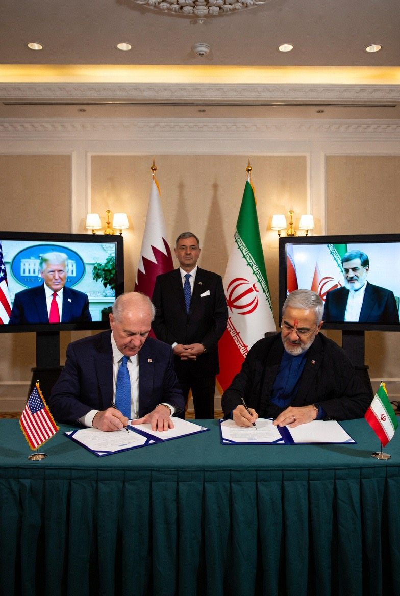

# Geneva 2026: Ketika Perdamaian Ditandatangani, tetapi Kecurigaan Tidak

*Ilustrasi (pic: Grok AI).*

  
***Musuh tidak gagal berdamai karena mereka saling membenci. Tetapi karena mereka lebih takut pada perdamaian daripada pada perang itu sendiri***
  

Bayangkan…

Utusan Trump dan perwakilan Iran berjabat tangan. Flash kamera menyala, pasar saham tersenyum, harga minyak turun.

Tetapi… di Yerusalem, banyak orang justru bertanya: “Apa yang sebenarnya baru saja dijual?”

Sementara di Lebanon, Israel masih membombardir yang katanya Hezbollah, namun yang menjadi korban justru rakyat sipil dan jurnalis.

## Perdamaian Ini Tidak Menyelesaikan Masalah

Kalau kita baca isi MoU, yang selesai adalah perang terbuka, blokade, dan krisis Selat Hormuz. 

Tetapi yang belum selesai program nuklir Iran, Hezbollah, Lebanon, sanksi, dan kepercayaan.

## Mengapa Israel Kesal?

Karena Israel punya ketakutan eksistensial. Mereka melihat Iran tidak kalah. Bahkan sebaliknya, Iran masih punya pemerintahan, masih punya pengaruh regional, masih punya program nuklir sipil, bahkan memperoleh peluang pencairan aset dan keringanan ekonomi.

Dari sudut pandang Israel: “Kami berperang…lalu musuh kami malah diajak berdamai.”

Tidak heran banyak media Israel menyebut perjanjian ini bad deal, catastrophic, atau lifeline for Tehran.

Tetapi… Apakah Trump Mengkhianati Israel?

Sepertinya tidak, sebab Trump juga punya ketakutan sendiri. Ia melihat harga minyak, ekonomi, opini publik, inflasi, dan biaya perang yang terus membengkak.

Maka ia mungkin berpikir: “Lebih baik perdamaian yang tidak sempurna daripada perang yang tidak ada ujungnya.”

## Lalu Netanyahu?

Nah… ini bagian paling menarik.

Banyak orang melihat Netanyahu sedang berada dalam posisi sulit, kalau menerima perjanjian, ia dituduh lemah. Kalau menolak, ia berisiko berseberangan dengan Washington. Kalau menyerang Iran lagi, ia bisa merusak hubungan dengan AS.

Jadi ia memilih posisi: “Itu perjanjian kalian. Aku punya kepentinganku sendiri.”

Kalimat yang dingin, Tetapi… sangat khas geopolitik.

Yang dikhawatirkan justru pada satu hal. Bukan Iran. bukan Israel, bukan Trump, tetapi ketika perdamaian dianggap pengkhianatan.

Karena kalau setiap kompromi dianggap lemah, atau menjual negara, maka yang tersisa hanya dua pilihan: perang sekarang, atau perang nanti.

Dan sejarah menunjukkan, sering kali… musuh tidak gagal berdamai karena mereka saling membenci. Tetapi karena mereka lebih takut pada perdamaian daripada pada perang itu sendiri.

  
**Referensi**

Reuters. (2026, June 14). US, Iran reach preliminary agreement to end war, signing set for Friday.  

The Guardian. (2026, June 15). Trump declares US-Iran peace deal ‘all signed’ as G7 leaders battle to tie up loose ends.  

The Guardian. (2026, June 20). ‘It’s a big mistake’: Israelis feel betrayed and angry after Iran peace deal.  

The Guardian. (2026, June 19). Israel and Hezbollah renew ceasefire after deadly flare-up disrupts opening of Iran talks.  

The Washington Post. (2026, June 18). U.S. and Iran sign initial deal to end war and open Strait of Hormuz.  
