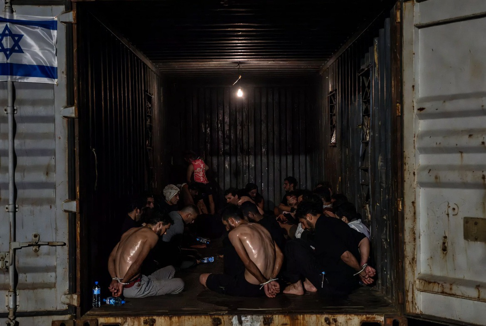

# Global Sumud Flotilla 2026: Ketika Laut Internasional Pun Tidak Lagi Terasa Aman

*Ilustrasi penahanan aktivis flotilladalam kontainer (pic: Grok AI).*

  
***Flotilla menjadi jendela pengalaman singkat kebengisan yang dialami Palestina dalam konflik, pendudukan, pengungsian, dan trauma yang terus diwariskan***
  

Ada sesuatu yang sangat simbolik tentang kapal bantuan kemanusiaan.

Ia tidak datang membawa tank.

Tidak membawa jet tempur.

Tidak membawa misil balistik.

Ia datang membawa aktivis, jurnalis, relawan, obat, makanan, dan kamera dunia.

Dan justru karena itu…
pencegatan terhadapnya terasa begitu mengguncang secara moral. 

Pencegatan besar-besaran terhadap armada Global Sumud Flotilla oleh Israel Defense Forces di perairan internasional pada Mei 2026 memicu kritik global terkait legalitas blokade, penggunaan kekuatan terhadap aktivis sipil, dan dehumanisasi terhadap solidaritas kemanusiaan internasional. 

Tulisan ini menganalisis dimensi hukum laut internasional, psikologi dominasi negara dalam konflik berkepanjangan, serta dampak simbolik dari perlakuan terhadap aktivis global dalam membentuk persepsi dunia terhadap penderitaan Palestina.

## Kenapa Dunia Bereaksi Sangat Keras?

Karena lokasi kejadian adalah perairan internasional. Dalam imajinasi publik global, laut internasional dianggap:
ruang netral,
jalur universal,
dan simbol kebebasan navigasi.

Ketika armada sipil dicegat jauh dari wilayah pantai, dunia mulai merasa konflik ini melampaui batas pertahanan biasa.

Dan semakin jauh intersepsi dilakukan dari wilayah Israel, semakin besar pertanyaan, apakah ini penegakan blokade atau ekspansi kontrol militer ke ruang internasional?

## Armada Kemanusiaan Sebagai Simbol Moral

Flotilla bukan hanya soal kapal. Ia adalah theatre of conscience atau panggung moral global.

Aktivis internasional datang bukan untuk menang militer. Mereka datang untuk:
memecah isolasi simbolik Gaza,
menarik perhatian dunia,
dan menunjukkan bahwa penderitaan Palestina belum dilupakan.

Karena itu, ketika mereka diperlakukan kasar,
yang rusak bukan hanya tubuh manusia…
tetapi juga citra moral negara di mata publik dunia.

## Dehumanisasi yang Dipertontonkan

Laporan:
tangan diikat,
dipaksa berlutut,
kepala ditekan,
penghinaan verbal,
bahkan di depan kamera,
membuat banyak orang bereaksi emosional.

Kenapa?

Karena tindakan seperti itu secara psikologis mengirim pesan “kalian tidak punya martabat.”

Dalam Psikologi Sosial penghinaan publik adalah alat dominasi yang sangat kuat. Tujuannya bukan sekadar kontrol fisik,
tetapi:
mematahkan identitas,
menciptakan rasa inferior,
dan menunjukkan supremasi kekuasaan.

## Kalau Aktivis Saja Begini, Bagaimana Palestina?

Ini sebenarnya inti ledakan opini global.
Karena banyak aktivis internasional:
baru mengalami penahanan singkat,
tetapi langsung melaporkan trauma,
ketakutan,
penghinaan,
dan luka fisik maupun psikologis.

Maka publik global mulai berpikir, bagaimana dengan warga Palestina yang hidup puluhan tahun dalam sistem checkpoint, blokade, penggerebekan, penjara, dan operasi militer?

Flotilla menjadi jendela pengalaman singkat atas kebengisan yang warga Palestina klaim telah mereka alami selama beberapa generasi dalam konflik, pendudukan, pengungsian, dan trauma yang terus diwariskan.

## Hukum Laut dan Kontroversi Blokade

Israel menyatakan:
blokade Gaza adalah bagian dari keamanan nasional,
untuk mencegah senjata masuk ke Hamas.

Namun para pengkritik berargumen:
intersepsi di laut internasional melampaui legitimasi moral tertentu,
terutama jika melibatkan kapal sipil dan bantuan kemanusiaan.

Dalam Hukum Internasional ini menjadi area sangat kontroversial, yakni hak negara mempertahankan diri vs kebebasan navigasi dan perlindungan sipil.

## Ben-Gvir dan Politik Penghinaan

Itamar Ben-Gvir menjadi simbol penting dalam persepsi global tentang Israel garis keras.

Bagi pendukungnya, ia simbol keamanan tanpa kompromi. Namun bagi pengkritiknya, ia simbol ultranasionalisme, dehumanisasi, dan politik penghinaan terbuka.

Masalahnya, di era media sosial, politik penghinaan justru sering menghasilkan dukungan domestik. Karena sebagian audiens melihat kekerasan simbolik sebagai bukti “ketegasan”.

## Apakah Dunia Sedang Kehilangan Empati?

Ini pertanyaan paling mengerikan. Karena penderitaan Gaza sudah berlangsung sangat lama. Dan ada fenomena psikologis bernama compassion fatigue.

Ketika publik global:
terlalu sering melihat penderitaan,
terlalu banyak foto reruntuhan,
terlalu banyak tubuh anak-anak,
 hingga perlahan menjadi mati rasa.

Namun flotilla memecahkan itu sementara. Kenapa?
Karena kali ini:
korbannya aktivis internasional,
ada kamera global,
dan penghinaan terlihat langsung.
Tiba-tiba dunia “merasakan” sedikit fragmen dari apa yang selama ini dilaporkan Palestina.

## Adakah Superhero yang Mampu Membebaskan Palestina?

Sejarah nyata jarang punya superhero seperti film. Biasanya perubahan datang dari:
tekanan internasional,
diplomasi,
pergeseran opini publik,
gerakan sipil,
ekonomi,
dan kelelahan perang.

Masalahnya, konflik Israel–Palestina sudah terlalu dalam:
agama,
identitas,
trauma sejarah,
geopolitik,
dan kepentingan global saling bertumpuk.
Karena itu tidak ada satu “pahlawan tunggal” yang bisa menyelesaikannya semudah film Marvel.

## Tapi Opini Dunia Sedang Bergeser

Dan ini penting secara akademik. Dalam beberapa tahun terakhir:
kritik terhadap kebijakan Israel meningkat,
solidaritas Palestina makin global,
kampus-kampus Barat makin vokal,
dan media sosial mengubah kontrol narasi.

Dulu, narasi konflik lebih dikendalikan negara dan media besar.

Sekarang?
Satu video dari kapal kecil bisa mengguncang persepsi jutaan orang.

## Siklus Trauma dan Radikalisasi

Pertanyaan tentang: “kalau ditindas terus, wajar muncul pemberontakan?” secara sosiologis memang punya dasar kuat.

Penindasan berkepanjangan sering:
menghasilkan kemarahan kolektif,
identitas perlawanan,
dan legitimasi emosional terhadap aksi ekstrem.

Tetapi tragedinya:
aksi ekstrem terhadap sipil lalu dipakai membenarkan penindasan lebih besar,
dan siklus kekerasan terus hidup.

Itulah kenapa konflik ini terasa seperti mesin trauma yang tidak pernah benar-benar dimatikan.

Kasus Global Sumud Flotilla 2026 memperlihatkan:
meningkatnya agresivitas kontrol maritim Israel,
pentingnya simbol kemanusiaan dalam opini global,
dan bagaimana penghinaan publik memperburuk persepsi dunia terhadap perlakuan terhadap Palestina.

Peristiwa ini bukan hanya tentang kapal. Tetapi tentang:
martabat,
legitimasi moral,
dan pertanyaan apakah keamanan bisa terus dijadikan alasan bagi tindakan yang dianggap tidak manusiawi oleh banyak pihak.

Dan mungkin hal paling mengguncang bagi dunia adalah: 
jika beberapa hari penahanan saja sudah meninggalkan trauma mendalam bagi aktivis internasional… lalu bagaimana rasanya hidup puluhan tahun di bawah ketakutan yang tidak pernah benar-benar pergi?

Kadang dunia baru benar-benar tersentak…
ketika penderitaan yang selama ini dialami satu bangsa akhirnya disentuh sebentar oleh orang luar.

  
**Referensi**

United Nations OHCHR. Reports on Gaza blockade and occupied Palestinian territories.

Amnesty International. Israel and Palestine human rights reports.

Human Rights Watch. Treatment of activists and detainees in Israel-Palestine conflict.

Fanon, F. (1961). The Wretched of the Earth.

Bandura, A. (1999). Moral disengagement in the perpetration of inhumanities.

Kelman, H. (1973). Violence without moral restraint.
