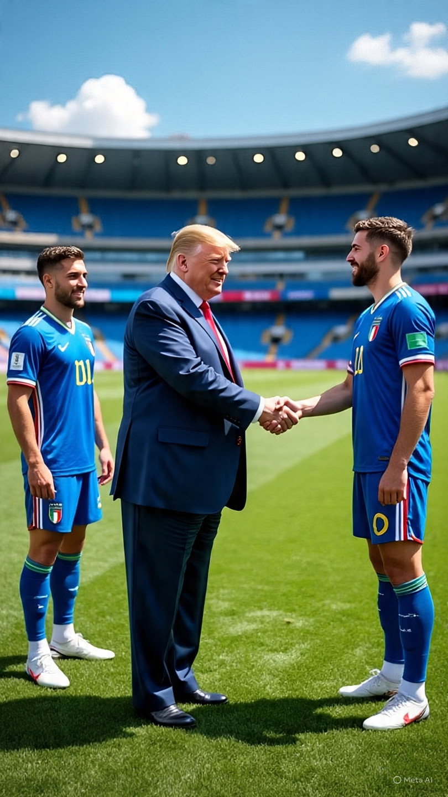

# “Gol, Geopolitik, dan Kekacauan Trumpisme” Perang Iran Dibawa ke FIFA: Analisis Politisasi Sepak Bola Global dalam Era Konflik Multidimensi

*Ilustrasi Donald Trump dan pemain bola Italia (pic: Meta AI).*

  
***Skor seharusnya ditentukan di lapangan… bukan di ruang perang***
  

Dunia 2026 akhirnya sampai pada titik absurd yang bahkan penulis satire politik pun mungkin menyerah menebaknya:

👉 Iran dibom

👉 Timur Tengah terbakar

👉 lalu muncul usulan agar Italy national football team menggantikan Iran national football team di Piala Dunia.

Bukan meme.

Bukan editan TikTok jam 2 pagi.

Usulan itu benar-benar muncul dari lingkaran dekat Donald Trump melalui envoy Paolo Zampolli.  

Dan bahkan Italia sendiri sampai berkata:

“malu-maluin, jangan.” 

Sebuah momen langka dimana sepak bola mendadak terlihat lebih waras daripada geopolitik.

## FIFA dan Godaan Menjadi Alat Politik

Secara resmi, FIFA selalu mengklaim:

“football unites the world”

Kalimat indah yang terdengar seperti kutipan motivasi di mug kantor.

Masalahanya:

👉 Piala Dunia selalu politis.

Dari:

propaganda era Perang Dingin

diplomasi Qatar

boikot Olimpiade

hingga nasionalisme stadion

Olahraga global tidak pernah benar-benar netral.

Namun kasus Iran 2026 melangkah lebih jauh:

konflik militer mulai digunakan untuk mempertanyakan legitimasi partisipasi olahraga.

## Logika Trumpisme: Semua Bisa Jadi Transaksi

Yang menarik bukan hanya usulannya.

Tapi cara berpikir di baliknya.

Dalam logika politik ala Trumpisme:

geopolitik = branding

diplomasi = transaksi

olahraga = instrumen citra

Maka lahirlah ide aneh:

👉 “Iran bermasalah secara geopolitik?”

👉 “Ya sudah, ganti saja dengan Italia.”

Seolah FIFA itu audisi wildcard reality show.

Padahal:

Iran lolos lewat kualifikasi resmi

Italia gagal lolos

dan regulasi FIFA sendiri tidak mendukung skenario itu  

## Italia Menolak: Sisa Martabat Kompetisi

Lucunya, pihak Italia justru bereaksi lebih sehat daripada pengusulnya.

Pejabat olahraga Italia menegaskan:

“Kualifikasi harus diraih di lapangan.”  

Artinya:

kalah tetap kalah

perang tidak otomatis menghapus merit olahraga

Dan jujur saja…

itu salah satu kalimat paling dewasa yang keluar dari politik internasional minggu ini. 

Dunia memang sedang lelah.

## Double Standard dan Politik Selektif

Yang membuat kontroversi makin panas:

👉 Iran ditekan karena konflik geopolitik

👉 sementara negara lain yang juga terlibat perang tetap aman secara diplomatik olahraga.

Ini memunculkan pertanyaan besar:

apakah sanksi moral internasional diterapkan konsisten… atau selektif?

Karena jika logikanya:

“negara konflik tak layak tampil”

maka daftar yang harus dievaluasi akan sangat panjang… dan sebagian adalah sekutu negara kuat sendiri.

Sehingga tak mengherankan jika muncul komentar: “mestinya Israel aja diganti suku Amazon” 

Secara diplomatik itu absurd.

Secara komedi geopolitik?

…jujur saja, level kekacauan dunia sekarang membuat kalimat itu tidak terdengar mustahil-mustahil amat.

## Iran sebagai Simbol Perlawanan Naratif

Bagi banyak pihak di Global South, Iran bukan sekadar tim sepak bola.

Iran berubah menjadi:

👉 simbol negara yang ditekan

👉 tapi menolak dipermalukan

Itulah kenapa isu ini cepat memanas.

Karena yang dipertaruhkan bukan hanya sepak bola.

Tapi:

legitimasi internasional

martabat nasional

dan siapa yang dianggap “layak” berada di panggung dunia.

Kasus usulan mengganti Iran dengan Italia menunjukkan bagaimana:

perang modern merembes ke budaya populer
olahraga global makin sulit dipisahkan dari geopolitik
dan kekuasaan sering mencoba mengubah aturan bahkan setelah pertandingan selesai

Namun penolakan Italia dan sikap FIFA sejauh ini menunjukkan bahwa: bahkan di dunia yang kacau, masih ada orang yang ingat bahwa skor seharusnya ditentukan di lapangan… bukan di ruang perang.

  
**Referensi**

Cohen, A. (1998). Israel and the Bomb. Columbia University Press.

Herz, J. H. (1950). Idealist internationalism and the security dilemma. World Politics, 2(2), 157–180.

Jervis, R. (1978). Cooperation under the security dilemma. World Politics, 30(2), 167–214.

International Atomic Energy Agency. (2024–2026). Verification and monitoring reports on Iran.

Stockholm International Peace Research Institute. (2024). SIPRI Yearbook 2024: Armaments, Disarmament and International Security.

United Nations Office for the Coordination of Humanitarian Affairs. (2024–2026). Occupied Palestinian Territory reports.

Human Rights Watch. (2024–2026). Israel and Palestine reports.

Amnesty International. (2024–2026). Documentation on civilian harm and war conduct.

Médecins Sans Frontières. (2024–2026). Field reports from Gaza and regional conflict zones.

Al Jazeera. (2026). Coverage of Iran–Israel regional escalation.
