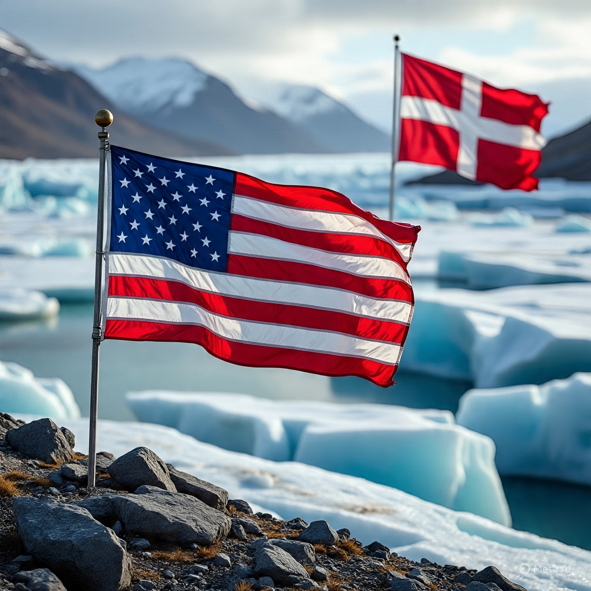

# Alibi Keamanan & Motif Ekonomi: Analisis Strategis Ambisi Amerika Serikat terhadap Greenland dalam Politik Kekuasaan Global

*Ilustrasi ambisi AS terhadap Greenland (pic: Meta AI).*

  
***Jika ancaman belum nyata, tetapi respons sudah ekstrem, maka masalahnya bukan keamanan, melainkan kepentingan***
  

Artikel ini menganalisis klaim Amerika Serikat bahwa kepentingannya terhadap Greenland didorong oleh kebutuhan keamanan strategis untuk mencegah pengaruh Rusia dan China. 

Dengan menggunakan pendekatan critical geopolitics dan political economy, studi ini menunjukkan bahwa narasi keamanan tersebut berfungsi sebagai alibi hegemonik yang menutupi motif ekonomi, sumber daya alam, dan pencitraan politik domestik. 

Melalui perbandingan historis dengan Irak dan Libya, makalah ini menegaskan bahwa pola “ancaman eksternal” kerap digunakan sebagai legitimasi intervensi yang kemudian terbukti destruktif dan salah sasaran.

## Keamanan sebagai Bahasa Kekuasaan

Dalam politik global kontemporer, keamanan bukan sekadar kondisi objektif, melainkan bahasa politik. 

Negara hegemon tidak mengatakan “kami ingin sumber daya”, tetapi: “Kami harus mencegah ancaman.”

Greenland, wilayah otonom Denmark dengan cadangan mineral langka dan posisi strategis Arktik, tiba-tiba diposisikan sebagai “rawan dicaplok” Rusia atau China. 

Klaim ini menempatkan AS sebagai penjaga moral global, bukan sebagai aktor berkepentingan.

## Greenland dan Nilai Strategis Arktik

Arktik kini menjadi arena kompetisi besar karena:

• cadangan rare earth elements

• rute pelayaran baru akibat mencairnya es

• posisi militer strategis (Thule Air Base)

Namun, hingga kini tidak ada bukti invasi langsung Rusia atau China terhadap Greenland. 

Yang ada adalah:

• investasi riset

• kerja sama ekonomi terbatas

• diplomasi Arktik formal

Narasi “ancaman” lebih bersifat antisipatif spekulatif, bukan respons terhadap agresi nyata.

## Alibi Keamanan sebagai Pola Historis

Pola ini bukan baru. Bandingkan:

Irak (2003)

• Alibi: senjata pemusnah massal

• Fakta: tidak ditemukan

• Hasil: kehancuran negara, perang sektarian

Libya (2011)

• Alibi: perlindungan warga sipil

• Fakta: rezim runtuh tanpa stabilisasi

• Hasil: negara gagal, perang saudara

Dalam kedua kasus, alibi keamanan runtuh, sementara motif energi dan pengaruh geopolitik justru menjadi jelas setelahnya.

## Trump dan Politik Warisan Sejarah

Dalam konteks Donald Trump, ambisi terhadap Greenland juga harus dibaca sebagai politik legacy.

Trump secara konsisten:

• mengutamakan simbol “deal besar”

• ingin tercatat sebagai presiden ekspansionis

• mempersonalisasi kebijakan luar negeri

Greenland menawarkan:

• kemenangan simbolik tanpa perang

• narasi “menyelamatkan Barat”

• pencapaian historis individual

Dengan kata lain, ini bukan sekadar kebijakan negara, tetapi politik ego dalam sistem kekuasaan.

## Critical Geopolitics: Siapa Mendefinisikan Ancaman?

Teori critical geopolitics menekankan bahwa: Ancaman tidak ditemukan, tetapi didefinisikan.

Ketika AS mengatakan “China atau Rusia bisa mencaplok”, pertanyaan ilmiahnya adalah:

• Berdasarkan data apa?

• Siapa yang diuntungkan dari ketakutan ini?

• Mengapa solusi selalu melibatkan dominasi AS?

Jika ancaman belum nyata, tetapi respons sudah ekstrem, maka masalahnya bukan keamanan, melainkan kepentingan.

## Implikasi Global: Normalisasi Akal Bulus

Jika alibi keamanan diterima tanpa kritik:

• hukum internasional melemah

• kedaulatan jadi relatif

• negara kuat bebas mendefinisikan realitas

Ini menciptakan preseden berbahaya: Jika cukup kuat, maka alasan apa pun bisa dibenarkan.

Klaim AS tentang Greenland sebagai upaya pencegahan terhadap Rusia dan China lebih tepat dibaca sebagai retorika defensif untuk ambisi ofensif. 

Sejarah menunjukkan bahwa alibi serupa telah digunakan dan terbukti keliru, namun tetap menghasilkan kehancuran permanen bagi negara target. 

Dalam konteks Trump, motif ekonomi dan pencitraan sejarah semakin memperkuat kesimpulan bahwa keamanan hanyalah selubung, bukan sebab utama.

  
**Referensi**

Agnew, J. (2010). Critical geopolitics. In J. Agnew & D. Livingstone (Eds.), The Sage handbook of geographical knowledge. Sage.

Klare, M. T. (2012). The race for what’s left: The global scramble for the world’s last resources. Metropolitan Books.

Mearsheimer, J. J. (2014). The tragedy of great power politics. W. W. Norton & Company.

Nephew, R. (2018). The art of sanctions: A view from the field. Columbia University Press.

O’Tuathail, G. (1996). Critical geopolitics. University of Minnesota Press.

Stokes, D. (2018). American hegemony and the political economy of oil. Review of International Studies, 44(1), 45–69.
