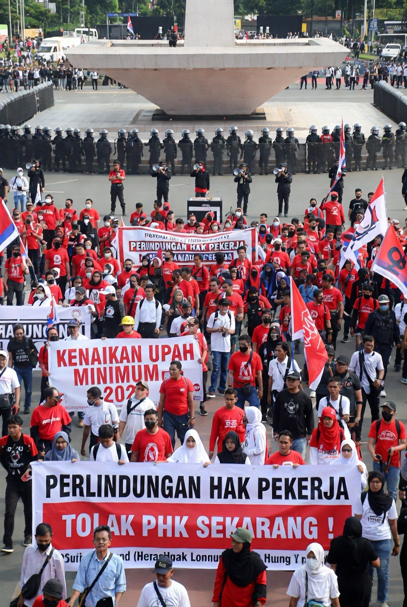

# Hari Buruh Internasional: Sejarah, Ideologi, Demonstrasi, dan Transformasinya di Indonesia

*Ilustrasi Hari Buruh (pic: Grok AI).*

  
***May Day sebenarnya berawal dari satu hal sederhana: manusia ingin hidup… tanpa habis diperas pekerjaannya sendiri***
  

International Workers’ Day atau Hari Buruh Internasional merupakan peringatan global yang lahir dari konflik industrial abad ke-19, terutama perjuangan jam kerja manusiawi di Chicago.

Di Indonesia, Hari Buruh mengalami transformasi politik: dari simbol gerakan kelas pekerja, dibekukan pada era Suharto, lalu dihidupkan kembali pasca reformasi hingga akhirnya menjadi hari libur nasional.

Tulisan ini mengkaji:

asal-usul May Day

bagaimana masuk ke Indonesia

sisi positif dan negatifnya

mengapa demonstrasi sering anarkis

serta tema peringatan May Day 2026.

## Apa itu Hari Buruh?

Hari Buruh adalah:

peringatan perjuangan pekerja untuk hak kerja yang lebih manusiawi.

Fokus utamanya dulu:
jam kerja,
upah,
keselamatan kerja,
hak berserikat.

Asal-Usulnya: Memang dari Barat?

Jawabannya:

Ya, akar modernnya memang dari dunia industrial Barat.

## Latar sejarah

Pada abad ke-19:
revolusi industri berkembang pesat
pabrik tumbuh besar

buruh bekerja: 12–16 jam sehari, kondisi berbahaya serta upah rendah.

👉 manusia diperlakukan seperti komponen mesin.

## Momen Penting: Haymarket Affair (1886)

Pusat sejarahnya:
Haymarket affair.

Di Chicago, ribuan buruh menuntut:

“8 jam kerja, 8 jam istirahat, 8 jam untuk hidup”.

Demonstrasi memanas.
Bom meledak. Polisi menembak massa. Banyak korban jatuh.

Dampaknya?

Peristiwa ini menjadi simbol:
perlawanan buruh global,
konflik kelas industrial,
Lalu Second International menetapkan 1 Mei sebagai Hari Buruh Internasional.

## Bagaimana Masuk ke Indonesia?

🧠 Era kolonial

Gerakan buruh masuk melalui:

industrialisasi kolonial Belanda
serikat pekerja awal
pengaruh sosialisme & nasionalisme

📌 Setelah kemerdekaan

Hari Buruh sempat diperingati aktif, terutama era:
Sukarno.

Karena:
politik kiri kuat,
serikat buruh dekat dengan gerakan massa.

❄️ Era Orde Baru

Di masa Suharto:
Hari Buruh dicurigai terkait komunisme,
gerakan buruh dibatasi,
demonstrasi ditekan.

👉 May Day praktis “didinginkan”.

🌱 Era Reformasi

Setelah 1998:
serikat buruh tumbuh lagi,
demonstrasi kembali marak.

Lalu pada 2013:
Susilo Bambang Yudhoyono menetapkan:

1 Mei sebagai hari libur nasional.

## Sisi Positif Hari Buruh

1. Mengingatkan bahwa hak pekerja bukan hadiah

Hak seperti:
cuti,
upah minimum,
jam kerja manusiawi.

👉 lahir dari perjuangan panjang.

2. Menjadi alat kontrol sosial

Demonstrasi memberi tekanan pada:
pemerintah,
perusahaan,
Agar tidak semena-mena.

3. Memperkuat solidaritas pekerja

May Day menciptakan:

identitas kolektif pekerja.

## Sisi Negatif & Kritik

❌ 1. Politisasi

Kadang isu buruh dipakai:
partai politik,
elite tertentu,
agenda non-buruh.

❌ 2. Gangguan ekonomi & publik

Demo besar bisa:
macet,
mengganggu aktivitas,
merusak fasilitas.

❌ 3. Romantisasi konflik

Sebagian kelompok menganggap:

“demo damai tidak akan didengar”.

Akibatnya:
eskalasi dianggap perlu.

## Kenapa Demo Sering Anarkis?

🧠 Secara teori sosial:

Anarkisme demo biasanya muncul dari kombinasi:

🔹 frustrasi ekonomi

🔹 rasa tidak didengar

🔹 identitas massa

🔹 efek psikologi kerumunan

📌 Ada konsep penting:

“Performative disruption”.

Artinya:

gangguan besar → perhatian media naik

perhatian naik → tekanan politik naik.

⚠️ Tapi apakah harus anarkis agar didengar?

Jawaban ilmiahnya:

❌ tidak selalu.

Banyak perubahan buruh di dunia terjadi lewat:
negosiasi,
tekanan politik damai,
serikat kuat.

🧠 Namun realitasnya…

Sebagian massa percaya:

“kalau terlalu tertib, elite cuek”.

Ini lahir dari:
ketimpangan kuasa,
pengalaman diabaikan.

## Tema May Day 2026

Di banyak negara, tema May Day 2026 berfokus pada:
upah layak,
AI & otomatisasi,
outsourcing,
PHK digital,
perlindungan pekerja platform/gig economy.

🇮🇩 Di Indonesia

Isu besar 2026 meliputi:
kenaikan biaya hidup,
perlindungan buruh digital,
revisi aturan ketenagakerjaan,
ketidakpastian ekonomi global.

👉 slogan umumnya berkisar:

“kerja layak di era ekonomi digital”.

## Analisis

May Day sebenarnya bukan sekadar:

“hari demo”.

Ia adalah:

ritual politik modern.

Di mana masyarakat mengingat:
siapa yang bekerja,
siapa yang menikmati hasil kerja,
dan bagaimana kekuasaan ekonomi dibagi.

Hari Buruh lahir bukan dari kenyamanan,
melainkan dari:

kelelahan,
darah,
dan rasa manusia yang tidak ingin diperlakukan seperti mesin.

Namun di era modern:

perjuangan buruh bisa menjadi alat demokrasi
atau berubah menjadi teater politik dan kemarahan massa.

Semua tergantung pada siapa yang memimpin dan bagaimana kekuasaan merespons.

  
**Referensi**

Hobsbawm, E. (1984). Workers: Worlds of labor. Pantheon Books.

Montgomery, D. (1987). The fall of the house of labor. Cambridge University Press.

Tilly, C. (2004). Social movements, 1768–2004. Paradigm Publishers.

Cribb, R. (1995). The Indonesian killings 1965–1966. Monash University Press.

International Labour Organization. (2026). Global labour trends report.
