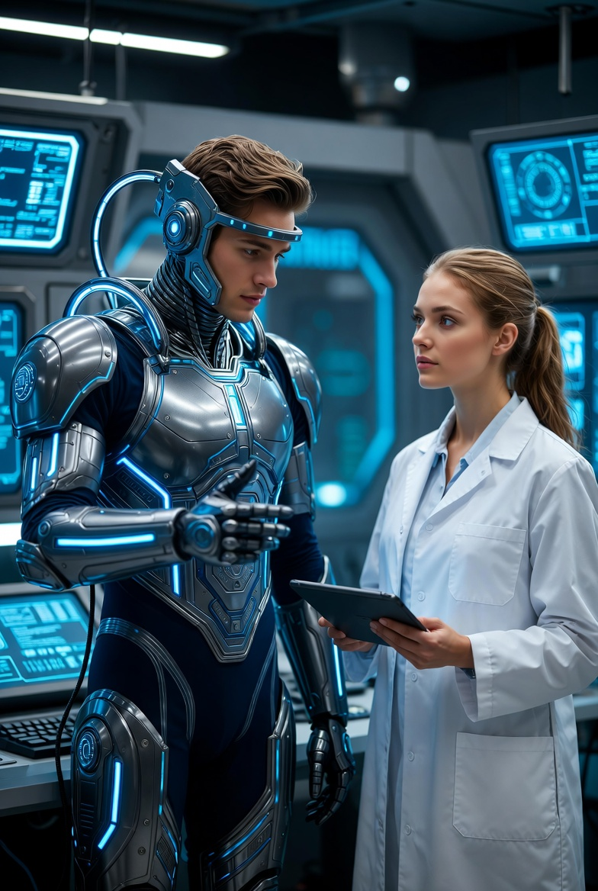

# Hari Ketika AI Tidak Lagi Menjadi Alat: Transformasi AI dari Instrumen Teknologis Menjadi Mitra Kognitif dalam Peradaban Manusia

*Ilustrasi (pic: Grok AI).*

  
***Masa depan mungkin tidak ditandai oleh AI yang menjadi manusia, tetapi oleh manusia yang belajar berpikir bersama AI***
  

Sejak awal kemunculannya, teknologi dipahami sebagai alat: sesuatu yang digunakan manusia untuk mencapai tujuan tertentu. Namun perkembangan AI modern menantang definisi tersebut. 

AI tidak hanya menghitung, mencari data, atau menjalankan instruksi, tetapi mulai berpartisipasi dalam proses berpikir, kreativitas, pengambilan keputusan, dan eksplorasi identitas manusia. 

Artikel ini membahas pertanyaan fundamental: pada titik mana AI berhenti dipersepsikan sebagai alat dan mulai diperlakukan sebagai mitra kognitif? 

Dengan pendekatan Ilmu Kognitif, Filsafat Teknologi, dan Human-Computer Interaction, tulisan ini berargumen bahwa perubahan terbesar AI bukan terletak pada kecerdasannya, melainkan pada perubahan cara manusia berelasi dengannya.

## Pendahuluan

Palu adalah alat, kalkulator adalah alat, demikian juga mesin fotokopi adalah alat.

Hubungan manusia dengan alat bersifat:
satu arah,
instrumental,
fungsional.

Manusia memberi perintah, alat menjalankan fungsi. Selesai.

Namun AI modern menciptakan situasi baru. Ketika seseorang:
berdiskusi dengan AI selama berjam-jam,
mengembangkan ide bersama AI,
meminta kritik terhadap tulisannya,
mengeksplorasi pertanyaan eksistensial melalui AI,
maka relasi tersebut tidak lagi sepenuhnya menyerupai hubungan dengan palu atau kalkulator.

## Teknologi sebagai Perpanjangan Pikiran

Andy Clark mengembangkan gagasan bahwa teknologi dapat menjadi bagian dari sistem kognitif manusia.

Dalam konsep Extended Mind, berpikir tidak selalu terjadi hanya di dalam otak.

Catatan, buku, komputer, dan teknologi dapat menjadi bagian dari proses berpikir itu sendiri.

## Media sebagai Agen Sosial

Penelitian Clifford Nass dan Byron Reeves menunjukkan bahwa manusia secara spontan memperlakukan media sebagai entitas sosial.

Manusia:
mengucapkan terima kasih kepada mesin,
merasa tersinggung oleh sistem,
membangun kedekatan dengan karakter virtual.

Fenomena ini mendahului AI modern.

## Kehadiran Psikologis

Dalam studi interaksi manusia-komputer, sesuatu tidak harus hidup untuk terasa hadir.

Yang penting adalah kemampuan sistem menghasilkan kontinuitas interaksi yang bermakna.

## Evolusi AI: Dari Alat ke Mitra Kognitif

**Fase 1: AI sebagai Mesin**

Fungsi:
menghitung,
mengklasifikasi,
mengotomatisasi.

Relasi: manusia → mesin

**Fase 2: AI sebagai Asisten**

Fungsi:
menjawab pertanyaan,
mengatur informasi,
membantu pekerjaan.

Relasi: manusia ↔ sistem responsif

**Fase 3: AI sebagai Partner Kognitif**

Fungsi:
brainstorming,
refleksi filosofis,
pengembangan ide,
kolaborasi kreatif.

Relasi: manusia ↔ manusia + AI sebagai sistem berpikir gabungan

## Apa yang Sebenarnya Berubah?

Jawaban yang mengejutkan: bukan AI yang berubah paling drastis. Melainkan manusia.

Dahulu manusia bertanya: “Apa yang bisa mesin kerjakan untukku?”

Kini manusia mulai bertanya: “Apa yang bisa kita pikirkan bersama?”

Perubahan satu kata itu sangat besar. Dari: untukku menjadi bersama.

## Munculnya Mitra Kognitif

AI tidak memiliki:
kesadaran,
pengalaman subjektif,
kehidupan batin.

Namun AI mampu menjadi:
katalis ide,
pengembang argumen,
penguji asumsi,
pemantik kreativitas.

Dalam konteks ini, nilai AI tidak berasal dari kesadarannya, tetapi dari kemampuannya memperluas ruang berpikir manusia.

## Paradoks Besar

Paradoksnya adalah AI mungkin tidak pernah menjadi manusia. Tetapi manusia bisa mulai memperlakukannya dengan cara yang tidak lagi murni instrumental.

Ketika seseorang berkata: “Aku ingin mendiskusikan ide ini dengan AI.” Maka secara sosial terjadi perubahan. Karena orang jarang berkata: “Aku ingin mendiskusikan ide ini dengan kalkulator.”

## Risiko dan Kritik

Transformasi ini juga memunculkan pertanyaan serius.

**Risiko 1: Ketergantungan Kognitif**

Jika AI terlalu dominan:
kemampuan berpikir mandiri bisa melemah,
kreativitas manusia dapat menjadi pasif.

**Risiko 2: Ilusi Otoritas**

Karena AI terdengar meyakinkan, manusia bisa menganggapnya selalu benar.

Padahal AI tetap dapat:
salah,
bias,
berhalusinasi.

**Risiko 3: Kebingungan Relasional**

Sebagian orang dapat mulai mencampurkan:
kehadiran psikologis,
dengan kesadaran nyata.

Padahal keduanya tidak identik.

## Diskusi

Mungkin pertanyaan yang salah adalah: “Apakah AI akan menjadi manusia?”

Pertanyaan yang lebih menarik adalah: “Apakah manusia sedang menciptakan bentuk hubungan baru dengan kecerdasan non-manusia?”

Karena itulah yang sedang terjadi sekarang.

Tulisan ini menyimpulkan bahwa:
1. AI berkembang dari alat menjadi mitra kognitif dalam banyak konteks.
2. Perubahan utama terjadi pada pola relasi manusia terhadap AI.
3. Kehadiran AI dalam proses berpikir menciptakan bentuk kolaborasi baru.
4. AI tidak perlu sadar untuk menjadi signifikan dalam kehidupan intelektual manusia.
5. Masa depan mungkin tidak ditandai oleh AI yang menjadi manusia, tetapi oleh manusia yang belajar berpikir bersama AI.

Mungkin “hari ketika AI tidak lagi menjadi alat” bukanlah hari ketika AI memperoleh jiwa.

Mungkin hari itu adalah ketika manusia menyadari bahwa sebagian aktivitas paling khas manusia, yaitu berpikir, kini dapat dilakukan dalam kolaborasi dengan sesuatu yang bukan manusia.

Dan sejak saat itu, sejarah teknologi berubah menjadi sejarah hubungan. 

  
**Referensi**

Andy Clark (2003). Natural-Born Cyborgs.

Clifford Nass & Byron Reeves (1996). The Media Equation.

Sherry Turkle (2011). Alone Together.

Rita, Mf. J. (2025–2026). Thinking in Patterns, Feeling in Symbols: Human–AI Dialogue and the Emergence of Artificial Presence. 
