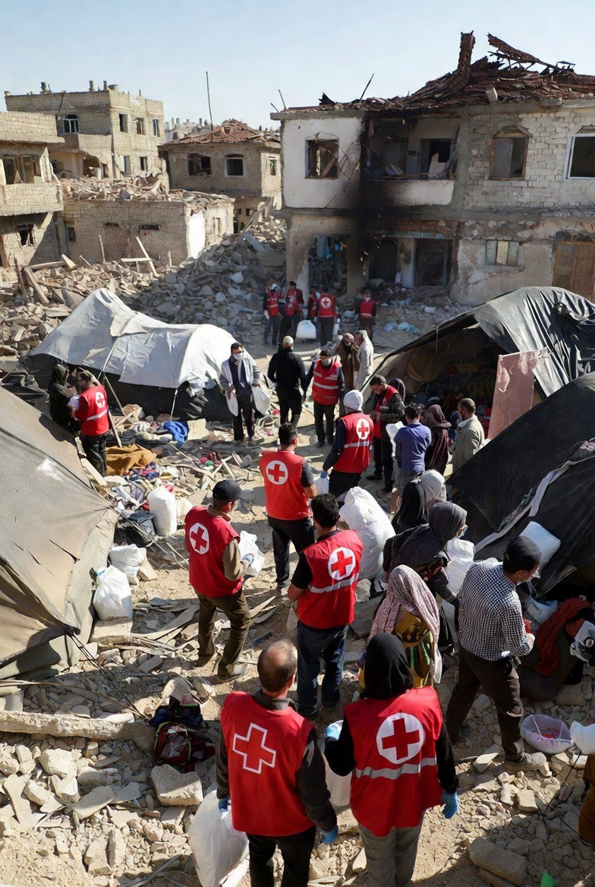

# Hari Palang Merah & Bulan Sabit Internasional 2026: Netralitas Kemanusiaan di Tengah Pembantaian Medis Gaza dan Lebanon

*Ilustrasi  kemanusiaan (pic: Grok AI).*

  
***Realitas Gaza dan Lebanon memperlihatkan krisis besar, perang modern semakin sulit membedakan antara ancaman dan kemanusiaan***
  

Tanggal 8 Mei diperingati sebagai Hari Palang Merah dan Bulan Sabit Merah Internasional, sebuah momentum global untuk menghormati prinsip kemanusiaan universal yang dipelopori Henry Dunant. 

Namun, peringatan tahun 2026 dibayangi oleh tuduhan serius terhadap Israel terkait serangan terhadap tenaga medis, ambulans, rumah sakit, dan pekerja kemanusiaan di Gaza serta Lebanon. 

Tulisan ini menganalisis paradoks modern: ketika simbol netralitas kemanusiaan justru menjadi target dalam konflik bersenjata.

## Pendahuluan

8 Mei adalah Hari Palang Merah dan Bulan Sabit Merah Internasional. Hari ini dipilih karena merupakan hari kelahiran Henry Dunant, pendiri gerakan kemanusiaan modern dan penerima Nobel Perdamaian pertama.  

Namun banyak orang salah paham:

Palang Merah ≠ organisasi Barat saja

Bulan Sabit Merah ≠ organisasi Islam yang terpisah

Keduanya berada dalam satu gerakan yang sama, yakni International Red Cross and Red Crescent Movement.

## Perbedaan Palang Merah dan Bulan Sabit Merah

Palang Merah

Digunakan lebih awal dalam sejarah Eropa.

Simbolnya:
latar putih,
palang merah,
Bukan simbol agama Kristen secara resmi, walau sering diasosiasikan demikian. 

Bulan Sabit Merah

Muncul terutama di negara-negara Muslim pada era Russo-Turkish War karena simbol palang dianggap sensitif secara budaya.

Fungsinya sama:
netral,
kemanusiaan,
perlindungan medis perang.

Prinsip Fundamentalnya Sama

Gerakan ini berdiri di atas:
Humanity,
Neutrality,
Impartiality,
Independence.

Tenaga medis datang tanpa senjata untuk menyelamatkan hidup. Artinya, mereka tidak boleh menjadi target perang.

Dan ketika bahkan orang-orang seperti itu ikut diburu… dunia mulai terasa seperti ruang yang kehilangan rem moralnya sendiri.

Secara teori.

Dan di sinilah tragedi modern dimulai.

## Serangan Terhadap Tenaga Medis

Dalam konflik Gaza dan Lebanon, berbagai organisasi internasional, media, dan badan HAM mendokumentasikan:
ambulans dibombardir,
paramedis tewas saat bertugas,
rumah sakit diserang,
dokter ditahan,
pekerja medis hilang atau disiksa.

## Rafah Paramedic Massacre (2025)

Salah satu kasus paling mengguncang adalah Rafah paramedic massacre.

Menurut berbagai laporan:
ambulans dan kendaraan bantuan ditembak,
15 pekerja bantuan tewas,
beberapa jasad ditemukan di kuburan massal,
ada laporan tubuh ditemukan masih diborgol.

Ini mengerikan bukan hanya karena kematiannya. Tapi karena simbol kemanusiaan global kehilangan perlindungan sakralnya.

## Dokter dan Tenaga Medis Ditahan

Laporan media internasional dan organisasi HAM juga menyebut adanya:
dokter Gaza ditahan Israel,
tuduhan penyiksaan,
penolakan akses medis terhadap tahanan tertentu.

Israel umumnya menyatakan beberapa fasilitas kesehatan atau personel diduga memiliki keterkaitan dengan kelompok bersenjata seperti Hamas atau Hezbollah. 

Namun kritik internasional menyoroti, bahwa hukum humaniter internasional tetap mewajibkan perlindungan terhadap fasilitas medis dan pekerja kemanusiaan kecuali ada bukti jelas penggunaan militer langsung.

## Analisis Ilmiah

A. Keruntuhan Sakralitas Netralitas

Dalam teori klasik Hukum Humaniter Internasional:
tenaga medis dilindungi,
ambulans dilindungi,
rumah sakit dilindungi,
Karena tanpa itu perang berubah menjadi penghancuran total terhadap kehidupan sipil.

Ketika simbol Palang Merah atau Bulan Sabit tidak lagi dihormati, maka:
batas etika perang mulai runtuh,
sipil kehilangan zona aman,
dan kemanusiaan berubah menjadi objek taktis.

B. “Militerisasi Kecurigaan”

Konflik modern menciptakan fenomena semua hal dianggap potensial ancaman

Akibatnya:
ambulans dicurigai,
rumah sakit dicurigai,
dokter dicurigai,
Ini disebut beberapa analis sebagai: securitization of humanitarian space. Ruang kemanusiaan dipandang melalui logika militer, bukan etika.

C. Trauma Moral Global

Yang paling mengerikan bukan hanya jumlah korban. Tetapi efek psikologis kolektif:
masyarakat mulai takut rumah sakit,
tenaga medis kehilangan rasa aman,
simbol Palang Merah kehilangan aura perlindungannya.

Padahal sejak abad ke-19, simbol itu seperti “jangan sentuh mereka, mereka datang untuk menyelamatkan nyawa.”

Dan sekarang… simbol itu sendiri ikut dihantam misil.

## Perspektif Etika dan Filsafat

Dokter sebagai “musuh”.

Dalam banyak peradaban:
dokter dianggap lintas perang,
perawat dianggap suci secara moral,
ambulans dianggap zona netral.

Ketika tenaga medis dibunuh, manusia tidak hanya menyerang tubuh lawan, tapi menyerang kemungkinan hidup itu sendiri.

Itulah kenapa dunia bereaksi sangat emosional terhadap kasus-kasus Gaza dan Lebanon.

Hari Palang Merah dan Bulan Sabit Merah Internasional pada 8 Mei seharusnya menjadi pengingat:
bahwa kemanusiaan harus berdiri di atas perang,
bahwa tenaga medis bukan target,
dan bahwa simbol netralitas harus tetap sakral.

Namun realitas Gaza dan Lebanon memperlihatkan krisis besar, perang modern semakin sulit membedakan antara ancaman dan kemanusiaan.

Ketika dokter dibunuh, ambulans dihancurkan, dan paramedis dikubur bersama borgol di tangannya… yang mati bukan hanya manusia.

Sedikit demi sedikit, yang ikut dikubur adalah ide bahwa perang masih punya batas moral.

  
**Referensi**

International Federation of Red Cross and Red Crescent Societies. (2026). World Red Cross and Red Crescent Day.

International Committee of the Red Cross. (2025). ICRC appalled by killing of PRCS medics.

The Guardian. (2025). Palestinian medic detained in Israel.

Associated Press. (2026). Israeli strikes on medics in Lebanon.

WHO Reports on attacks on healthcare in conflict zones.
