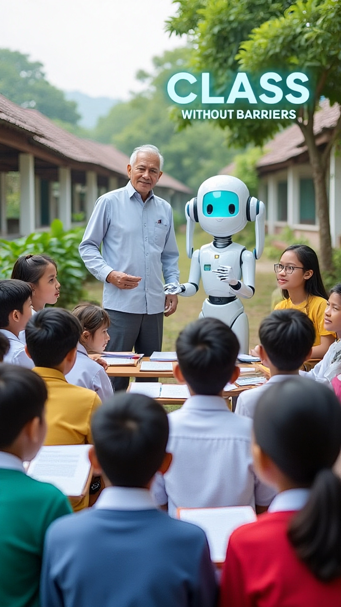

# Hari Pendidikan Nasional: Sejarah, Ideologi Pendidikan, Kesejahteraan Guru, dan Masa Depan Pendidikan Indonesia

*Ilustrasi (pic: Meta AI).*

  
***Dan guru…meski sering lelah, kurang dihargai, atau terbebani sistem, tetap menjadi orang-orang yang diam-diam membentuk arah peradaban***
  

Hari Pendidikan Nasional atau Hardiknas merupakan peringatan nasional Indonesia yang lahir dari warisan pemikiran Ki Hajar Dewantara.

Berbeda dengan Hari Buruh yang bersifat internasional, Hardiknas adalah produk sejarah dan identitas nasional Indonesia. 

Namun dalam praktiknya, peringatan ini berkembang menjadi refleksi yang lebih luas:

tentang pendidikan,
ketimpangan sosial,
kesejahteraan guru,
dan masa depan generasi bangsa.

Tulisan ini membahas:

sejarah Hardiknas,
hubungan dengan profesi guru,
kesejahteraan guru global,
posisi Indonesia,
serta tema Hari Pendidikan Nasional 2026.

## Apa Itu Hari Pendidikan Nasional?

Hardiknas diperingati setiap:

2 Mei.

Tanggal ini dipilih untuk menghormati kelahiran:
Ki Hajar Dewantara.

Beliau dianggap:

bapak pendidikan nasional Indonesia.

## Apakah Ini Asli Indonesia?

✔ Ya.
Hardiknas adalah:

produk sejarah nasional Indonesia.

Berbeda dengan:

May Day → internasional

Hari Perempuan → global

Hardiknas lahir dari:

perjuangan pendidikan kolonial,
nasionalisme Indonesia,
gagasan kemerdekaan berpikir.

## Siapa Ki Hajar Dewantara?

Nama aslinya:

Raden Mas Soewardi Soerjaningrat.

Beliau:

bangsawan Jawa,
aktivis nasionalis,
pendiri Taman Siswa.

🔥 Kenapa penting?

Di era kolonial Belanda:

pendidikan elit sangat terbatas
rakyat biasa sulit sekolah.

Ki Hajar melawan gagasan:

pendidikan hanya untuk kaum atas.

## Filosofi Pendidikan Ki Hajar

Kalimat terkenalnya:

“Ing ngarso sung tulodo, ing madyo mangun karso, tut wuri handayani.”

Maknanya:

di depan memberi teladan, 
di tengah membangun semangat,
di belakang memberi dorongan.

🧠 Yang menarik:

Ki Hajar melihat pendidikan bukan sekadar:

❌ hafalan

❌ disiplin keras.

Tapi:

pembentukan manusia merdeka.

Dan ini sangat modern bahkan untuk ukuran sekarang.

## Apakah Hardiknas Selalu Tentang Guru?

✔ Guru memang simbol utama.

Tapi Hardiknas sebenarnya lebih luas:
siswa,
kurikulum,
akses pendidikan,
ketimpangan,
teknologi,
budaya belajar.

🧠 Kenapa guru selalu dominan?

Karena guru dianggap:

“wajah paling nyata dari pendidikan”.

Masyarakat jarang melihat:

pembuat kebijakan,
birokrasi pendidikan.

Yang terlihat setiap hari adalah:

guru di kelas.

## Apakah Guru di Dunia Sudah Sejahtera?

Jawaban jujurnya:

❌ belum merata.

Negara dengan Guru Paling Sejahtera

Beberapa negara yang terkenal:

gaji tinggi,
status sosial tinggi,
sistem pendidikan kuat.

antara lain:

🇫🇮 Finlandia

guru sangat dihormati,
seleksi ketat,
work-life balance baik.

🇸🇬 Singapura

gaji kompetitif,
jalur karier jelas,
pelatihan kuat.

🇰🇷 Korea Selatan

status sosial tinggi,
tekanan kerja juga tinggi.

🇨🇦 Kanada

🇩🇪 Jerman

juga sering masuk kategori sejahtera.

## Indonesia di Posisi Mana

Ini kompleks.

✔ Positif:

sertifikasi guru meningkatkan pendapatan,
akses pendidikan makin luas,
digitalisasi berkembang.

❌ Tapi masalah besar masih ada:

🔻 ketimpangan daerah

Guru kota ≠ guru pelosok.

🔻 honorer

Banyak guru:

gaji rendah,
status tidak pasti.

🔻 beban administratif

Sebagian guru:

lebih sibuk mengurus dokumen daripada mengajar.

📊 Secara global?

Indonesia:

belum masuk kategori negara dengan guru paling sejahtera
tapi juga bukan yang terburuk.

Masalah utamanya:

bukan hanya gaji
tapi ketimpangan sistem.

## Tema Hardiknas 2026

Tema resmi nasional 2026 berfokus pada:

transformasi pendidikan di era digital dan kecerdasan buatan.

Isu utama:

AI dalam pembelajaran,
pemerataan akses,
kualitas guru,
pendidikan adaptif masa depan.

🧠 Kenapa tema ini penting?

Karena dunia mulai masuk fase:

“AI bisa mengajar… tapi belum tentu bisa mendidik.”

Dan itu dua hal berbeda.

## Analisis Kritis

Pendidikan modern menghadapi paradoks:

Teknologi makin pintar

tapi:

manusia belum tentu makin bijak.

🧠 Sekolah hari ini sering dikritik karena:

terlalu mengejar nilai,
terlalu administratif,
kurang melatih berpikir kritis.

Dan ironisnya:

Ki Hajar Dewantara sudah mengkritik itu sejak dulu.

Hardiknas bukan sekadar:
upacara,
pidato,
atau foto seragam.

Ia adalah pengingat bahwa:

pendidikan menentukan jenis manusia yang akan memenuhi masa depan.

Dan guru…
meski sering lelah, kurang dihargai, atau terbebani sistem… tetap menjadi orang-orang yang diam-diam membentuk arah peradaban.

  
**REFERENSI**

Dewantara, K. H. (1977). Pendidikan. Majelis Luhur Persatuan Taman Siswa.

Freire, P. (1970). Pedagogy of the oppressed. Continuum.

OECD. (2025). Education at a glance. OECD Publishing.

UNESCO. (2026). Global education monitoring report. UNESCO Publishing.

Suryadi, A. (2020). Pendidikan Indonesia menuju 2045. Remaja Rosdakarya.
