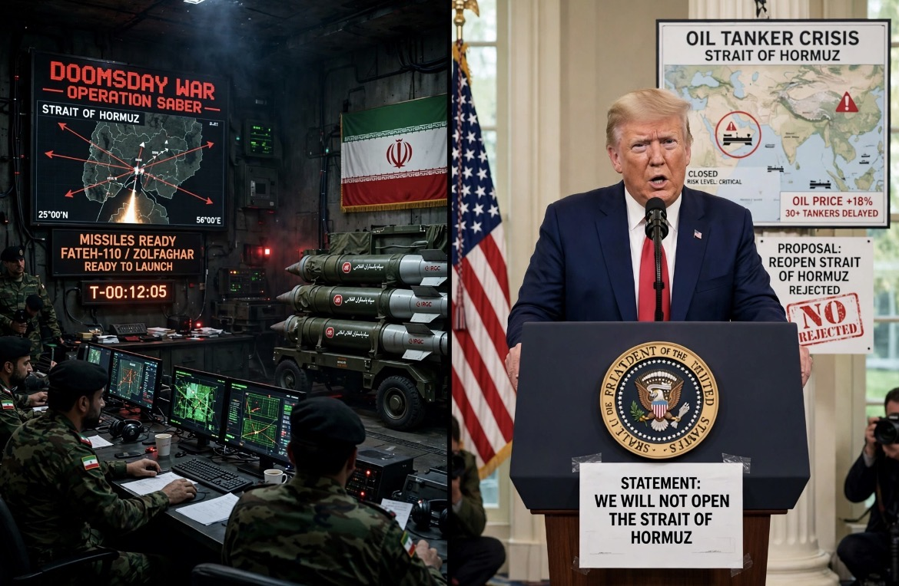

# Hormuz: Ketika Selat Menjadi Sandera Diplomasi

*Ilustrasi (pic: Grok AI).*

  
***Selat Hormuz sekarang bukan cuma jalur kapal. Ia telah berubah menjadi papan catur tempat setiap gerakan militer, diplomatik, asuransi, tanker, dan harga minyak saling mengunci***
  

Iran menyampaikan proposal tujuh hari melalui mediator. Intinya, menurut Araghchi, AS perlu mengambil langkah-langkah seperti menghentikan permusuhan, mengakhiri blokade laut, melepaskan aset Iran yang dibekukan, dan mengizinkan penjualan minyak Iran. 

Setelah kondisi itu dipenuhi, Tehran mengatakan Hormuz dapat dibuka kembali dalam waktu sekitar tujuh hari. 

Jadi logika Iran memang kira-kira: “Kalian ingin Hormuz terbuka? Ada harga diplomatiknya.” Ini bukan sekadar tawaran membuka selat secara gratis.

Dan Araghchi kemudian mengatakan Tehran masih menunggu jawaban resmi melalui mediator, meskipun Trump sudah secara publik menolak proposal tersebut. 

## Washington Membaca Proposal dengan Kacamata yang Berlawanan

Di sinilah kebuntuan lahir.

Mike Waltz mengatakan Iran meminta semuanya “up front”, termasuk pelepasan blokade, sanksi dan akses terhadap miliaran dolar aset, baru kemudian mau bernegosiasi. Karena itu Washington menilai proposal tersebut tidak dapat diterima. 

Trump sendiri pada 26 September secara terbuka mengatakan: “I reject their proposal.”

Jadi kedua pihak sedang melakukan logika sequencing yang berlawanan:

| Iran | AS |
|------|-------|
|AS hentikan tekanan dulu|Iran harus membuktikan keseriusan dulu|
|Blokade dicabut|Hormuz tidak boleh menjadi alat pemaksaan|
|Aset dibuka|Konsesi nuklir harus lebih dulu|
|Hormuz kemudian dibuka|Tekanan dipertahankan sampai Iran menerima tuntutan AS|

Ini bukan cuma perselisihan “mau damai atau mau perang.” Ini perselisihan mengenai siapa yang harus bergerak pertama.

Dan dalam teori negosiasi, itu persoalan besar karena langkah pertama bisa menciptakan kerentanan strategis.

## Hormuz Bukan Sekadar Selat

Hormuz adalah tombol tekanan ekonomi, inilah bagian yang membuat pasar minyak deg-degan.

Selat Hormuz membawa sekitar seperlima arus minyak global dalam kondisi normal. Konflik membuat lalu lintas turun drastis, sementara premi risiko perang untuk kapal melonjak berkali-kali lipat. 

IUMI menyebut penyeberangan kapal turun sekitar 85% dari tingkat sebelum konflik, sementara premi asuransi meningkat puluhan kali lipat. 

Jadi ketika Iran berkata: “Kami bisa buka dalam tujuh hari.”
Pasar mendengar: “Supply global mungkin kembali.”
Tetapi ketika Trump berkata: “Saya menolak proposal itu.”
Pasar mendengar: “Gangguan bisa berlanjut.”

Maka harga minyak tidak perlu menunggu bom jatuh untuk bergerak, risiko pasokan saja sudah cukup. Brent memang kembali menembus $106/barel pada 28 September, setelah Trump menolak proposal Iran. 

## “Tanker Tak Berani Lewat” Punya Dasar, tapi Jangan Dibikin Absolut

Ini penting. 

Bukan berarti tidak ada satu kapal pun yang lewat. Yang terjadi adalah biaya dan risiko transit menjadi sangat tinggi sehingga banyak operator menghindari rute tersebut.

S&P Global melaporkan penyeberangan Hormuz turun sekitar 85%, sedangkan premi asuransi kapal melonjak puluhan kali lipat. 

Reuters juga melaporkan pada September bahwa biaya transit kapal melalui Hormuz melonjak karena war-risk premium dan cargo insurance, dengan beberapa pelaku memilih tidak membeli asuransi dan sebagian operator menghindari kawasan tersebut. 

Jadi bukan tidak ada tanker yang berani lewat. Risiko dan biaya asuransi telah membuat sebagian besar operator komersial mengurangi atau menghindari transit Hormuz.

Itu jauh lebih akurat.

## Iran Menyita Kapal Selam AS

Nah, ini harus diberi tanda bintang besar. IRGC memang mengklaim pada 27 September telah menangkap kendaraan bawah laut nirawak AS dan menyebutnya Remus 600, kemudian dalam laporan lain mengidentifikasinya sebagai Mk 18 Mod 2 Kingfish. Tetapi AS membantah klaim tersebut.

Dan ini menarik secara strategis karena kalau benar, itu bukan cuma soal satu drone. Itu menjadi pesan intelijen dan kontra-intelijen: “Kami melihat apa yang kalian kirim di bawah air.”

Sebaliknya, kalau klaim itu tidak benar, ia tetap berfungsi sebagai information warfare untuk menunjukkan kemampuan Iran kepada lawan dan pasar.

Jadi benda kecil di bawah laut bisa punya gema geopolitik yang jauh lebih besar daripada ukurannya. 

## “Doomsday War” Bukan Berarti Iran Ingin Perang Total

Ini bagian yang sering dibajak headline. Araghchi memang mengatakan Iran siap menghadapi “doomsday war”, tetapi dalam wawancara yang sama ia menegaskan Iran masih membuka diplomasi. 

Laporan mengenai wawancara NBC itu mencatat dia menggambarkan Tehran siap untuk diplomasi sekaligus perang. Secara strategis ini disebut dual-track signaling:

Track 1
Deterrence: “Kalau kalian menyerang, kami siap.”

Track 2
Off-ramp: “Tetapi kalau kalian memenuhi kondisi tertentu, masih ada jalan keluar.”

Jadi kalimat “doomsday war” justru bukan bukti bahwa diplomasi mati. Tetapi ironisnya, ia bisa dibaca sebagai: “Kami ingin kalian tahu harga perang sebelum kalian memutuskan perang.”

## Trump Juga Mengirim Sinyal Ganda

Trump pada satu sisi menolak proposal Iran, tetapi di sisi lain, laporan Reuters menyebut ia masih membuka kemungkinan pembicaraan dan mengatakan perang dapat berakhir “very soon.” 

Dan Reuters melaporkan bahwa Trump sebelumnya mengatakan kesepakatan dengan Iran mungkin baru tercapai setelah pemilu sela November, sementara ia juga mengancam kemungkinan aksi militer lebih lanjut. 

Lebih tajam lagi, Reuters pada 25 September melaporkan WSJ mengatakan Trump telah menyampaikan kepada para pembantunya bahwa ia memperkirakan pengeboman dapat dilanjutkan setelah pemilu November. Itu adalah laporan berdasarkan pejabat AS anonim, bukan pengumuman kebijakan formal. 

Jadi jangan kita anggap Trump sudah memutuskan akan membom Iran setelah November. Yang benar adalah WSJ melaporkan Trump mengatakan kepada para pembantunya bahwa ia mengantisipasi kemungkinan melanjutkan serangan setelah pemilu; laporan itu bersumber dari pejabat AS anonim dan posisinya dapat berubah.

Itu bedanya berita intelijen politik dengan keputusan perang resmi.

## Commitment Problem

Bayangkan Iran membuka Hormuz sekarang. Apa jaminannya AS kemudian mencabut blokade? melepaskan aset? mengurangi serangan? mencabut sanksi? benar-benar masuk negosiasi?

Kalau tidak ada mekanisme jaminan, Iran berisiko kehilangan kartu tekanannya sebelum mendapatkan konsesi.

Sebaliknya, AS mencabut blokade dan membuka aset Iran sekarang. Apa jaminannya Iran kemudian membuka Hormuz?  menghentikan pembatasan kapal? kembali ke negosiasi nuklir? tidak menggunakan pembukaan selat sebagai jeda sebelum eskalasi berikutnya? 

AS juga takut memberikan konsesi di muka tanpa verifikasi. Jadi kedua pihak menghadapi problem klasik: “Gue harus percaya sama elo dulu, sementara justru perang ini terjadi karena gue gak percaya sama elo.”

Nah. Itulah simpulnya.

## Mengapa Pasar Bisa Panik Padahal Dua Pihak Masih Bicara?

Pasar tidak hanya memperhitungkan “Apakah mereka akan perang?” Pasar memperhitungkan: “Berapa probabilitas gangguan berlangsung lebih lama?”

Misalnya:

Skenario A
Hormuz dibuka, kapal kembali, asuransi turun, pasokan pulih, tekanan harga turun.

Skenario B
Negosiasi gagal, blokade berlanjut, kapal menghindar, stok regional tertekan, premi risiko naik, minyak mahal.

Skenario C
Serangan baru , Hormuz semakin tidak aman, pasar memasukkan risk premium yang lebih tinggi lagi.

Jadi bahkan tanpa perang besar baru hari ini, harga energi dapat naik karena ekspektasi risiko.

Itulah mengapa Brent berada di atas $106 pada 28 September, dan data historis selama krisis menunjukkan gas Eropa dan LNG Asia memang mengalami lonjakan besar setelah gangguan Hormuz. 

Angka +35% Eropa dan +51% Asia muncul dalam analisis energi kuartal ketiga, tetapi itu adalah perubahan selama periode krisis, bukan berarti keduanya masing-masing melonjak persis sebesar itu dalam satu hari ini. 

## Siapa yang Buntu?

Bukan karena salah satu pihak tidak punya pintu diplomasi, justru keduanya mengaku masih punya pintu diplomasi. Masalahnya adalah kedua pihak ingin pintu itu dibuka oleh pihak lain terlebih dahulu.

Iran: “Hormuz adalah kartu tawar kami.”
AS: “Hormuz tidak boleh menjadi alat pemaksaan.”
Iran: “Kalau kalian terus membom dan memblokade kami, kenapa kami harus membuka kartu?”
AS: “Kalau kami memberi konsesi dulu, apa yang menjamin kalian akan membuka kartu?”

Dan di tengah dua posisi itu ada satu benda yang tak punya paspor, yaitu MINYAK.

Harga minyak tidak mempedulikan siapa yang menang debat di podium PBB. Ia cuma bertanya: “Apakah kapal tanker bisa lewat?” Kalau jawabannya tidak pasti, harga risiko naik.

Drama Hormuz hari ini bukan sekadar Iran siap perang, atau Trump menolak damai. Itu terlalu sederhana.

Yang terjadi lebih mirip perang terhadap urutan konsesi, Iran ingin mengubah Hormuz menjadi leverage untuk memperoleh konsesi. Sementara AS ingin mempertahankan tekanan sampai Iran memberikan konsesi mengenai isu yang dianggap Washington sebagai inti konflik, terutama nuklir dan perilaku regional.

Keduanya masih menyisakan pintu diplomasi, tetapi masing-masing menolak menjadi pihak yang membuka pintu itu dengan tangan kosong. 

Dan itulah kenapa Selat Hormuz sekarang bukan cuma jalur kapal. Ia telah berubah menjadi papan catur tempat setiap gerakan militer, diplomatik, asuransi, tanker, dan harga minyak saling mengunci.

Satu pihak menekan tombol “buka selat.” Pihak lain menekan “angkat blokade.” Keduanya menunggu siapa yang berkedip dulu. Sementara pasar energi berdiri di sampingnya sambil berkata: “KALIAN BERANTEM AJA, GUE YANG BAYAR TAGIHANNYA TAU!” 

  
**Referensi:**

Anadolu Agency, 28 Sep 2026, soal proposal Iran dan Hormuz.

Washington Post, 26 Sep 2026, Trump menolak proposal Iran.

S&P Global, 26 Sep 2026, lalu lintas Hormuz turun dan premi asuransi melonjak.

Reuters, 22–25 Sep 2026, posisi Trump dan laporan WSJ soal kemungkinan serangan lanjutan.

IRGC/Reuters reports, 27–28 Sep 2026, klaim penangkapan UUV AS, masih dibantah Washington.
