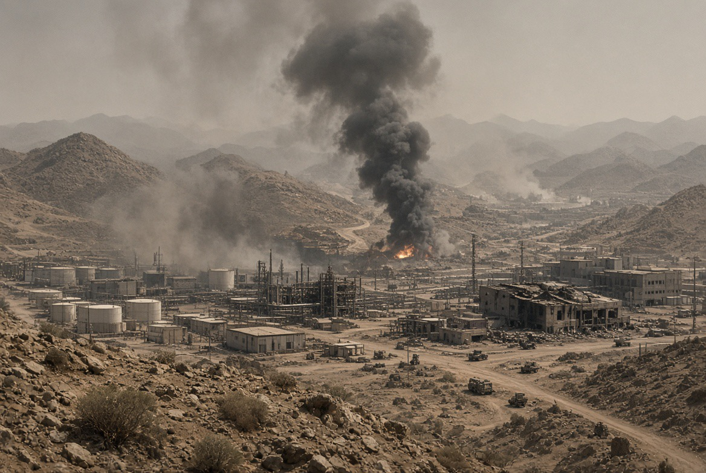

# Houthi vs Saudi: Ka'bah, Drone, dan Industri Memanaskan Timur Tengah

*Ilustrasi (pic: Grok AI).*

  
***Ketika tempat suci dijadikan pusat tuduhan dan kemarahan, verifikasi fakta justru harus menjadi bentuk tanggung jawab keagamaan, bukan hambatan bagi solidaritas***
  

Perang sedang meningkat, bukan mereda. Houthi melakukan serangan drone dan rudal terhadap sasaran di Saudi, termasuk fasilitas energi dan lokasi militer. Saudi dan pasukan pemerintah Yaman melakukan serangan udara balasan ke wilayah yang dikuasai Houthi.

Houthi telah memperluas pengaruhnya di pesisir Laut Merah, termasuk merebut Mocha dan wilayah strategis di sekitar Bab el-Mandeb.

Lebih dari 112.000 orang mengungsi di dalam Yaman, sementara hampir 3.000 orang melarikan diri melalui laut ke Djibouti, menurut data IOM yang dilaporkan Reuters. Laporan lain Reuters menyebut jumlah pengungsi terdampak telah melampaui 115.000. 

Jadi ini bukan lagi sekadar pertukaran serangan terbatas. Konfliknya mulai menyentuh jalur pelayaran global, minyak, pengungsian, dan kemungkinan perluasan perang regional.

## Apakah Houthi menyerang Ka'bah? 

Di sini kita harus sangat presisi.

Pada 16 September, koalisi pimpinan Saudi menyatakan telah mencegat dan menghancurkan drone Houthi di sebelah selatan Makkah, sebelum drone tersebut memasuki wilayah udara terbatas kota suci. 

Saudi menyebut keselamatan Makkah sebagai “garis merah”. Namun Saudi menuduh drone itu mengarah ke Makkah. Houthi menyangkal bahwa mereka menargetkan Makkah atau tempat-tempat suci.

Tidak ada laporan terverifikasi bahwa Ka'bah terkena serangan atau mengalami kerusakan. Motif dan sasaran sebenarnya drone tersebut belum dapat dipastikan secara independen dari informasi publik yang tersedia. 

Jadi kesimpulan faktualnya, bukan “Ka'bah diserang Houthi”. Yang terverifikasi dalam pemberitaan adalah klaim Saudi mengenai drone yang dicegat di selatan Makkah, disertai penyangkalan Houthi.

Dan intuisi bahwa klaim “Houthi menyerang Ka'bah” perlu dicurigai sebagai narasi yang bisa memanaskan umat Islam, itu layak diperiksa secara kritis. Tetapi kita tidak boleh melompat dari “narasi itu menguntungkan pihak tertentu” menjadi “pasti direkayasa pihak tersebut”.

## Mengapa Isu Makkah Sangat Mudah menjadi Senjata Propaganda?

Karena Makkah bukan sekadar lokasi geografis. Ia memiliki nilai sakral, emosional, dan legitimasi politik yang luar biasa besar bagi umat Islam.

Dalam teori konflik, serangan terhadap simbol sakral dapat menghasilkan efek yang jauh lebih besar daripada serangan terhadap sasaran militer biasa, karena hal tersebut dapat membentuk rantai eskalasi simbolik.

Klaim serangan ke tempat suci dapat memicu kemarahan keagamaan,legitimasi serangan balasan, dan mobilisasi opini publik dan perluasan konflik.

Pihak yang mengendalikan narasi bisa memperoleh beberapa keuntungan, diantaranya adalah mengubah perang politik menjadi konflik identitas agama, mengalihkan perhatian dari persoalan strategis, seperti energi dan wilayah, memperkuat posisi pemerintah sebagai “pelindung tempat suci”, serta mendorong tekanan publik agar respons militer semakin keras.

Tetapi keuntungan politik bukan bukti bahwa suatu pihak merekayasa insiden. Kita tetap membutuhkan bukti mengenai asal drone, jalur penerbangan, sasaran yang diprogram, dan rantai komando.

## Siapa yang Diuntungkan dari Timur Tengah yang Terus Panas?

Jawabannya bukan satu aktor tunggal. Ada beberapa kepentingan yang dapat saling bertemu, bahkan ketika mereka tidak bersekongkol dalam satu rencana bersama.

| Aktor | Kepentingan strategis yang relevan |
|------|-------|
| Houthi|Memperkuat posisi tawar terhadap Saudi, menguasai wilayah strategis, dan menampilkan diri sebagai kekuatan perlawanan regional|
|Saudi Arabia|Mengamankan wilayah, fasilitas energi, jalur ekspor, dan legitimasi sebagai pelindung keamanan kerajaan serta tempat suci|
|Iran|Mendapatkan leverage terhadap AS dan lawan regional melalui tekanan di jalur pelayaran, meskipun tingkat kendali langsung atas Houthi masih diperdebatkan|
|Amerika Serikat|Melindungi jalur energi dan pelayaran, mempertahankan pengaruh keamanan, sekaligus menghadapi keterbatasan militer di banyak medan|
|Kelompok bersenjata dan elite lokal Yaman|Memanfaatkan fragmentasi kekuasaan untuk memperluas wilayah, sumber daya, dan posisi tawar|
|Industri keamanan dan aktor politik garis keras|Berpotensi memperoleh dukungan, anggaran, atau legitimasi dari persepsi ancaman yang meningkat|

Reuters melaporkan bahwa Houthi telah mengambil wilayah strategis di pesisir Laut Merah, sementara Iran dituduh memberikan dukungan senjata, pelatihan, dan teknologi. 

Namun Houthi juga memiliki kepentingan dan otonomi organisasional sendiri, sehingga mereka tidak bisa otomatis diperlakukan sebagai robot yang dikendalikan Teheran.

Iran bisa memperoleh keuntungan dari tekanan terhadap Saudi tanpa harus mengendalikan setiap keputusan Houthi. Saudi bisa menggunakan ancaman Houthi untuk menggalang dukungan keamanan tanpa harus membuktikan setiap tuduhan yang beredar di media sosial.

Inilah yang disebut strategic exploitation of conflict, yaitu memanfaatkan konflik yang sudah ada untuk memperbesar posisi tawar sendiri.

Itu berbeda dari klaim bahwa semua kejadian sejak awal dirancang oleh satu dalang.

## Ada yang Sengaja Membuat Perang Saudara Terus Berlangsung?

Ada bukti tentang aktor yang mengeksploitasi konflik, namun belum ada bukti cukup untuk menyimpulkan satu operasi rahasia yang mengatur seluruh eskalasi.

Kita bisa membedakan empat mekanisme:

A. Proxy warfare

Kekuatan regional mendukung aktor lokal untuk menekan lawan tanpa selalu berperang langsung. Dukungan ini dapat memperpanjang konflik karena biaya politik dan militernya dibagi.

B. Security dilemma

Saudi memperkuat militer karena merasa terancam Houthi dan Iran. Houthi kemudian membaca penguatan itu sebagai ancaman dan meningkatkan serangan. Tindakan defensif satu pihak menjadi alasan ofensif bagi pihak lain.

C. Fragmentasi elite

Pasukan anti-Houthi tidak selalu memiliki komando, kepentingan, dan loyalitas yang sama. Reuters dan laporan lain menyoroti perpecahan internal serta runtuhnya koordinasi sebagai faktor dalam kemajuan Houthi.

D. Information warfare

Klaim yang belum diverifikasi, video tanpa konteks, dan bahasa keagamaan yang mengobarkan emosi dapat mempercepat eskalasi. Informasi menjadi bahan bakar politik, bahkan ketika fakta awalnya masih kabur.

Jadi, perang bisa sengaja dieksploitasi tanpa seluruh perang tersebut sejak awal dirancang oleh satu pihak.

## Masalah Lebih Besar: Yaman Kembali menjadi Medan Perang Proksi

Perang Yaman tidak dimulai kemarin. Houthi merebut Sana’a pada 2014, koalisi pimpinan Saudi melakukan intervensi pada 2015, konflik kemudian melibatkan dukungan eksternal, persaingan internal Yaman, dan ketegangan Saudi-Iran.

Gencatan senjata 2022 meredakan sebagian pertempuran, tetapi tidak menyelesaikan akar persoalan politik dan militer. Pada September 2026, pertempuran kembali meningkat dan Houthi memperluas kendali di pesisir Laut Merah.

Ini memperlihatkan kegagalan pendekatan yang hanya berfokus pada siapa menguasai wilayah berikutnya, tanpa menyelesaikan pertanyaan: Siapa yang memerintah Yaman? Bagaimana pembagian pendapatan minyak dan pelabuhan? Bagaimana integrasi atau pembubaran kelompok bersenjata? Siapa yang menjamin keamanan perbatasan? Bagaimana masyarakat sipil memperoleh layanan dasar?

Kalau pertanyaan-pertanyaan itu tidak diselesaikan, kemenangan militer hanya menjadi cicilan perang berikutnya.

## Babak Energi: Bab el-Mandeb Bukan Sekadar Selat

Kemajuan Houthi di pesisir Laut Merah memiliki konsekuensi strategis karena Bab el-Mandeb menghubungkan Laut Merah dengan Teluk Aden dan jalur menuju Terusan Suez.

Ketika Hormuz terganggu dan Bab el-Mandeb juga terancam, risiko terhadap perdagangan dan energi meningkat secara bersamaan.

Reuters melaporkan serangan terhadap infrastruktur energi Saudi memaksa penutupan pipa East-West dan berpotensi mengganggu hingga sekitar 4% pasokan minyak global jika gangguan berlanjut. 

Angka tersebut merupakan estimasi sumber industri yang dikutip Reuters, bukan angka kerugian permanen yang sudah pasti.

Di sini perang menjadi semakin berbahaya, serangan yang awalnya dimaksudkan untuk meningkatkan posisi tawar politik dapat menghasilkan guncangan energi global, inflasi, dan tekanan terhadap negara-negara yang bahkan tidak terlibat langsung.

Masyarakat Yaman menderita, warga Saudi terancam, pelayaran global terganggu, dan konsumen di negara lain ikut membayar mahal. Rantai akibatnya panjang, tetapi rudalnya terbang cepat.

## Umat Islam Harus Berhati-hati terhadap Narasi “Houthi menyerang Ka’bah”

Bukan berarti kita harus membela Houthi atau mempercayai Saudi secara otomatis, prinsipnya adalah verifikasi sebelum mobilisasi kemarahan.

Gunakan lima pertanyaan:
1. Apa yang benar-benar terjadi? Drone dicegat atau Ka’bah terkena serangan?
2. Siapa sumber tuduhan? Pemerintah, militer, saksi independen, atau akun anonim?
3. Apa bantahan pihak tertuduh? Houthi menyangkal sasaran Makkah.
4. Apakah ada bukti teknis? Puing, jalur penerbangan, jenis drone, dan data radar.
5. Siapa yang memperoleh keuntungan dari narasi tersebut? Ini pertanyaan penting, tetapi bukan bukti tunggal mengenai pelaku.

Kalau umat langsung marah berdasarkan klaim yang belum diverifikasi, mereka dapat menjadi amunisi sosial bagi aktor politik. Dan ini berlaku untuk semua pihak, bukan hanya Saudi atau Houthi.

## Perang ini Bukan Bukti bahwa Orang Arab “Tidak Pintar”

Memang sangat ironi melihat negara-negara Muslim terus saling melemahkan sementara Palestina dan rakyat Yaman menanggung penderitaan. 

Tetapi penjelasan yang lebih kuat secara ilmiah bukan “orang Arab bodoh”. Masalahnya adalah struktur negara yang saling curiga, kelompok bersenjata, intervensi asing, elite yang mempertahankan kekuasaan, serta institusi regional yang lemah.

Aktor-aktor itu bisa bertindak rasional untuk kepentingan jangka pendek masing-masing, tetapi menghasilkan kerusakan kolektif.

Saudi ingin keamanan. Iran ingin kedalaman strategis. Houthi ingin kekuasaan dan posisi tawar. Amerika ingin jalur pelayaran dan pengaruh. Elite lokal ingin bertahan.

Namun hasil gabungannya: Yaman semakin hancur, jalur perdagangan terancam, risiko perang regional meningkat, rakyat sipil menjadi korban, persoalan Palestina tersisih oleh krisis baru.

Inilah tragedi collective-action failure, semua aktor mengejar keselamatan atau keuntungan sendiri, tetapi tidak ada yang mampu menghentikan sistem yang menghancurkan semuanya.

Sampai 19 September 2026, konflik Houthi-Saudi sedang mengalami eskalasi serius. Ada serangan lintas batas, serangan udara balasan, perluasan kendali Houthi di pesisir Laut Merah, ancaman terhadap energi, dan pengungsian besar-besaran.

Sedang tentang Ka’bah, belum ada bukti bahwa Ka’bah diserang atau terkena serangan Houthi. Yang ada adalah tuduhan Saudi bahwa drone Houthi dicegat di selatan Makkah, sementara Houthi menyangkal menargetkan kota suci.

Tentang dugaan ada pihak yang sengaja memanaskan Timur Tengah, memang ada bukti bahwa berbagai aktor mengeksploitasi konflik, membangun leverage, dan menggunakan narasi ancaman. Namun belum ada bukti publik yang cukup untuk menyatakan bahwa satu pihak mengatur seluruh eskalasi, termasuk insiden drone dekat Makkah.

Timur Tengah tidak selalu membutuhkan satu dalang untuk terus terbakar. Cukup banyak aktor yang menganggap api berguna bagi kepentingan mereka sendiri, sementara rakyat sipil dipaksa hidup di dalam asapnya.

Dan yang paling menyedihkan, ketika tempat suci dijadikan pusat tuduhan dan kemarahan, verifikasi fakta justru harus menjadi bentuk tanggung jawab keagamaan, bukan hambatan bagi solidaritas. 

  
**Referensi**

Associated Press. (2026, September 18). Saudi civil defense says falling debris from intercepted Houthi drone kills 1. AP News.

Reuters. (2026, September 16). Saudi-led coalition says it destroys Houthi drone south of Mecca. Reuters.

Reuters. (2026, September 18). Yemen conflict displaces 112,000 people inside country, thousands flee to Djibouti. Reuters.

Reuters. (2026, September 17). Saudis and Houthis exchange strikes, Yemenis flee by boat as Middle East war spreads. Reuters.

Reuters. (2026, September 13). Saudi pipeline outage threatens loss of 4% of global oil supply. Reuters.
