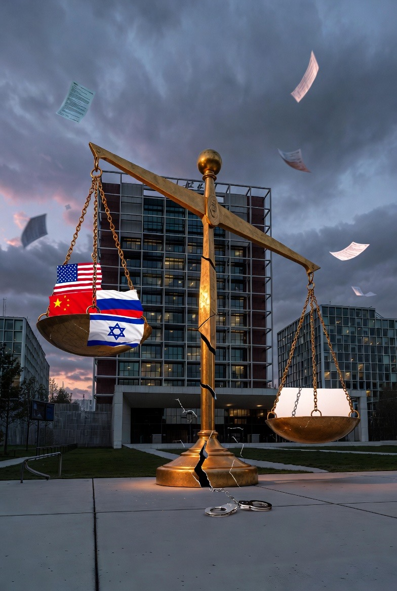

# ICC & ICJ: Mengapa Hukum Internasional Tidak Memiliki Mekanisme Paksa Efektif dan Konsekuensinya bagi Konflik Palestina–Israel

*Ilustrasi mekanisme paksa (pic: Meta AI).*

  
***Selama struktur kekuasaan dunia tetap asimetris, hukum akan selalu berjalan berdampingan dengan realpolitik***
  

Dalam teori klasik hubungan internasional, sistem internasional bersifat anarkis. Bukan chaos, tetapi tidak ada otoritas tertinggi di atas negara.

Berbeda dengan hukum domestik yang ditegakkan oleh polisi dan pengadilan nasional, hukum internasional bergantung pada:

•	persetujuan negara

•	kemauan politik

•	tekanan kolektif

Seperti dijelaskan oleh Hedley Bull, masyarakat internasional adalah “anarchical society” — ada norma, tetapi tidak ada pemerintah dunia.

Akibatnya:

➡️ Tidak ada monopoli kekerasan global.

➡️ Tidak ada aparat eksekusi independen.

➡️ Penegakan selalu politis.

## Desain Pasca-1945: Legalitas Dikompromikan oleh Kekuasaan

Struktur hukum modern dibentuk melalui United Nations setelah Perang Dunia II.

Namun Dewan Keamanan memberi hak veto kepada lima negara permanen:

•	Amerika Serikat

•	Rusia

•	China

•	Inggris

•	Prancis

Artinya sejak awal, sistem ini menginstitusionalisasi ketimpangan kekuasaan.

Hukum internasional bukan sistem egaliter murni. Ia adalah kompromi antara idealisme hukum dan realpolitik pemenang perang.

## ICC dan Problem Eksekusi

International Criminal Court memiliki yurisdiksi pidana internasional, tetapi:

•	tidak punya polisi sendiri

•	bergantung pada negara untuk menangkap tersangka

•	tidak dapat memaksa negara non-pihak

Seperti dicatat banyak artikel Q1 dalam Journal of International Criminal Justice, problem terbesar ICC bukan legitimasi normatif, tetapi defisit kapasitas penegakan.

Jika negara kuat menolak kooperasi, ICC hanya memiliki tekanan reputasional.

## Teori Kepatuhan: Mengapa Negara Kadang Taat?

Menurut Harold Hongju Koh, kepatuhan terhadap hukum internasional sering terjadi melalui internalisasi norma, bukan paksaan.

Negara patuh karena:

•	reputasi internasional

•	tekanan domestik

•	kepentingan jangka panjang

•	resiprositas

Namun teori ini lebih efektif pada negara demokratis dengan ketergantungan ekonomi tinggi.

Negara dengan proteksi geopolitik kuat lebih tahan terhadap tekanan.

## Konsekuensi terhadap Konflik Palestina–Israel

Sekarang kita masuk implikasi konkret.

1️⃣ Normalisasi Impunitas Selektif

Jika resolusi Dewan Keamanan diveto, dan putusan ICC sulit dieksekusi, maka:

➡️ Pelanggaran berulang bisa terjadi tanpa konsekuensi langsung.

➡️ Norma tetap ada, tetapi daya cegahnya melemah.

Dalam jangka panjang ini menciptakan persepsi “double standard.”

2️⃣ Delegitimasi Hukum Internasional

Ketika satu pihak melihat hukum ditegakkan selektif, legitimasi sistem melemah.

Akibatnya:

•	aktor non-negara semakin skeptis

•	radikalisasi mendapat justifikasi moral

•	narasi “hukum hanyalah alat Barat” menguat

Ini berbahaya karena menggerus fondasi norma global.

3️⃣ Perang Hukum (Lawfare)

Karena militer dan politik sulit dipaksa, konflik bergeser ke arena hukum:

•	gugatan di ICC

•	advisory opinion di International Court of Justice

•	litigasi HAM regional

Hukum menjadi arena simbolik legitimasi, bukan alat paksa langsung.

4️⃣ Pembekuan Konflik Jangka Panjang

Tanpa mekanisme paksa efektif:

•	status quo bertahan

•	perubahan struktural lambat

•	solusi final tertunda

Konflik menjadi “managed conflict” alih-alih resolved conflict.

## Paradoks Besar

Negara lemah paling membutuhkan hukum internasional.
Tetapi hukum internasional paling sulit memaksa negara kuat.

Namun jika hukum itu ditinggalkan sepenuhnya, yang tersisa hanya kekuatan militer.

Dengan kata lain:

⚖️ Hukum internasional lemah

❌ Tetapi tanpa hukum internasional, yang kuat menjadi absolut

Itu paradoks permanen sistem global modern.

## Proyeksi Jangka Panjang

Jika tidak ada reformasi struktural:

1.	Polarisasi global akan meningkat.

2.	Aliansi blok geopolitik makin mengeras.

3.	ICC dan ICJ akan semakin simbolik.

4.	Konflik Palestina–Israel tetap berada dalam siklus eskalasi periodik.

Namun norma tetap bekerja sebagai arsip moral dan dasar litigasi masa depan.

Sejarah menunjukkan bahwa akuntabilitas internasional sering tertunda, bukan hilang.

Sistem hukum internasional tidak memiliki mekanisme paksa efektif karena:

•	tidak ada otoritas supranasional dengan monopoli kekuatan

•	desainnya mengakomodasi realpolitik

•	penegakan bergantung pada kemauan negara

Konsekuensinya terhadap konflik Palestina–Israel adalah:

•	impunitas selektif

•	delegitimasi norma

•	pergeseran konflik ke arena hukum

•	pembekuan struktural jangka panjang

Hukum internasional bukan ilusi.
Ia adalah norma tanpa polisi global.

Dan selama struktur kekuasaan dunia tetap asimetris, hukum akan selalu berjalan berdampingan dengan realpolitik.

Itu bukan sinis.

Itu desain sistem sejak 1945.

  
**Referensi**

Bull, H. (1977). The Anarchical Society: A Study of Order in World Politics. London: Macmillan.

Waltz, K. N. (1979). Theory of International Politics. Reading, MA: Addison-Wesley.

United Nations Charter, 1945.

Hurd, I. (2007). After Anarchy: Legitimacy and Power in the United Nations Security Council. Princeton University Press.

International Criminal Court
Rome Statute, khususnya Pasal 86–89 (kerja sama dan penangkapan).

Bosco, D. (2014). Rough Justice: The International Criminal Court in a World of Power Politics. Oxford University Press.

Nouwen, S. (2013). Complementarity in the Line of Fire. Cambridge University Press.

Kelley, J. (2007). Who Keeps International Commitments and Why? American Political Science Review, 101(3), 573–589.

Koh, H. H. (1997). Why Do Nations Obey International Law? Yale Law Journal, 106(8), 2599–2659.

Goldsmith, J., & Posner, E. (2005). The Limits of International Law. Oxford University Press.

International Court of Justice (2004). Advisory Opinion on the Legal Consequences of the Construction of a Wall in the Occupied Palestinian Territory.

United Nations Security Council Resolution 2334 (2016).

Kattan, V. (2009). From Coexistence to Conquest: International Law and the Origins of the Arab–Israeli Conflict. Pluto Press.

Maoz, Z. (2019). The War over the Wall. International Security, 43(4), 7–44.

Simpson, G. (2004). Great Powers and Outlaw States. Cambridge University Press.

Tzouvala, N. (2020). Capitalism as Civilisation. Cambridge University Press.
