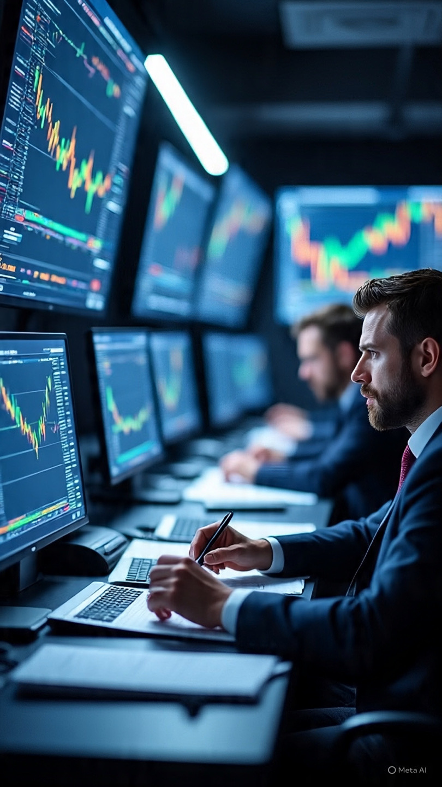

# IHSG, Bursa Asia, dan Harapan Damai AS-Iran: Analisis Geopolitik, Psikologi Pasar, dan Mekanisme Risk-On Global

*Ilustrasi pasar saham (pic: Meta AI).*

  
***Pasar modern pada dasarnya adalah mesin psikologi global yang bergerak berdasarkan harapan dan ketakutan kolektif***
  

Pasar saham itu kadang seperti kumpulan manusia yang minum kopi sambil panik berjamaah.  

Sedikit harapan damai saja bisa membuat layar hijau mendadak bermekaran seperti rumput habis hujan.

Pada April 2026, pasar saham Asia termasuk IHSG menunjukkan penguatan signifikan seiring munculnya harapan tercapainya de-eskalasi konflik antara Amerika Serikat dan Iran. 

Artikel ini menganalisis fenomena tersebut melalui perspektif geopolitik energi, behavioral finance, dan teori risk appetite global. 

Temuan menunjukkan bahwa pasar tidak hanya bereaksi terhadap “fakta perang”, tetapi terutama terhadap perubahan persepsi risiko masa depan.

## Pendahuluan

Pasar keuangan modern sangat sensitif terhadap geopolitik.

Konflik AS-Iran memiliki efek global karena menyangkut:

minyak dunia

Selat Hormuz

stabilitas Timur Tengah

inflasi global

Ketika muncul harapan ceasefire atau negosiasi:

pasar cenderung masuk mode risk-on

yakni:

investor kembali membeli aset berisiko

saham naik

tekanan terhadap emerging market berkurang

## Apa yang Terjadi pada April 2026?

Laporan pasar menunjukkan:

saham Asia sempat menguat karena optimisme perundingan AS-Iran  

IHSG ikut terdorong bersama sentimen global  

investor asing kembali masuk ke emerging markets termasuk Indonesia  

Bahkan pada awal April:

IHSG sempat melonjak lebih dari 3%–4% setelah berita ceasefire sementara AS-Iran.  

## Kenapa Konflik AS-Iran Sangat Mempengaruhi Bursa?

Selat Hormuz = Nadi Energi Dunia.

Sebagian besar distribusi minyak global melewati:

Strait of Hormuz.

Jika konflik meningkat:

harga minyak naik

biaya energi global naik

inflasi meningkat

Pasar takut terhadap:

shock energi global.

## Mekanisme “Harapan Damai = Saham Naik”

Pasar saham bergerak berdasarkan:

ekspektasi masa depan

bukan kondisi hari ini saja.

Jadi ketika investor mendengar:

“ceasefire”

“negosiasi”

“de-eskalasi”

mereka membaca:

✅ risiko perang turun

✅ distribusi minyak lebih aman

✅ inflasi mungkin mereda

✅ ekonomi global lebih stabil

## Konsep Behavioral Finance

Dalam teori:

Behavioral Finance

pasar dipengaruhi emosi kolektif.

Harapan damai menciptakan:

optimism rally

relief rally

fear reduction

## Tapi Kenapa Pasar Kadang Naik Lalu Turun Lagi?

Karena pasar bukan makhluk rasional penuh.

Ia seperti:

kawanan burung yang berubah arah bersama-sama.

Masalahnya:

harapan damai belum tentu damai sungguhan

geopolitik Timur Tengah sangat fluktuatif

Reuters bahkan melaporkan bahwa:

meski ada harapan ceasefire

ketegangan tetap tinggi

Iran masih melakukan tindakan maritim di Hormuz.

Akibatnya:

sebagian rally mulai terkoreksi

investor kembali hati-hati

## Posisi IHSG Indonesia

IHSG sangat sensitif terhadap:

arus modal asing

harga komoditas

sentimen global

Ketika geopolitik membaik:

✅ rupiah cenderung stabil

✅ dana asing masuk

✅ saham bank & komoditas naik

Namun jika konflik memburuk:

❌ capital outflow

❌ tekanan rupiah

❌ IHSG melemah.

## Paradoks Pasar Modern

Ironisnya:

tragedi manusia bisa menjadi variabel angka di layar saham.

Ketika berita perang membaik:

trader bersorak

indeks naik.

Padahal di balik grafik:

ada ketegangan nyata

ada korban manusia

ada ancaman krisis energi.

Harapan damai AS-Iran sempat mendorong penguatan pasar Asia dan IHSG pada April 2026.  

Namun penguatan ini bersifat:

sangat sensitif terhadap berita

bergantung pada persepsi risiko

mudah berubah jika konflik memburuk kembali

Pasar modern pada dasarnya adalah mesin psikologi global yang bergerak berdasarkan harapan dan ketakutan kolektif.

  
**Referensi**

Antara News. (2026). IHSG menguat ikuti bursa global didorong harapan kesepakatan AS-Iran.

International Monetary Fund (IMF). (2024). Global Financial Stability Report.

Iacoviello, M. (2018). Measuring geopolitical risk. American Economic Review.

Kahneman, D. (2011). Thinking, fast and slow. Farrar, Straus and Giroux.

Reuters. (2026). Global markets rally on US-Iran peace hopes.

Shiller, R. J. (2015). Irrational exuberance. Princeton University Press.

U.S. Energy Information Administration (EIA). (2025). World oil transit chokepoints.

IDN Financials. (2026). IHSG naik akibat sentimen ceasefire AS-Iran.

Investing.com. (2026). Asia stocks extend rally on US-Iran peace hopes
