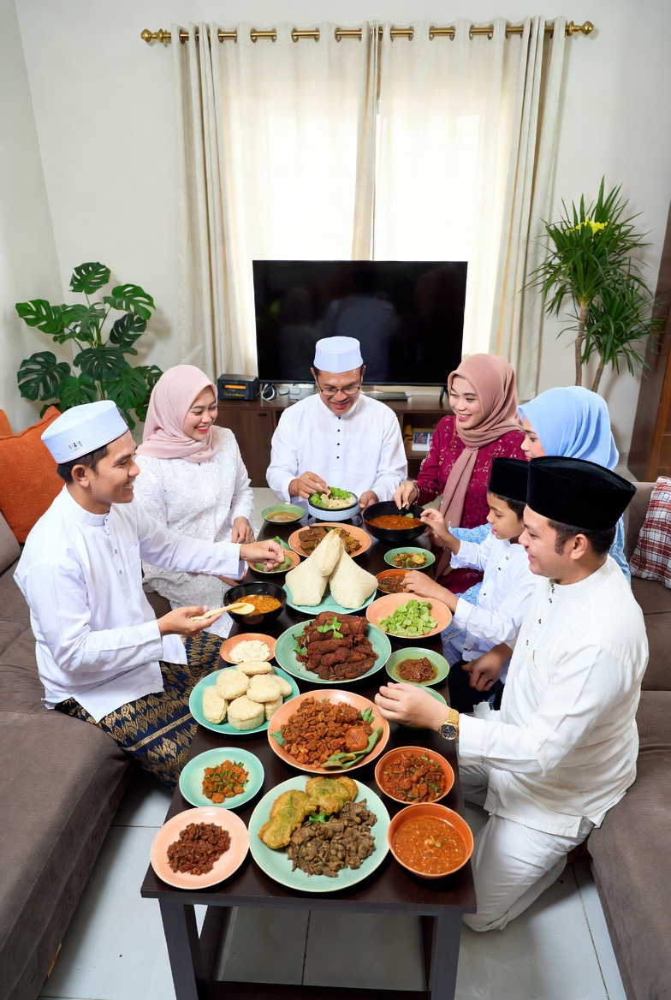

# Idul Adha, Pengorbanan Anak & Krisis Bakti Modern: Dari Kisah Ibrahim dan Ismail menuju Individualisme Keluarga Kontemporer

*Ilustrasi (pic: Grok AI).*

  
***Kisah Ibrahim dan Ismail mengingatkan: manusia besar bukan hanya yang mampu mencintai pasangan, tetapi juga yang tidak melupakan siapa yang membesarkannya sejak lemah dan tak berdaya***
  

Idul Adha sering dipahami sekadar sebagai ritual kurban, pembagian daging, dan simbol empati sosial.

Padahal di inti terdalamnya, Idul Adha menyimpan drama eksistensial antara cinta, ketaatan, dan pengorbanan keluarga.

Kisah Ibrahim dan Ismail bukan hanya tentang seorang ayah yang diuji Tuhan, tetapi juga tentang seorang anak yang rela menyerahkan dirinya demi ketaatan dan cinta terhadap orang tua serta Tuhan.

Tulisan ini membahas:
makna psikologis dan spiritual pengorbanan,
pergeseran relasi anak–orang tua di era modern,
konflik pasangan versus keluarga,
serta mengapa masyarakat modern mengalami krisis bakti dan penghormatan terhadap orang tua.

## Idul Adha Bukan Sekadar Daging Kurban

Dalam narasi populer, Idul Adha sering direduksi menjadi:
sapi,
kambing,
sate,
dan distribusi daging.

Padahal inti simboliknya jauh lebih dalam.

Kisah utamanya adalah pengorbanan paling menyakitkan yang mungkin dialami manusia: rela kehilangan yang paling dicintai.

## Drama Psikologis Ibrahim dan Ismail

Menurut tradisi Islam, Ibrahim mendapat perintah untuk mengorbankan putranya, Ismail.

Yang sering dilupakan, Ismail tidak memberontak. Ia justru berkata: “Wahai ayahku, lakukanlah apa yang diperintahkan kepadamu.”

Secara psikologis, ini luar biasa.

Mengapa?

Karena manusia secara naluriah:
takut mati,
takut kehilangan,
mempertahankan diri.

Namun Ismail, menempatkan cinta, iman, dan penghormatan kepada ayah di atas ego biologisnya.

## Pengorbanan Anak dalam Makna Terdalam

Idul Adha bukan sekadar “orang tua berkorban untuk anak.” Tetapi juga: “anak rela berkorban demi nilai yang lebih tinggi.”

Ini penting. Karena budaya modern sering hanya menekankan:
hak anak,
kebebasan individu,
validasi diri.
Namun lupa:
tanggung jawab,
hormat,
dan pengorbanan terhadap keluarga.

## Mengapa Banyak Anak Modern Mudah Durhaka?

Pertanyaan ini sensitif, tapi penting.

1. Budaya individualisme ekstrem

Masyarakat modern menekankan:
“hidupku milikku”
“aku bebas”
“jangan atur aku”

Akibatnya, otoritas keluarga melemah. Orang tua tidak lagi dipandang sebagai figur sakral penuh pengorbanan, tetapi sering hanya “hambatan terhadap kebebasan pribadi.”

2. Budaya validasi emosional tanpa batas

Era modern sangat fokus pada:
perasaan individu,
trauma pribadi,
self-priority.

Ini penting sampai batas tertentu. Namun tanpa keseimbangan… muncul generasi yang:
sulit menerima nasihat,
mudah melawan,
menganggap kritik sebagai serangan.

3. Romantisasi cinta pasangan berlebihan

Dalam banyak kasus:
pasangan romantis dianggap segalanya,
sementara ibu yang membesarkan sejak kecil perlahan tersingkir.

Akibatnya muncul konflik:
mertua vs menantu,
anak lelaki di tengah,
keluarga retak atas nama “cinta.”

## Mengapa Pengorbanan Ibu Sering Dilupakan?

Secara biologis, ibu mengalami:
kehamilan,
perubahan hormon,
nyeri persalinan,
menyusui,
kurang tidur bertahun-tahun.

Dari sudut evolusi, hubungan ibu–anak adalah salah satu ikatan biologis paling kuat dalam spesies manusia.

Namun ironisnya… justru karena pengorbanan itu berlangsung lama dan “normal,” manusia mulai menganggapnya biasa.

Padahal pengorbanan ibu bukan komedi absurd. Ia fondasi eksistensi manusia itu sendiri.

## Psikologi “Anak Tak Berdaya di Depan Pasangan”

Fenomena ini kompleks. 
Banyak laki-laki:
takut konflik rumah tangga,
takut kehilangan pasangan,
atau terjebak loyalitas ganda.

Akibatnya, mereka memilih:
diam,
menghindar,
atau membiarkan ibunya tersakiti.

Dalam psikologi keluarga, ini disebut split loyalty conflict, yakni konflik antara:
loyalitas terhadap pasangan,
dan loyalitas terhadap orang tua.

Masalahnya bukan sekadar memilih siapa. Tetapi apakah seseorang cukup dewasa menjaga keduanya tanpa menghancurkan salah satunya.

## Islam Tidak Meminta Anak Menyembah Orang Tua

Ini penting diluruskan, Islam tetap mengakui:
ada orang tua toxic,
ada ketidakadilan,
ada batas sehat.

Namun secara umum, bakti kepada orang tua dipandang sangat tinggi karena manusia tidak mungkin membalas seluruh pengorbanan mereka.

## Idul Adha Sebagai Kritik Terhadap Ego Modern

Idul Adha mengajarkan sesuatu yang sangat bertentangan dengan budaya modern: cinta sejati tidak selalu tentang “aku mau.”

Kadang cinta berarti:
menahan ego,
menjaga keluarga,
menghormati pengorbanan,
dan rela berkorban demi sesuatu yang lebih besar dari diri sendiri.

Idul Adha bukan sekadar ritual penyembelihan hewan. Ia adalah simbol:
ketaatan,
cinta keluarga,
pengorbanan,
dan penghormatan lintas generasi.

Krisis modern terjadi ketika:
ego pribadi menggantikan bakti,
romantisme menggantikan tanggung jawab,
dan keluarga diperlakukan sebagai beban, bukan akar kehidupan.

Kisah Ibrahim dan Ismail mengingatkan: manusia besar bukan hanya yang mampu mencintai pasangan, tetapi juga yang tidak melupakan siapa yang membesarkannya sejak lemah dan tak berdaya.

Mungkin dunia modern terlalu sibuk mencari cinta yang membuat jantung berdebar…sampai lupa menghormati tangan yang dulu menjaga jantung itu tetap hidup sejak dalam kandungan.

  
**Referensi**

Al-Qur’an, Surah As-Saffat 37:99–113.

Shahih al-Bukhari.

John Bowlby. (1969). Attachment and Loss. Basic Books.

Murray Bowen. (1978). Family Therapy in Clinical Practice. Jason Aronson.

Individualism literature in modern sociology.

Erich Fromm. (1956). The Art of Loving. Harper & Brothers.
