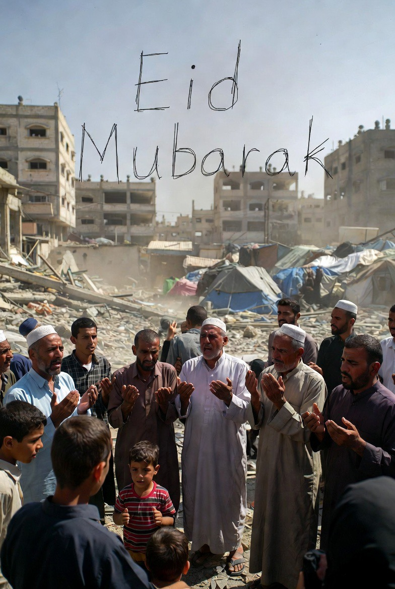

# Idul Fitri sebagai Survival Ritual di Gaza dan Tepi Barat: Analisis Human Security, Disrupsi Sosial, dan Ketahanan Simbolik

*Ilustrasi idhul fitri di Gaza (pic: Grok AI).*

  
***Idul Fitri di Gaza dan Tepi Barat tidak lagi sekadar perayaan keagamaan, melainkan telah bertransformasi menjadi simbol ketahanan dalam kondisi krisis***
  

Artikel ini menganalisis transformasi perayaan Idul Fitri di Gaza dan Tepi Barat dalam konteks konflik bersenjata yang berkelanjutan. 

Dengan menggunakan pendekatan human security dan teori disrupsi sosial, penelitian ini menunjukkan bahwa ritual keagamaan mengalami pergeseran dari fungsi perayaan menuju mekanisme bertahan hidup (survival ritual). 

Studi ini berargumen bahwa dalam kondisi krisis kemanusiaan, Idul Fitri tidak hanya kehilangan dimensi materialnya, tetapi juga mengalami redefinisi sebagai simbol ketahanan psikososial di tengah kehancuran struktural.

## Pendahuluan

Idul Fitri secara tradisional dipahami sebagai momen rekonsiliasi sosial, kelimpahan, dan perayaan kolektif setelah Ramadan. 

Namun, dalam konteks konflik berkepanjangan di Gaza dan Tepi Barat, makna ini mengalami transformasi signifikan.

Pertanyaan utama penelitian ini adalah:
bagaimana konflik bersenjata mengubah praktik dan makna Idul Fitri dalam masyarakat yang mengalami krisis kemanusiaan ekstrem?

## Human Security

Pendekatan ini menekankan:

•	keamanan pangan

•	akses air dan kesehatan

•	tempat tinggal layak

•	keselamatan individu

## Social Disruption Theory

Konflik bersenjata menyebabkan:

•	runtuhnya struktur sosial

•	terganggunya praktik budaya dan keagamaan

•	fragmentasi komunitas

## Symbolic Resilience

Konsep ini menjelaskan bagaimana:

•	ritual keagamaan tetap dipertahankan

•	meskipun dalam kondisi ekstrem

•	sebagai bentuk ketahanan psikologis kolektif

## Idul Fitri di Gaza: Ritual dalam Ruang Kehancuran

1. Disintegrasi Ruang Perayaan

•	masjid rusak atau tidak dapat digunakan

•	perayaan dilakukan di area terbuka atau dekat reruntuhan

2. Krisis Material

•	keterbatasan makanan dan air

•	tidak adanya pakaian baru

•	hilangnya kemampuan ekonomi rumah tangga

3. Redefinisi Ritual

Idul Fitri berubah menjadi ritual bertahan hidup (Eid of survival).

Fungsi utamanya bukan lagi perayaan, melainkan:

•	mempertahankan identitas

•	menjaga stabilitas emosional keluarga

4. Trauma Kolektif

•	kehilangan anggota keluarga

•	paparan kekerasan berulang

•	ketidakpastian masa depan

Idul Fitri di Tepi Barat dan Yerusalem

1. Pembatasan Ibadah

•	akses ke masjid dibatasi

•	pembatasan mobilitas melalui checkpoint

2. Fragmentasi Sosial

•	keluarga terpisah akibat pembatasan wilayah

•	berkurangnya interaksi sosial

3. Ritual dalam Tekanan

•	ibadah tetap dilakukan

•	namun dalam kondisi pengawasan dan keterbatasan

## Analisis: Transformasi Makna Idul Fitri

| Dimensi | Kondisi Normal | Kondisi Konflik |
|--------|--------|--------|
| Fungsi  | Perayaan  | Bertahan hidup  |
| Ruang  | Masjid & rumah  | Tenda & reruntuhan  |
| Emosi | Kebahagiaan | Duka & kecemasan |
| Sosial | Kolektif | Terfragmentasi |
| Material | Kelimpahan | Kekurangan |

Temuan menunjukkan bahwa konflik tidak hanya menghancurkan infrastruktur fisik, tetapi juga:

•	mengganggu praktik budaya

•	mengubah makna simbolik ritual

•	menciptakan bentuk baru ekspresi keagamaan

Dalam konteks ini, Idul Fitri berfungsi sebagai:

👉 mekanisme adaptasi sosial

👉 bentuk resistensi terhadap dehumanisasi

## Implikasi Kemanusiaan

•	perlunya perlindungan ruang ibadah

•	pentingnya akses bantuan selama hari besar keagamaan

•	pengakuan terhadap dimensi psikososial dalam bantuan kemanusiaan

Idul Fitri di Gaza dan Tepi Barat tidak lagi sekadar perayaan keagamaan, melainkan telah bertransformasi menjadi simbol ketahanan dalam kondisi krisis. 

Ritual ini menunjukkan bahwa bahkan dalam situasi kehancuran ekstrem, masyarakat tetap mempertahankan praktik budaya sebagai bentuk perlawanan terhadap kehilangan identitas dan kemanusiaan.

  
**Referensi**

United Nations Office for the Coordination of Humanitarian Affairs. (2026). Humanitarian Situation in Gaza.

International Committee of the Red Cross. (2026). Civilians in Armed Conflict Report.

Amnesty International. (2025). Israel/Palestine Human Rights Overview.

Human Rights Watch. (2025). Restrictions and Civilian Impact in West Bank.
