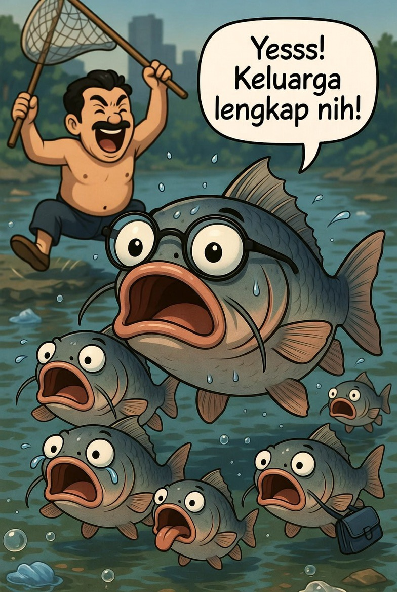

# Ikan Sapu-Sapu: Antara Penyelamat Sungai dan Ancaman Ekologis

*Ilustrasi pemusnahan massal ikan sabu-sabu (pic: Grok AI ).*

  
***Kita menciptakan masalah ekologis… lalu “menghukum” spesies yang paling adaptif***
  

Ikan sapu-sapu (genus Hypostomus / Pterygoplichthys) sering dianggap sebagai pembersih sungai karena kemampuannya memakan alga dan detritus. 

Namun, di ekosistem non-asli seperti Jakarta, spesies ini diklasifikasikan sebagai invasive species yang berpotensi merusak keseimbangan ekologis. 

Tulisan ini membahas konflik antara persepsi utilitarian masyarakat dan realitas ekologis, serta mengevaluasi kebijakan pemusnahan dari perspektif biologi konservasi.

## Pendahuluan

Fenomena ledakan populasi ikan sapu-sapu di sungai perkotaan Indonesia, termasuk Jakarta, menimbulkan dilema: apakah mereka “pembersih alami”… atau “perusak diam-diam”?

## Identitas Biologis

Ikan sapu-sapu berasal dari Amerika Selatan (Amazon Basin) dan termasuk:

pemakan alga (detritivora)

memiliki daya tahan tinggi terhadap polusi

berkembang biak cepat

➡️ karakter ini membuatnya unggul di lingkungan tercemar

## Mitos: “Pembersih Sungai”

Secara parsial, benar:

✔️ memakan alga

✔️ memakan sisa organik

Namun:

mereka tidak membersihkan polusi kimia atau limbah industri.

## Analisis

Peran mereka hanya kosmetik:

➡️ memperlambat pertumbuhan alga

➡️ bukan solusi utama pencemaran

## Realitas: Spesies Invasif

Sebagai spesies invasif, mereka:

⚠️ 1. Mengganggu ekosistem lokal

bersaing dengan ikan asli

mendominasi sumber makanan

⚠️ 2. Merusak habitat

menggali lubang di tebing sungai
    
  ➡️ menyebabkan erosi

⚠️ 3. Reproduksi agresif

populasi meledak tanpa predator alami

## Dampak Ekologis Jangka Panjang

Jika tidak dikontrol:

biodiversitas menurun

spesies lokal punah

struktur ekosistem berubah permanen

## Perspektif Kebijakan: Kenapa Dimusnahkan?

Kebijakan pengendalian (termasuk pemusnahan) didasarkan pada: prinsip konservasi: melindungi ekosistem, bukan individu spesies invasif.

Analogi ilmiah:

Mengendalikan spesies invasif seperti: mengangkat satu batu untuk menyelamatkan seluruh bangunan

## Apakah Mereka “Berdosa”?

Tidak.

Dalam biologi:

hewan tidak memiliki moral
mereka hanya mengikuti naluri adaptasi.

Masalahnya bukan pada ikan tersebut, tapi:

manusia yang memperkenalkan mereka ke ekosistem yang salah.

## Isu Konsumsi (Beracun?)

Ikan sapu-sapu:

tidak secara inheren beracun

tetapi bisa mengandung logam berat dari lingkungan tercemar

➡️ risiko kesehatan jika dikonsumsi.

## Diskusi Kritis

Ironinya: manusia mencemari sungai, lalu menyalahkan ikan yang mampu bertahan di dalamnya.

Lebih jauh:

kita menciptakan masalah ekologis…
lalu “menghukum” spesies yang paling adaptif.

Ikan sapu-sapu bukan “jahat” maupun “penyelamat”.

Mereka adalah:

➡️ spesies adaptif

➡️ yang berada di tempat yang salah

Pemusnahan bukan soal kebencian, tapi strategi menjaga keseimbangan ekosistem yang lebih besar.

Namun ironinya: manusia mencemari sungai, lalu menyalahkan ikan yang mampu bertahan di dalamnya.

  
**Referensi**

Kurniawati, N., & Rahardjo, M. F. (2016).
Distribusi dan dampak ikan sapu-sapu (Pterygoplichthys pardalis) di Sungai Ciliwung. Jurnal Biologi Tropis, 16(2), 45–54.

Haryono, H. (2017).
Spesies ikan invasif dan dampaknya terhadap keanekaragaman hayati perairan Indonesia. Jurnal Iktiologi Indonesia, 17(1), 1–12.

Putra, R. M., & Sari, D. P. (2021).
Dampak ekologis ikan invasif terhadap struktur komunitas ikan lokal. Jurnal Pengelolaan Sumberdaya Perairan, 13(2), 85–94.

Badan Riset dan Inovasi Nasional (BRIN). (2026).
Dampak ikan sapu-sapu terhadap ekosistem perairan dan masyarakat. Jakarta: BRIN.

Kementerian Kelautan dan Perikanan Republik Indonesia. (2020).
Pedoman pengendalian spesies ikan invasif di perairan umum Indonesia. Jakarta: KKP.

Nico, L. G., Jelks, H. L., & Tuten, T. (2009).
Non-native suckermouth armored catfishes in Florida: Description of nest burrows and burrow colonies. Journal of Fish Biology, 74(5), 124–130.

Hoover, J. J., Killgore, K. J., & Cofrancesco, A. F. (2004).
Suckermouth catfishes: Threats to aquatic ecosystems of the United States? Aquatic Nuisance Species Research Program Bulletin, 4(1), 1–9.

Authman, M. M. N., Zaki, M. S., Khallaf, E. A., & Abbas, H. H. (2015).
Use of fish as bio-indicator of the effects of heavy metals pollution. Journal of Aquaculture Research & Development, 6(4), 1–13.
