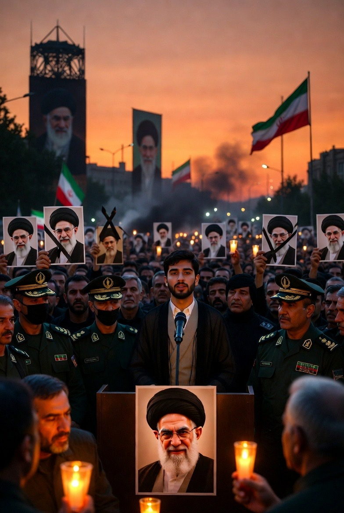

# Implikasi Kematian Ayatollah Khamenei terhadap Politik Iran dan Timur Tengah: Analisis Struktural, Strategis, dan Geopolitik

*Ilustrasi Kondisi Iran (pic: Grok AI).*

  
***Pusatnya bukan hanya tentang satu individu, melainkan tentang struktural politik negara dan jaringan kekuatan yang ia wakili selama puluhan tahun***
  

Pada 28 Februari- 1 Maret 2026, serangan udara gabungan Amerika Serikat dan Israel dilaporkan telah menewaskan Pemimpin Tertinggi Iran, Ayatollah Ali Khamenei — figur sentral dalam politik republik Islam selama lebih dari tiga dekade. 

Peristiwa ini memicu respon yang luas secara regional dan internasional, berpotensi mengguncang tatanan politik di Iran, memperluas eskalasi militer, mengubah aliansi regional, dan berdampak pada ekonomi global, terutama pasar energi. 

Analisis ini membedah implikasi politik, keamanan, dan diplomatik dari peristiwa tersebut secara holistik.  

## Kekosongan Kepemimpinan dan Ketidakpastian Politik Dalam Negeri

Khamenei menjadi simbol kekuatan ideologis dan struktural dalam Republik Islam Iran sejak 1989. 

Kematian seorang pemimpin yang berkuasa selama 36 tahun memiliki sejumlah implikasi mendalam:

1. Kepemimpinan Pasca-Khamenei

•	Dengan wafatnya Khamenei, posisi Pemimpin Tertinggi yang sangat kuat secara konstitusional kini kosong, menciptakan kekosongan struktural dalam sistem politik Iran.

•	Iran diperkirakan akan menempatkan badan kolektif sementara (termasuk presiden, ketua parlemen, dan ulama senior) untuk mengelola transisi kepemimpinan sementara.

Proses ini berpotensi memunculkan konflik intra-elite dan kontestasi di dalam struktur kekuasaan.  

2. Stabilitas Dalam Negeri

•	Dalam negeri, kemungkinan eskalasi represi terhadap protes anti-rezim yang sempat terjadi sejak awal 2026, karena pemimpin baru mungkin berusaha mengamankan otoritasnya.

•	Ketidakpastian politik dapat memperdalam krisis ekonomi dan sosial, memperlemah legitimasi rezim di mata publik yang sudah resah.  

## Eskalasi Militer dan Keamanan Regional

1. Retaliasi Iran

•	Garda Revolusi Iran (IRGC) telah menyatakan sumpah balas dendam terhadap serangan yang menewaskan Khamenei, menunjukkan potensi eskalasi konflik berskala lebih luas.

•	Serangan balasan bisa menargetkan infrastruktur militer atau posisi AS dan Israel di kawasan, memperluas konflik.  

2. Risiko Destabilisasi Kawasan

•	Ketegangan telah memicu serangan lintas negara, termasuk sasaran sasaran militer Amerika dan Israel di kawasan Teluk.

•	Negara tetangga seperti Arab Saudi, UAE, dan negara Arab lain merasa terancam, berpotensi menarik aliansi baru atau memperkuat yang sudah ada.  

## Diplomasi Internasional dan Aliansi Global

1. Pandangan Dunia

•	Negara-negara besar seperti Rusia, Cina, dan Uni Eropa telah menyatakan keprihatinan atas eskalasi, seraya menyerukan de-eskalasi.

•	AS dan Israel menegaskan tindakan militer sebagai respons terhadap ancaman nuklir dan keamanan nasional mereka, tetapi pengamat internasional mengkhawatirkan implikasi jangka panjang terhadap stabilitas global.  

2. Reaksi Organisasi Internasional

PBB dan negara lain menyerukan dialog dan resolusi diplomatik, memperingatkan konflik yang lebih luas akan berdampak tidak hanya di Timur Tengah tetapi juga pasar energi global dan keamanan dunia.  

## Perubahan Strategis dalam Politik Regional

1. Kekuatan Proxy dan Jaringan Milisi

•	Iran selama bertahun-tahun menjadi pendukung utama beberapa kelompok proxy di kawasan, seperti Hezbollah, milisi di Irak, dan faksi lain di Yaman dan Lebanon.

•	Ketiadaan kepemimpinan kuat seperti Khamenei dapat mengubah pola dukungan dan strategi milisi ini, memicu realokasi politik kekuatan baru di kawasan.  

2. Arab–Iran Rebalancing

•	Negara Teluk, terutama Arab Saudi dan negara GCC lain, dapat mengubah strategi mereka terhadap Iran, yang sebelumnya sangat dominan di sebagian front geopolitik.

•	Ini bisa mempercepat negosiasi baru, pembentukan blok baru, atau penyesuaian hubungan bilateral.  

## Dampak Ekonomi dan Pasar Energi Global

Pasar Minyak dan Jalur Hormuz:

•	Jika konflik berlarut, ancaman terhadap Jalur Hormuz – rute penting ekspor minyak global – dapat menciptakan ketidakpastian harga minyak, memengaruhi ekonomi global.

•	Investor global dan pasar keuangan bereaksi terhadap risiko tinggi di kawasan, yang bisa membawa dampak inflasi dan gangguan pasokan energi.  

Kematian Khamenei bukan sekadar peristiwa simbolik; ia adalah pivot geopolitik yang dapat membuka episode baru dalam politik Iran dan keseimbangan kekuatan di Timur Tengah. 

Dampaknya mencakup:

•	transisi kekuasaan yang penuh risiko domestik

•	eskalasi konflik militer

•	reaksi diplomatik global

•	reorientasi aliansi regional dan proxy forces

•	konsekuensi ekonomi global

Pusatnya bukan hanya tentang satu individu, melainkan tentang struktural politik negara dan jaringan kekuatan yang ia wakili selama puluhan tahun.

  
**Referensi**

CBS News. (2026, March 1). Live updates: U.S.-Israel launch another round of strikes on Iran following Khamenei’s killing. https://www.cbsnews.com/live-updates/israel-us-attack-iran-trump-says-major-combat-operations/

Detik.com. (2026, February 29). Sosok Ayatollah Ali Khamenei, pemimpin Iran yang tewas dalam serangan AS-Israel. https://www.detik.com/jateng/berita/d-8378203/sosok-ayatollah-ali-khamenei-pemimpin-iran-yang-tewas-dalam-serangan-as-israel

Kontan. (2026, March 1). Timur Tengah bergejolak: Ini dampak kematian pemimpin tertinggi Iran yang mengguncang. https://internasional.kontan.co.id/news/timur-tengah-bergejolak-ini-dampak-kematian-pemimpin-tertinggi-iran-yang-mengguncang

Livemint. (2026, February 29). What Ayatollah Ali Khamenei’s death means for Iran’s leadership, nuclear talks with US and the Middle East. https://www.livemint.com/news/world/what-ayatollah-ali-khameneis-death-means-for-iran-s-leadership-nuclear-talks-with-us-and-the-middle-east-11772333565668.html

Reuters. (2026, March 1). More strikes aimed at Iran after Khamenei’s death, Trump issues new warning. https://www.reuters.com/world/middle-east/more-strikes-aimed-iran-after-us-israeli-assault-kills-supreme-leader-2026-03-01/

The Guardian. (2026, February 28). US and Israel strike Iran as Netanyahu says “many signs” Khamenei “no longer alive”. https://www.theguardian.com/world/2026/feb/28/israel-launches-attack-on-iran-as-explosions-heard-in-tehran

The Guardian. (2026, February 28). Iran vows “no leniency” as it launches reprisal attacks on Israel and US air bases. https://www.theguardian.com/world/2026/feb/28/iran-vows-no-leniency-reprisal-attacks-israel-us-air-bases

Washington Post. (2026, February 28). European allies react to US-Israel attack on Iran. https://www.washingtonpost.com/world/2026/02/28/iran-us-israel-attack-european-allies-reactions/
