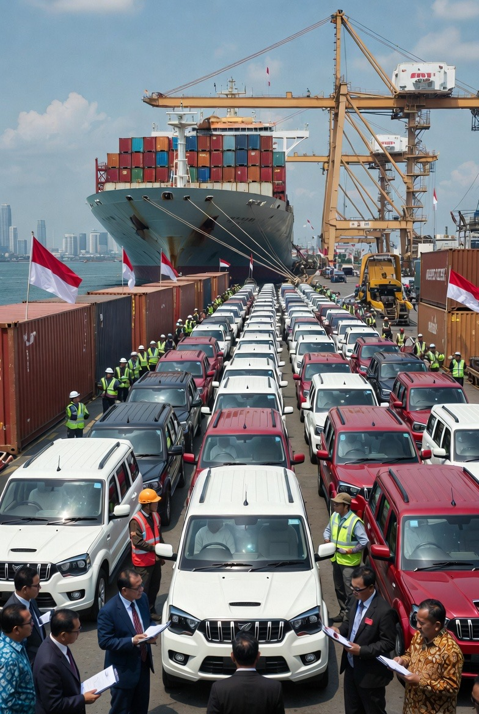

# Analisis Kebijakan Pembelian Mobil dari India oleh Pemerintah Indonesia: Efisiensi Biaya, Risiko Industri, dan Dampak Jangka Panjang

*Ilustrasi mobil impor India (pic: Grok AI).*

  
***Efek jangka panjang dapat berupa fiskal stress, degradasi kemampuan industri, dan peningkatan ketergantungan teknologi asing***
  

Pada 25 Februari 2026 ramai diberitakan bahwa suatu entitas (disebut “koperasi Merah Putih”) melakukan pembelian mobil India dengan klaim biaya lebih murah, yang diproyeksikan menghemat Rp 40 triliundibanding pembelian lokal atau impor biasa. 

Namun pertanyaan muncul:

•	Apakah benar efisiensi biaya itu bersih (clean saving)?

•	Apa konsekuensi jangka panjangnya?

•	Apakah ada risiko hidden cost, quality risk, atau pemborosan fiskal masa depan?

Untuk menjawab ini, kita akan menggunakan kerangka analisis dari ekonomi industri, perdagangan internasional, dan manajemen pemerintahan publik.

## Kerangka Teoretis

A. Teori Keunggulan Komparatif & Spesialisasi

Menurut teori klasik Ricardo, suatu negara akan memperoleh keuntungan jika memproduksi barang dengan kesempatan biaya lebih rendah dibanding negara lain. 

Dalam konteks mobil:

•	India memiliki industri otomotif dengan biaya tenaga kerja relatif rendah dan regulasi hemat biaya, sehingga unit cost produksi bisa lebih rendah.

•	Namun teori ini hanya berlaku jika kualitas, layanan purna jual, dan biaya total kepemilikan (total cost of ownership) diperhitungkan, bukan sekadar harga pembelian awal.

B. Analisis Biaya Total & Efisiensi Fiskal

Dalam kajian ekonomi publik (e.g., Musgrave & Musgrave), biaya pembelian bukan satu-satunya ukuran. Yang lebih penting adalah:

📌 Total Cost of Ownership (TCO) =
harga pembelian + biaya perawatan + suku cadang + efisiensi bahan bakar + depresiasi + resale value

Negara yang hanya melihat harga awal sangat mungkin mengalami overshooting di masa depan.

## Inti Permasalahan

1. Klaim Hemat 40 Triliun

Hemat biaya pada harga pembelian bisa valid jika:

✔ Spesifikasi kendaraan setara

✔ Warranty & layanan purna jual jelas

✔ Ketersediaan suku cadang terjamin

✔ Rekam jejak reliabilitas memadai

Namun pertanyaan kunci:

🔹 Apakah biaya total ownership sudah diperhitungkan?

🔹 Adakah biaya tambahan seperti import duty, logistic cost, garansi ekspor?

🔹 Adakah dampak pada industri otomotif domestik?

Jika semua itu tidak termasuk dalam perhitungan, angka “Rp 40 triliun hemat” hanyalah penampakan efisiensi jangka pendek (nominal), bukan penghematan ekonomi sejati.

2.Biaya Tersembunyi & Risiko

a. Kualitas Produk

Industri otomotif India berkembang pesat, namun fokus utamanya pada kendaraan budget segment. 

Banyak analisis industri yang menunjukkan bahwa dalam segmen ini:

•	reliabilitas sering lebih rendah

•	jaringan layanan lebih sempit di luar India

•	suku cadang impor bisa mahal

Ini bisa menimbulkan:

📌 biaya garansi tinggi

📌 downtimes operasional

📌 perbaikan yang justru membengkak biaya pemerintah

b. Risiko Pasar & Teknologi

Mobil yang murah sering ditebus oleh:

•	penggunaan bahan bakar kurang efisien

•	emisi yang tidak sesuai standar lebih ketat

•	teknologi safety yang lebih rendah

Dalam jangka panjang biaya sosial bisa muncul dalam bentuk:

📌 polusi lebih tinggi

📌 kecelakaan lalu lintas

📌 ketergantungan teknologi asing

3.Dampak pada Industri Domestik

Jika pemerintah membeli mobil impor murah secara besar-besaran:

❌ Industri otomotif domestik tertekan

❌ Produksi supplier lokal turun

❌ Tenaga kerja industri turun

❌ Investasi lokal memudar

Akibatnya dalam jangka panjang:

🔥 Kemampuan manufaktur lokal melemah

🔥 Ketergantungan impor komponen otomotif meningkat

🔥 Potensi neraca perdagangan otomotif makin defisit

Ini telah diobservasi dalam banyak studi industri di negara berkembang.

Perspektif Publik Ekonomi dan Kebijakan

A. Eksternalitas Fiskal

Dalam konteks penilaian kebijakan publik, penghematan satu kali (one-off saving) tidak selalu lebih baik daripada peningkatan produktivitas jangka panjang.

Justru investasi dalam industri domestik sering memberikan:

✔ multiplier effect

✔ penciptaan lapangan kerja

✔ transfer teknologi

✔ kemampuan inovasi nasional

Kalau pembelian murah justru mengikis struktur industri lokal, maka itu bukan efisiensi fiskal, tapi short-termism yang berbiaya tinggi di masa depan.

B. Efek Distribusi

Jika anggaran pemerintah dihemat sekarang tapi kemudian kebutuhan perbaikan & suku cadang meningkat tahun depan, maka:

📉 Tekanan fiskal bergeser ke periode berikutnya

📉 Anggaran operasional membengkak

📉 Nilai ekonomis pembelian awal terdepresiasi cepat

Dalam ekonomi publik, ini dikenal sebagai: Moral hazard fiskal, yakni ketika pengambil keputusan mengejar penghematan nominal tanpa memperhitungkan risiko distribusi biaya di masa depan.

## Kesimpulan

Analisis menunjukkan bahwa:

1.	Penghematan nominal Rp 40 triliun tidak otomatis efisiensi jangka panjang. Hal ini hanya mencerminkan harga pembelian unit.

2.	Biaya total kepemilikan (TCO) bisa jauh lebih tinggi karena risiko perawatan, suku cadang, garansi, kualitas, dan emisi.

3.	Pembelian barang murah dari luar negeri berpotensi melemahkan industri domestik, karena substitusi impor mengikis basis produksi dan investasi lokal.

4.	Efek jangka panjang dapat berupa fiskal estrés, degradasi kemampuan industri, dan peningkatan ketergantungan teknologi asing.

  
**Referensi**

Baldwin, R. E. (2016). The Great Convergence: Information Technology and the New Globalization.

Gereffi, G. (2018). Global Value Chains and Development.

Pavcnik, N. (2017). The Impact of Trade on Inequality in Developing Countries.

DetikOto. (24 Februari 2026). Penampakan pick-up Mahindra tiba di Tanjung Priok meski DPR minta tunda impor.  

Indonesia delays plan to import 105,000 Indian trucks. (24 Februari 2026). ANTARA News.  

DetikFinance. (24 Februari 2026). Anggaran impor 105.000 pickup India dicicil Rp 40 triliun per tahun.  

Suara.com. (23 Februari 2026). Purbaya ungkap skema pembiayaan impor 105.000 pickup India dari Himbara/Dana Desa.  

DetikFinance. (21 Februari 2026). Impor 105.000 pickup India disorot DPR karena dampaknya pada industri Indonesia.  

The Jakarta Post. (23 Februari 2026). Pressure to halt imports of Indian vehicles; industry warns of impact on domestic automotive sector.  

VOI Indonesia. (24 Februari 2026). DPR soroti keputusan impor 105.000 pickup India melalui PT Agrinas.
