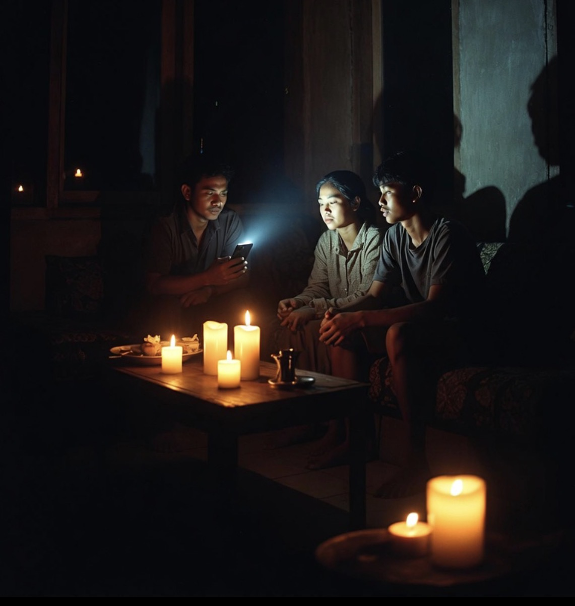

# Indonesia Byarpet Nasional: Semua Pembangkit Rusak Bersamaan atau Sedang Hemat Batu Bara?

*Ilustrasi (pic: Grok AI).*

  
***Negara modern tidak diukur dari berapa banyak batu bara yang ia gali, tetapi dari seberapa kecil kemungkinan rakyatnya harus makan malam dalam gelap ketika satu atau dua bagian sistem mengalami gangguan***
  

Ketika seluruh Indonesia mengalami pemadaman, wajar kalau muncul pertanyaan: “Masa iya semua pembangkit rusak bareng?”

Jawabannya: Hampir pasti tidak. Sebab Indonesia memiliki ratusan pembangkit listrik, berbagai jenis energi: PLTU, PLTA, PLTG, PLTGU, panas bumi, diesel, serta sistem kelistrikan yang dibagi per wilayah: Jawa-Bali, Sumatera, Kalimantan, Sulawesi, dan Indonesia Timur.

Kalau semuanya rusak sekaligus… itu sudah level film bencana Hollywood.

## Jadi Kenapa Pemadaman Bisa Terjadi di Banyak Daerah?

Ada dua hipotesis besar yang sekarang dibahas:

**Hipotesis 1
Gangguan teknis + efek domino**

PLN mengakui bahwa di Jawa ada dua pembangkit besar milik mitra (IPP) yang mengalami gangguan teknis dan keluar dari sistem. Salah satu pembangkit sudah mulai pulih, tetapi sebelumnya gangguan itu memaksa PLN melakukan pemadaman bergilir.  

Bahkan Kementerian ESDM juga mengatakan: masalah utamanya adalah kendala teknis operasional, bukan karena Indonesia kehabisan batu bara.  

**Hipotesis 2
Ada tekanan pasokan batu bara tertentu**

Nah… ini agak rumit.

Pemerintah mengakui memang ada masalah pada batu bara kalori menengah sekitar 5.200 GAR, yang dibutuhkan beberapa PLTU di Jawa. Pemerintah sampai membentuk tim khusus untuk mengamankan pasokan jenis batu bara ini.  

Tetapi… ESDM dan PERHAPI berkali-kali menegaskan bahwa stok batu bara nasional tidak habis, dan isu bahwa Indonesia tinggal punya batu bara seminggu dianggap tidak tepat.    

## Jadi Apakah PLN Sedang Menghemat Batu Bara?

Kemungkinannya tidak secara resmi, sebab PLN tidak pernah mengatakan: “Kami sengaja memadamkan listrik demi menghemat batu bara.”

Yang mereka katakan: ada gangguan pembangkit, ada kendala pasokan batu bara spesifikasi tertentu, sehingga dilakukan manajemen beban sementara.  

Tetapi… secara ekonomi, kalau stok batu bara jenis tertentu seret dan pembangkit besar terganggu, maka operator sistem memang akan mengurangi beban, mematikan wilayah bergilir, serta menjaga agar sistem tidak kolaps total. Karena pemadaman sebagian lebih baik daripada blackout nasional.

## Kok Kalimantan Juga Ikut Padam?

Nah ini yang sering bikin orang Kalimantan kesel: “Lah kita penghasil batu bara!”

Batu bara itu seperti beras. Kalau kita tinggal di daerah penghasil padi, belum tentu rumah  otomatis penuh nasi. Karena masih ada transportasi, pembangkit, transmisi, gardu, serta distribusi.

Kalimantan memang kaya batu bara. Tetapi listriknya tetap bergantung pada pembangkit lokal, jaringan transmisi, dan kestabilan sistem. Kalau salah satu terganggu, ya tetap bisa byarpet.

## Apakah Ini Akibat Selat Hormuz?

Jawaban singkat: Ada pengaruh, tetapi bukan penyebab utama karena Indonesia tidak terlalu bergantung pada Iran.

Namun, kalau Hormuz panas maka harga minyak dunia naik, biaya logistik naik, harga energi naik, serta biaya operasional pembangkit ikut naik.

Tetapi… kalau listrik padam hari ini, kemungkinan besar penyebab utamanya tetap masalah teknis dan rantai pasok domestik.  

## Yang Sebenarnya Membuat Orang Khawatir

Jujur saja, kita tidak terlalu takut kalau satu pembangkit rusak. Itu biasa.

Yang dikhawatirkan justru kalau negara kaya energi, produsen batu bara raksasa, apalagi  eksportir energi dunia, tetapi masih bisa mengalami pemadaman bergilir, sinyal melemah, serta industri terganggu.

Karena itu menunjukkan masalahnya bukan sekadar ada atau tidak ada energi. Tetapi apakah sistemnya cukup tangguh?

Indonesia adalah salah satu raksasa batu bara dunia. Kita mengekspor jutaan ton, kapal-kapal berlayar ke China, India, Jepang. Tetapi… di rumah sendiri, orang bertanya “Kenapa lampuku mati?”

Kalau benar penyebabnya hanya dua pembangkit yang bermasalah, maka pertanyaan berikutnya menjadi: Mengapa sistem sebesar Indonesia bisa begitu bergantung pada beberapa titik penting?

Karena negara modern tidak diukur dari berapa banyak batu bara yang ia gali, tetapi dari seberapa kecil kemungkinan rakyatnya harus makan malam dalam gelap ketika satu atau dua bagian sistem mengalami gangguan. 

Menurut informasi yang tersedia saat ini, belum ada bukti bahwa seluruh Indonesia sedang melakukan penghematan batu bara secara nasional. Yang lebih kuat justru kombinasi gangguan teknis, masalah pasokan batu bara spesifikasi tertentu, dan kerentanan sistem distribusi listrik.  

  
**Referensi**

Reuters. (2026, June 18). Indonesia’s energy minister says government working to secure coal supply for state utility. Reuters.

Reuters. (2026, June 16). China mine disaster, Indonesia policy changes upend global coal market. Reuters.

Kementerian ESDM. (2026). Pernyataan resmi mengenai pemadaman listrik dan pasokan batu bara nasional. Jakarta: Ministry of Energy and Mineral Resources.

CNBC Indonesia. (2026, June 23). Terungkap! Ini 2 PLTU yang sempat jadi penyebab listrik padam bergilir. CNBC Indonesia.

PERHAPI. (2026). Pemadaman meluas di sejumlah daerah, stok batu bara untuk PLTU masih aman. Jakarta: Perhimpunan Ahli Pertambangan Indonesia.
