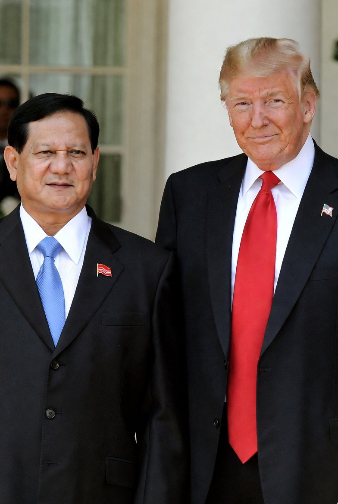

# Ketergantungan, Kekuasaan, dan Ketidakpastian: Indonesia, Tarif AS, dan Politics of Strategic Alignment di Era Trump

*Ilustrasi Prabowo dan Trump (pic: Grok AI).*

  
***Bukan soal “baper” atau “ngambil keputusan tanpa nalar.” Itu dampak struktural dari sistem internasional yang tidak egaliter***
  

Dalam teori hubungan internasional (HI), negara menengah (middle powers) sering menghadapi:

•	ketergantungan struktural pada ekonomi dan keamanan negara hegemon (mis. AS)

•	dilema antara kepentingan domestik dan prioritas stabilitas eksternal

•	trade-offs antara sovereignty dan strategic alignment

Ini digambarkan dalam literatur realist-liberal, misal:

•	Keohane & Nye (1977) – Power and Interdependence

•	Ikenberry (2011) – Liberal Leviathan

•	Hurrell (1995) – Middle Powers in International Politics

Tulisan ini menggarisbawahi bahwa kekuatan struktural AS memungkinkan ia mempengaruhi kebijakan luar negeri negara lain melalui:

•	ancaman coercive diplomacy

•	insentif ekonomi

•	kondisi pasar global

•	legitimasi keamanan

## Konteks Global 2026

Pada 25 Februari 2026, beberapa fenomena geopolitik relevan:

1.	Kebijakan tarif proteksionis AS di bawah pemerintahan Trump
– sering muncul tanpa peringatan dan beralasan “keamanan nasional”.
– negara lain terkejut karena dampaknya langsung ke pendapatan pajak dan investasi asing.

2.	Board of Peace (BoP) dan keterlibatan Indonesia
– sebagai platform diplomatik yang dipromosikan oleh AS
– menawarkan paket bantuan kemanusiaan, legitimasi global, dan peluang dagang

3.	Ancaman politik pasar global terhadap kebijakan domestik
pembatalan tarif oleh Mahkamah Agung AS menunjukkan ketidakpastian kebijakan ekonomi.

Dalam literatur HI, ini disebut sebagai: structural vulnerability of middle powers in asymmetrical interdependence systems.

## Pemahaman Ketergantungan Struktural

A. Ketergantungan Ekonomi

Menurut Keohane & Nye, interdependensi ekonomi sering mengubah struktur kekuasaan:

•	AS sebagai pasar besar → negara lain sangat sensitif terhadap perubahan tarif AS.

•	Jika AS mengenakan tarif proteksionis, pasar ekspor negara menengah jadi terombang-ambing.

Ini bukan sekadar “pilihan.” Ini fakta struktural.

Indonesia, seperti banyak negara ekspor-orientasi, punya proporsi tertinggi pada:

📌 ekspor komoditas

📌 investasi portofolio asing

📌 aliran modal langsung AS

Ketika AS membuat kebijakan proteksionis, penerima dampaknya tidak punya leverage simetris.

Itu bukan manipulasi personal si Trump, tetapi dampak dari struktur pasar global.

B. Ketergantungan Keamanan

Dalam liberal institutionalism, banyak negara bergantung pada AS untuk:

•	dukungan militer

•	jaminan keamanan regional

•	kerja sama intelijen

•	operasi perdamaian

BoP adalah manifestasi dari struktur itu: legitimasi + insentif keamanan + insentif ekonomi.

Ketika negara menengah mendekat ke hegemon, mereka cenderung:

➡ mengadopsi kebijakan yang dianggap “layak oleh hegemon”

➡ menyeimbangkan antara dukungan domestik dan tekanan eksternal

➡ menghadapi cost-benefit yang tergantung pada preferensi hegemon

Ini bukan soal “baper”. Ini soal tekanan struktural.

Strategi AS: Coercive Diplomacy dan Economic Levers

Alfred Thayer Mahan dan Robert Gilpin menulis tentang:

📌 kekuatan militer sebagai leverage

📌 kekuatan ekonomi sebagai leverage

AS menggunakan kombinasi:

•	ancaman tarif

•	bantuan multilateral via BoP

•	legitimasi politik global

•	akses ke pasar dan jaringan investasi

Ini bukan “emosi politik Trump”.
Ini praktik coercive diplomacy dalam literatur politik internasional.

Contoh analog:
Mancur Olson (1982) – kekuatan ekonomi besar bisa membuat “rules of the game” yang menguntungkan dirinya.

## Mahkamah Agung AS: Pembatalan Tarif

Ini menunjukkan:

1.	Ketidakpastian kebijakan domestik AS
– pengadilan independen bisa membatalkan kebijakan eksekutif.
– pasar dan negara lain tidak bisa memprediksi stabilitas kebijakan.

2.	Risiko bagi negara menengah
ketika struktur hukum domestik AS berubah 180°, negara yang sudah menyesuaikan diri menghadapi ketidakpastian besar.

3.	Asimetris antara keputusan politik dan keputusan hukum
Ini menunjukkan betapa rentannya negara lain terhadap kombinasi politik domestik AS + struktur hukum AS.

Strategi Negara Menengah: Respon dan Resiliensi

Dalam literatur politik internasional, ada beberapa strategi yang sering dibahas:

a. Hedging

Negara menengah tidak sepenuhnya menyeberang ke satu blok.
Namun tetap menjalin hubungan yang seimbang.

b. Bandwagoning

Mengikuti hegemoni dan menerima risiko ketergantungan.

c. Balancing

Memperkuat kapasitas sendiri dan/atau bekerja sama dengan kekuatan lain untuk mengurangi ketergantungan.

Indonesia tampaknya berada di titik hedging dengan bias ke bandwagoning, karena:
•	keterlibatan di BoP

•	kesepakatan dagang

•	dukungan politis terhadap Israel/AS

•	dan pada saat yang sama mempertahankan prinsip bebas-aktif

Ini mencerminkan dilema negara menengah dalam sistem yang tidak simetris.

## Dampak Jangka Panjang

Secara jangka panjang, ketergantungan struktural mampu menghasilkan:

1.	Volatilitas kebijakan luar negeri
sering recalibration sesuai perubahan di negara hegemon

2.	Masalah legitimasi domestik
pemerintah dipaksa menjelaskan keputusan yang dipengaruhi eksternal

3.	Keterbatasan otonomi kebijakan
negara tidak sepenuhnya bebas membuat keputusan yang optimal

4.	Risiko backlash domestik
karena keputusan yang dianggap “mengikuti hegemon” dapat menggerus dukungan publik

## Kesimpulan

Kebijakan Indonesia terhadap tarif AS + keterlibatan di BoP adalah contoh klasik:

📌 negara menengah dalam sistem hegemonik

📌 struktur kekuatan yang asimetris

📌 ketergantungan yang sulit dipecahkan

📌 dan realpolitik yang mewarnai keputusan yang tidak sepenuhnya rasional secara domestik

Itu bukan soal “baper” atau “ngambil keputusan tanpa nalar.”

Itu dampak struktural dari sistem internasional yang tidak egaliter.

  
**Referensi**

Hurrell, A. (1995). Regionalism in theoretical perspective. In L. Fawcett & A. Hurrell (Eds.), Regionalism in World Politics. Oxford University Press.

Keohane, R. O., & Nye, J. S. (1977). Power and Interdependence: World Politics in Transition. Little, Brown.

Ikenberry, G. J. (2011). Liberal Leviathan: The Origins, Crisis, and Transformation of the American World Order. Princeton University Press.

Gilpin, R. (1987). The Political Economy of International Relations. Princeton University Press.

Olson, M. (1982). The Rise and Decline of Nations: Economic Growth, Stagflation, and Social Rigidities. Yale University Press.

Bosco, D. (2009). Five to Rule Them All: The UN Security Council and the Making of the Modern World.Oxford University Press.
