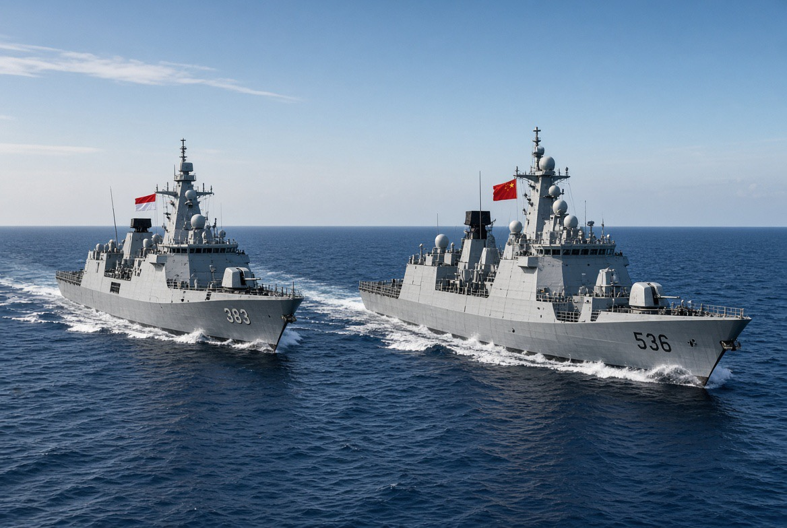

# Indonesia–China di Timur Taiwan: Mengapa Taipei Langsung Pasang Alis? 

*Ilustrasi (pic: Grok AI).*

  
***Semakin dekat kau bermain dengan dua kekuatan yang sedang saling curiga, semakin keras kedua pihak membaca gerak kakimu***
  

Yang membuat kasus ini penting bukan sekadar kapal Indonesia bertemu kapal China.

Masalahnya adalah, Indonesia, yang selama ini berusaha mempertahankan posisi bebas-aktif dan tidak masuk blok kekuatan, muncul bersama Angkatan Laut China di perairan sebelah timur Taiwan, pada saat Taiwan sedang menjalankan latihan militer Han Kuang.

Secara taktis mungkin sederhana, namun secara strategis? Bunyinya jauh lebih keras.

## Apa Sebenarnya yang Terjadi?

Menurut laporan terbaru Reuters, kapal Indonesia KRI I Gusti Ngurah Rai-332 sedang dalam perjalanan pulang dari Rusia dan melakukan passing exercise dengan kapal China.

Indonesia menekankan bahwa kegiatan tersebut rutin, non-tempur, dan tidak dimaksudkan sebagai operasi perang.

China menggambarkannya sebagai latihan navigasi yang mencakup komunikasi, manuver formasi, dan pengisian logistik di laut.

Ini juga disebut sebagai pertama kalinya China melakukan latihan semacam itu dengan angkatan laut asing di kawasan tersebut. 

Nah… di sinilah alis Taiwan naik. 

## Mengapa Taiwan Sensitif terhadap Lokasinya?

Karena timur Taiwan bukan sembarang laut. Secara geografis, sisi timur Taiwan menghadap langsung ke Pasifik Barat.

Dalam kalkulasi pertahanan Taiwan, kawasan ini sangat penting karena menjadi jalur keluar menuju Pasifik, relatif terbuka dibandingkan sisi barat Taiwan, mempunyai nilai strategis bagi operasi angkatan laut dan udara, serta berkaitan dengan kemungkinan strategi pengepungan atau encirclement jika terjadi konflik.

China sendiri menganggap Taiwan bagian dari wilayahnya dan tidak mengakui kedaulatan Taiwan sebagai negara terpisah. Taipei, sebaliknya, menolak klaim tersebut.

Maka ketika Beijing melakukan aktivitas militer atau maritim di sekitar Taiwan, lokasi geografis otomatis memperoleh makna politik.

## Taiwan menyebutnya “Provokasi”. Apakah itu Berlebihan?

Taiwan menyebut aktivitas tersebut “military provocation” dan menuduh Beijing berusaha menunjukkan atau menegaskan yurisdiksinya terhadap perairan di sekitar Taiwan.

Tetapi ada nuansa penting, militer Taiwan sendiri mengatakan tidak ada dampak langsung terhadap Taiwan dari kegiatan tersebut.

Jadi kita harus membedakan:

Level 1

Ancaman militer langsung?

Belum ada bukti bahwa latihan ini merupakan persiapan serangan terhadap Taiwan.

Level 2

Sinyal strategis?

Jelas lebih penting.

Karena China sedang menunjukkan bahwa kapal militernya mampu beroperasi bersama angkatan laut negara lain di kawasan yang sangat sensitif bagi Taiwan. 

Dengan kata lain, tidak ada rudal yang ditembakkan, tetapi ada pesan yang dikirim.

Dan dalam geopolitik, pesan semacam itu kadang justru lebih menarik daripada suara meriam.

## Lalu Indonesia sedang Bermain Apa? 

Nah, ini bagian yang paling menarik.

Indonesia tidak memiliki hubungan diplomatik resmi dengan Taiwan, tetapi memiliki hubungan ekonomi dan sosial yang sangat besar dengan masyarakat Taiwan.

Pada saat yang sama, Indonesia memiliki hubungan strategis dan ekonomi yang semakin penting dengan China.

Maka Jakarta menghadapi tiga kepentingan sekaligus:

China:
mitra ekonomi dan kekuatan regional utama.

Taiwan:
mitra ekonomi, teknologi, perdagangan, serta tempat tinggal banyak warga Indonesia.

Amerika Serikat dan negara Indo-Pasifik lainnya:
mitra strategis dan keamanan yang juga penting.

Indonesia karena itu memiliki insentif kuat untuk mengatakan: “Kami tidak sedang memilih kubu.” Dan itulah persis penjelasan resmi Indonesia mengenai latihan tersebut.

## Tapi ada Masalah dengan “Kami Tidak Memilih Kubu” 

Dalam hubungan internasional terdapat konsep security dilemma. Bahwa sebuah negara dapat melakukan sesuatu untuk alasan defensif atau rutin, tetapi negara lain melihat tindakan itu sebagai ancaman.

Misalnya,

Indonesia: “Kami cuma passing exercise.”

Taiwan: “Kenapa dilakukan bersama China di sebelah timur kami?”

China: “Ini latihan navigasi biasa.”

Taiwan: “Tetapi kalian memilih lokasi yang sangat sensitif.”

Indonesia: “Kami tidak berpihak.”

Dan semua pihak pulang sambil membawa interpretasi masing-masing. 

Inilah inti security dilemma. Niat suatu negara tidak selalu sama dengan persepsi negara lain terhadap niat tersebut.

## Timing-nya Justru Lebih Pedas 

Kegiatan ini terjadi ketika Taiwan sedang menjalankan latihan militer Han Kuang, latihan pertahanan utama Taiwan.

Jadi bayangkan situasinya. Taiwan sedang berlatih: “Bagaimana kalau China menyerang?” Kemudian di laut sebelah timurnya, kapal China melakukan kegiatan maritim bersama kapal Indonesia.

Secara hukum belum tentu ada pelanggaran. Namun secara militer belum tentu merupakan ancaman. Tetapi secara persepsi keamanan, timing tersebut sangat sensitif.

Dan itulah mengapa Taiwan bereaksi. 

## Apakah Indonesia sedang Bergeser ke Beijing?

Belum cukup bukti untuk menyimpulkan demikian. Ini bagian yang perlu kita tahan supaya analisis tidak tergelincir menjadi propaganda.

Ada dua fakta yang berjalan bersamaan.

Fakta A

Indonesia melakukan kegiatan maritim dengan China di kawasan sensitif.

Fakta B

Indonesia juga tetap menjaga hubungan pertahanan dengan Amerika Serikat dan negara lain.

Bahkan laporan Reuters mencatat bahwa perkembangan ini terjadi ketika pejabat pertahanan AS dan Indonesia sedang bertemu di Jakarta. 

Jadi lebih tepat melihat Indonesia sebagai negara yang sedang menjalankan hedging strategy.

Bukan: “Saya pilih China.” Bukan pula: “Saya pilih Amerika.” Melainkan: “Saya akan menjaga hubungan dengan keduanya selama masih memungkinkan.”

## Mengapa Strategi Hedging Masuk Akal bagi Indonesia?

Karena Indonesia tidak memiliki kepentingan untuk melihat Indo-Pasifik berubah menjadi perang blok.

Bayangkan jika terjadi: AS, Jepang, Australia, dan Taiwan vs. China. Indonesia akan berada di tengah jalur perdagangan yang sangat strategis.

Risikonya mencakup perdagangan, investasi, rantai pasok, keamanan laut, energi, pekerja migran, serta stabilitas ASEAN. Jadi bagi Jakarta, tidak berpihak secara formal dapat menjadi aset strategis. 

Tetapi hedging memiliki kelemahan. Semakin banyak kerja sama militer dengan satu kekuatan, semakin besar kemungkinan pihak lain bertanya: “Kamu sebenarnya netral atau sedang bergeser?”

Dan itulah problem yang sedang muncul sekarang.

## Yang Sebenarnya Diperebutkan Bukan Hanya Taiwan

Ini bagian yang paling menarik.

Persoalannya bukan hanya China vs Taiwan. Ada permainan yang lebih besar, China ingin menunjukkan bahwa aktivitas maritimnya di sekitar Taiwan adalah sesuatu yang normal dan dapat dilakukan bersama negara lain.

Sedangkan Taiwan ingin mencegah normalisasi aktivitas China di sekitar wilayah yang dianggapnya vital bagi keamanan nasional.

Sementara Indonesia ingin mempertahankan ruang strategis agar tidak dipaksa memilih blok.

Lalu Amerika Serikat ingin mempertahankan arsitektur keamanan Indo-Pasifik tanpa membuat negara seperti Indonesia sepenuhnya masuk orbit Beijing.

Nah, di sinilah kapal Indonesia menjadi lebih besar daripada ukuran kapalnya sendiri.

KRI tersebut secara fisik hanya satu kapal. Tetapi secara geopolitik ia membawa sebuah pertanyaan: Seberapa jauh Indonesia bersedia melakukan kerja sama keamanan dengan China tanpa dianggap ikut memperkuat posisi Beijing terhadap Taiwan?

## Apakah ini Berbahaya?

Belum merupakan tanda bahwa Indonesia sedang masuk perang China–Taiwan. Tetapi sebagai sinyal strategis, kasus ini patut diperhatikan.

Karena kalau aktivitas seperti ini menjadi rutin, persepsinya bisa berubah.

Hari ini passing exercise, bisa jadi besok latihan komunikasi, lusa latihan formasi. Kemudian latihan logistik. Lalu tiba-tiba semua pihak sadar: “Lho, kok sudah menjadi pola?” 

Dalam studi keamanan internasional, normalisasi aktivitas militer dapat mengubah apa yang sebelumnya dianggap luar biasa menjadi sesuatu yang dianggap biasa. Itu memiliki konsekuensi strategis.

Taiwan tidak sedang panik karena satu kapal Indonesia tiba-tiba menjadi kapal perang China. Namun Taiwan bereaksi karena konteks, lokasi, aktor, dan timing bertemu pada titik yang sensitif.

Dan Indonesia berada dalam posisi yang sangat menarik, tidak ingin menjadi sekutu militer China, tetapi juga tidak ingin memutus hubungan dengan China; tidak ingin menjadi bagian blok AS, tetapi juga tidak ingin kehilangan hubungan strategis dengan Washington.

Itulah hedging.

Namun hedging punya hukum besi: Semakin dekat kau bermain dengan dua kekuatan yang sedang saling curiga, semakin keras kedua pihak membaca gerak kakimu.

Jadi, pertanyaan yang jauh lebih menarik daripada “Indonesia pro-China atau tidak?” adalah: “Berapa lama Indonesia dapat mempertahankan ambiguitas strategis ketika rivalitas AS–China semakin militeristik?”

  
**Referensi**

Reuters. (2026, August 12). Indonesia says navy drill with China that angered Taiwan is routine. 

Reuters. (2026, August 11). China, Indonesia navies to hold drills in sensitive waters to east of Taiwan.

South China Morning Post. (2026, August 12). PLA to hold first joint naval drill with Indonesia in waters east of Taiwan. 

The Diplomat. (2026, July 30). At a Jakarta Conference, Two Maritime Orders Collide.
