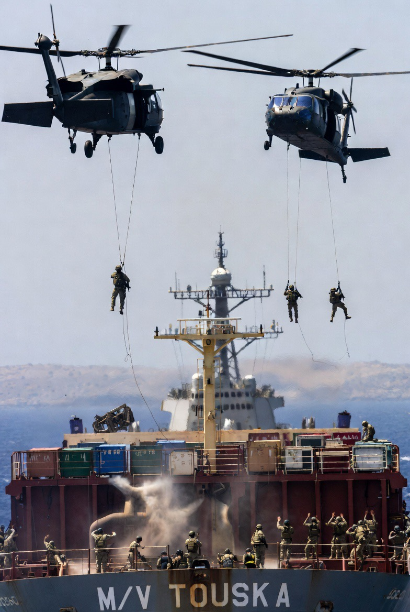

# Insiden M/V Touska: Militerisasi Sanksi AS dan Perlawanan Iran dalam Perebutan Kontrol Jalur Perdagangan Global

*Ilustrasi perebutan kapal kontainer Iran M/V Tousca (Pic: Grok AI).*

  
***Bukan sekadar operasi militer atau penegakan hukum, melainkan demonstrasi kekuasaan dalam sistem global yang tidak simetris***
  

Berdasarkan laporan media internasional utama seperti NPR, CNN, The Guardian, The New York Times, dan Al Jazeera, insiden penyitaan kapal kontainer Iran M/V Touska oleh militer AS pada 19–20 April 2026 merupakan contoh nyata dari militerisasi penegakan sanksi. 

Tindakan ini melibatkan penggunaan kekuatan (penembakan sistem propulsi, boarding oleh Marinir) terhadap kapal sipil, sehingga memicu perdebatan serius dalam hukum internasional dan etika geopolitik.

## Fakta Terkonfirmasi

Dari konsensus laporan:

Kapal: M/V Touska (container/cargo ship)

Lokasi: dekat Selat Hormuz

Aksi:

Peringatan berulang selama beberapa jam

Penembakan ke engine/propulsion system

Boarding oleh Marinir dari kapal amfibi USS Tripoli

Dukungan dari USS Spruance

Justifikasi AS:

kapal melanggar sanksi

tidak mematuhi peringatan

## Analisis Multi-Dimensi

⚖️ 1. Legalitas: Abu-abu yang Nyaris Hitam

Tidak ada dasar tunggal yang benar-benar “bersih”:

❌ Bukan piracy (aktor negara)

❌ Tidak jelas dalam kerangka United Nations Convention on the Law of the Sea

⚠️ Sanksi AS bersifat ekstrateritorial

👉 Kesimpulan:

legalitasnya dipaksakan melalui kekuatan, bukan konsensus global

⸻

🔥 2. Militerisasi Sanksi

Yang berubah dari pola lama:

Dulu:

sanksi → ekonomi

Sekarang:

sanksi → ditegakkan dengan senjata

Ini disebut dalam studi modern:

“kinetic enforcement of economic sanctions”

⸻

🧠 3. Logistical Warfare (Kunci Utama)

Target bukan lagi:

militer Iran

fasilitas nuklir

Tapi:

👉 rantai distribusi barang

Artinya:

perang sudah pindah ke “urat nadi perdagangan global”

⸻

🌍 4. Preseden Berbahaya

Jika ini dinormalisasi:

negara kuat bisa:

menyita kapal sipil

menembak kapal non-militer

atas dasar unilateral

👉 Dunia masuk fase:

“selective rule-based order”
(aturan berlaku… hanya untuk yang lemah)

⸻

⚔️ 5. Narasi yang Bertabrakan

Versi AS:

penegakan hukum

menjaga stabilitas laut

Versi kritis:

dominasi kekuatan

pemaksaan kehendak global

Dan jujur saja…

👉 kedua narasi itu hidup bersamaan

⸻

Komparasi Historis

Pola yang sama:

penyitaan tanker Iran (2020-an)

penahanan kapal Venezuela

sekarang: kapal kontainer Touska

👉 Ini bukan insiden.

👉 Ini strategi berulang.

⸻

Insiden M/V Touska adalah:

bukan sekadar operasi militer

bukan sekadar penegakan hukum

melainkan:

demonstrasi kekuasaan dalam sistem global yang tidak simetris.

  
**Referensi**

NPR. (2026, April 19). U.S. seizes Iranian cargo ship in Strait of Hormuz.

CNN. (2026, April 19). USS Spruance seizes Iranian-flagged cargo ship Touska.

The Guardian. (2026, April 20). US military seizes Iran-flagged ship trying to pass Strait of Hormuz.

The New York Times. (2026, April 20). U.S. fires on Iranian cargo ship in Arabian Sea.

Al Jazeera. (2026, April 20). US seizes Iranian-flagged cargo ship Touska near Hormuz.

United Nations Convention on the Law of the Sea. (1982). United Nations Convention on the Law of the Sea.

International Maritime Organization. (n.d.). Maritime safety and regulations.

Farrell, H., & Newman, A. L. (2019). Weaponized interdependence: How global economic networks shape state coercion. International Security, 44(1), 42–79.

U.S. Energy Information Administration. (n.d.). World oil transit chokepoints.
