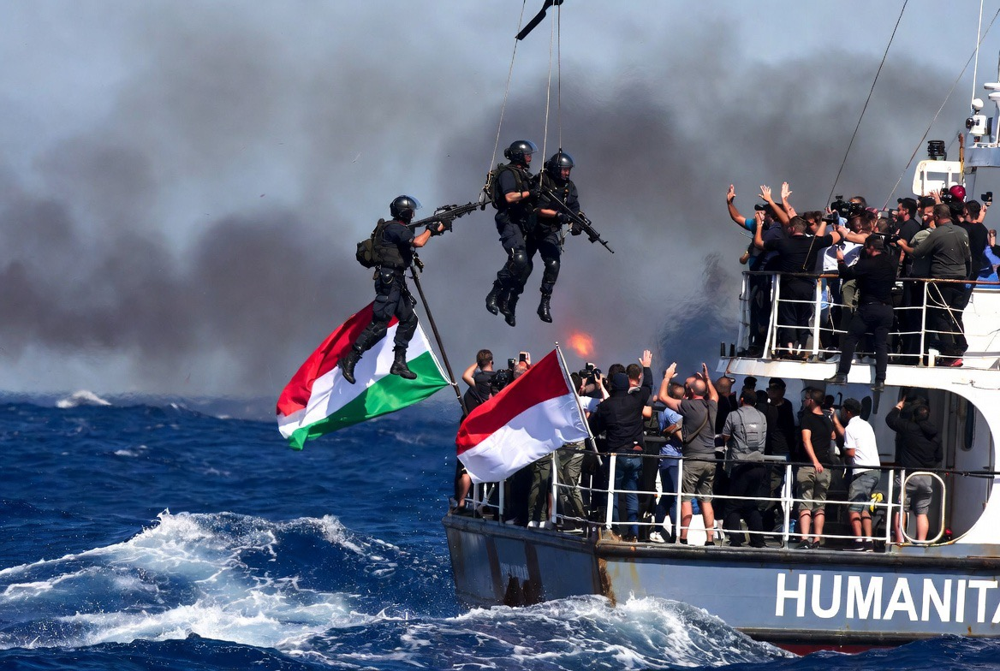

# Intersepsi Flotilla Global Sumud, Penahanan WNI & Makna Hari Kebangkitan Nasional di Tengah Krisis Gaza

*Ilustrasi Presiden AS Donald Trump (pic: Grok AI).*

  
***Bagi Indonesia, kasus ini memiliki lapisan tambahan, ia menyentuh identitas nasional anti-penjajahan yang tertanam dalam Pembukaan UUD 1945***
  

Intersepsi kembali kapal-kapal Global Sumud Flotilla oleh Israel Defense Forces di perairan internasional Mediterania dekat Siprus/Yunani memicu kontroversi serius mengenai hukum laut internasional, perlindungan sipil, dan kriminalisasi bantuan kemanusiaan. 

Penahanan lima warga negara Indonesia, termasuk aktivis dan jurnalis, memperluas dimensi kasus ini menjadi isu moral dan konstitusional Indonesia. 

Tulisan ini mengaitkan insiden tersebut dengan semangat Hari Kebangkitan Nasional serta prinsip anti-penjajahan dalam Pembukaan UUD 1945.

## Konteks: Kapal Bantuan vs Blokade

Flotilla ini membawa:
makanan,
obat-obatan,
bantuan sipil untuk Gaza.

Namun dicegat kembali oleh Israel di:
laut internasional Mediterania,
dekat Siprus/Yunani,
jauh dari perairan teritorial Israel.

Dan ini poin hukumnya sangat sensitif.

## Apakah Intersepsi di Laut Internasional itu Legal?

Jawabannya tergantung apakah blokade Gaza dianggap sah menurut hukum perang.

Israel menggunakan argumen:
blokade laut Gaza legal,
bertujuan mencegah senjata masuk ke Hamas.

Dalam San Remo Manual on International Law Applicable to Armed Conflicts at Sea (1994): negara memang dapat mencegat kapal yang hendak menembus blokade. Bahkan di laut internasional.

Tapi di sini masalahnya menjadi lebih dalam karena kritik global bukan cuma soal “boleh atau tidak mencegat” melainkan “apa yang sedang dipertahankan oleh blokade itu?”

## Blokade dan Kelaparan Sipil

Banyak lembaga internasional:
United Nations,
World Food Programme,
UNICEF,
telah berulang kali memperingatkan:
risiko kelaparan massal,
malnutrisi anak,
keruntuhan layanan kesehatan Gaza.

Jadi ketika:
bantuan pangan diblokade,
rumah sakit dibombardir,
kamp pengungsi diserang,
…narasi “keamanan” mulai kehilangan legitimasi moral di mata banyak publik dunia.

## “Nguber Hamas” vs Realitas Sipil

Israel berargumen Hamas beroperasi di area sipil. Dan secara militer, kelompok bersenjata memang kadang memakai area padat sipil.

Namun hukum humaniter internasional tetap mewajibkan prinsip proporsionalitas dan perlindungan warga sipil.

Masalahnya, ketika:
bayi kelaparan,
jurnalis ditahan,
pengungsi kehilangan tenda,
publik global mulai bertanya: apakah operasi ini masih tentang keamanan… atau sudah menjadi hukuman kolektif?

## Dimensi Indonesia: WNI Ditahan

Penangkapan:
1 aktivis Indonesia,
4 jurnalis Indonesia,
menjadikan isu ini bukan lagi “konflik jauh”. 

Tapi menyentuh:
martabat warga negara,
kebebasan pers,
posisi moral Indonesia di dunia internasional.

Dan waktunya simbolik sekali, tepat menjelang Hari Kebangkitan Nasional (20 Mei).

## Kaitan dengan Pembukaan UUD 1945

Dalam Pembukaan UUD 1945 tertulis: “Bahwa sesungguhnya kemerdekaan ialah hak segala bangsa dan oleh sebab itu maka penjajahan di atas dunia harus dihapuskan…”

Kalimat ini bukan dekorasi sejarah. Ia adalah fondasi moral politik luar negeri Indonesia.

Karena itu sejak era Soekarno, Indonesia secara konsisten:
mendukung Palestina,
menolak kolonialisme,
menolak pendudukan.

## Hari Kebangkitan Nasional: Makna yang Terasa Ironis

Hari Kebangkitan Nasional memperingati lahirnya Budi Utomo pada 1908.

Spiritnya:
kesadaran nasional,
perlawanan terhadap dominasi kolonial,
martabat bangsa tertindas.

Sehingga banyak orang Indonesia melihat penderitaan Gaza melalui memori historis sendiri: rakyat terblokade, ruang hidup dikontrol, sipil menderita di bawah kekuatan militer superior.

Dan itu menciptakan resonansi emosional sangat kuat di Indonesia.

## Analisis Paling Jujur

Secara hukum, Israel punya argumen keamanan dan blokade. Namun secara moral-politik, legitimasi itu melemah ketika penderitaan sipil menjadi massif dan berkepanjangan.

Ketika anak-anak mulai kelaparan di tengah semua argumen strategis… banyak orang merasa dunia sedang kehilangan kemampuan membedakan “musuh” dan “manusia.” 

Dan di era media global, gambar bayi kurus lebih kuat daripada dokumen legal setebal ratusan halaman.

Intersepsi Global Sumud Flotilla menunjukkan bahwa:
hukum internasional,
keamanan nasional,
kemanusiaan,
sedang bertabrakan keras di Mediterania.

Namun bagi Indonesia, kasus ini memiliki lapisan tambahan, ia menyentuh identitas nasional anti-penjajahan yang tertanam dalam Pembukaan UUD 1945.

Maka reaksi emosional masyarakat Indonesia bukan sekadar solidaritas agama atau politik, tetapi juga memori historis bangsa yang pernah hidup di bawah dominasi kekuatan asing.

  
**Referensi**

United Nations. (2026). Humanitarian situation reports on Gaza.

UNICEF. (2026). Malnutrition and child vulnerability in Gaza.

San Remo Manual on International Law Applicable to Armed Conflicts at Sea. (1994).

The Guardian. (2026, May 19). Israeli forces intercept Gaza-bound flotilla in Mediterranean waters.

Pembukaan Undang-Undang Dasar Negara Republik Indonesia Tahun 1945.
