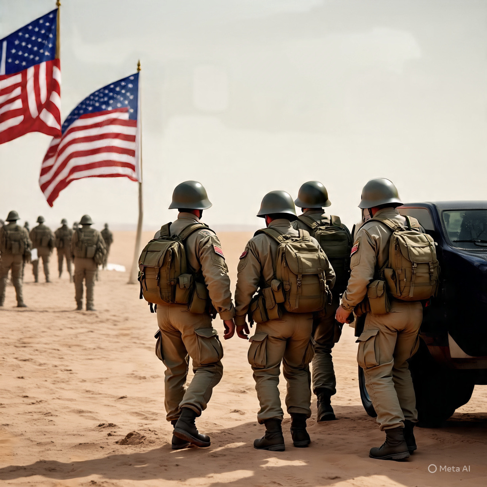

# Dari Eskalasi ke Stabilitas atau Destabilisasi? Analisis Kritis Skenario Intervensi AS terhadap Iran dan Potensi Perubahan Rezim

*Ilustrasi intervensi(pic: Meta AI).*

  
***Iran tetap menegaskan kesediaan negosiasi, sementara secara strategis siap mempertahankan diri jika dipaksa berkonfrontasi***
  

Artikel ini mengevaluasi proyeksi skenario ekstrem dalam hubungan Amerika Serikat–Iran pasca berbagai ketegangan geopolitik terbaru: pengerahan kekuatan militer AS, tekanan sanksi, dinamika protes domestik di Iran, dan kemungkinan perubahan rezim lewat intervensi eksternal. 

Menggunakan data berita terbaru dan literatur hubungan internasional, tulisan ini menilai apakah skenario yang mirip model Venezuela (penculikan pemimpin, intervensi penuh, perang saudara) mungkin terjadi, atau justru tidak rasional dari perspektif strategi internasional dan hukum global.

## Kondisi Aktual Ketegangan AS–Iran (Februari 2026)

Dalam 24–48 jam terakhir, sejumlah fakta penting telah muncul:

A. Dinamika Militer

AS telah menempatkan armada perang besar di wilayah Teluk Persia, termasuk kapal induk USS Abraham Lincoln dan banyak pesawat tempur serta sistem pendukung, menunjukkan kemampuan ofensif kuat jika diperlukan. Namun tidak ada serangan langsung yang terjadi hingga kini.  

B. Iran memilih dialog terbuka

Presiden Iran Masoud Pezeshkian memerintahkan pembicaraan “adil dan setara” dengan AS di tengah ketegangan tentang program nuklir meski bersyarat dan menolak negosiasi di bawah tekanan militer.  

C. Retorika keras tetap ada

Pemimpin Iran memperingatkan setiap serangan AS dapat memicu konflik regional yang lebih luas, menggambarkan strategi deterrence (pencegah).  

D. Protesta domestik menambah kompleksitas

Iran mengalami gelombang protes besar yang berujung pada kekerasan represif domestik oleh aparat keamanan.  

## Kaji Ulang Skenario “Venezuela 2.0”

A. Penculikan Pemimpin Iran (Seperti Maduro)?

Dalam kasus Venezuela, proses tersebut melibatkan:

• negara kecil

• tekanan internal ekonomi

• politisi lokal yang lemah terhadap Washington

• kurangnya pertahanan bersenjata yang kuat

Iran berbeda secara fundamental:

• Negara menengah dengan kemampuan militer signifikan

• Hubungan strategis dengan mitra non-Barat seperti Rusia

• Retorika kuat terhadap ancaman eksternal

• Tidak bergantung pada ekspor minyak secara penuh seperti Venezuela  

Artinya intervensi langsung untuk menculik pemimpin rezim bukan hanya ilegal secara hukum internasional, tetapi juga strategi militer yang sangat berisiko tinggi dengan potensi reaksi keras dari angkatan bersenjata Iran dan sekutu regionalnya.

## Apakah AS punya alasan strategis untuk meng-invasi dan mengganti rezim?

Permintaan Trump soal negosiasi nuklir atau sanksi bukanlah sinyal pasti perang. Bahkan ketika AS meningkatkan kehadiran militer, ini sering digunakan sebagai:

• leverage diplomatik, bukan persiapan invasi penuh;

• sinyal tekanan militer tanpa eskalasi langsung yang menghancurkan.  

Selain itu, taruhan militer langsung menghadapi risiko:

• reaksi nuklir Iran jika merasa terancam kehancurannya sendiri

• terperangkapnya AS dalam konflik regional berkepanjangan

Ini membuat skenario perang penuh atau “ganti rezim ala Venezuela” kurang realistis dalam kerangka kebijakan ACTUAL realpolitik.

## Alasan Utama Kenapa Skenario Ekstrem Itu Tidak Rasional

A. Sistem Internasional dan Hukum

Invasi sepihak atau penculikan pemimpin asing adalah pelanggaran serius Piagam PBB, yang hampir pasti memicu kecaman global, retaliasi regional, dan berpotensi operasi balasan dari negara-negara yang tidak ingin hegemon global mengukuhkan kekuasaan absolut.

B. Struktur Kekuatan Iran

Iran bukan rezim yang mudah runtuh. Struktur militernya — termasuk IRGC — kuat, terorganisir, dan memiliki pengalaman bertahun-tahun menghadapi sekutu regional AS.  

C. Reaksi Mitra Non-Barat

Negara-negara lain seperti Rusia telah menyerukan diplomasi untuk mencegah perang dan menolak solusi kekerasan, menunjukkan adanya kekuatan penyeimbang terhadap opsi ofensif.  

Skenario Venezuela-style regime change di Iran adalah kemungkinan ekstrem yang tidak didukung oleh realpolitik kontemporer.

Posisi militer AS saat ini lebih menunjukkan leverage negosiasi daripada niat invasi total.

Iran tetap menegaskan kesediaan negosiasi, sementara secara strategis siap mempertahankan diri jika dipaksa berkonfrontasi.  

Hukum internasional dan penyeimbang global membuat skenario penculikan pemimpin asing atau perang saudara terstruktur menjadi implausibel.

Jalur yang paling mungkin adalah kombinasi tekanan diplomatik, sanksi ekonomi, dan negosiasi yang berhati-hati di bawah pengawasan sejumlah negara netral.

  
**Referensi**

• AP News. (2026, February 2). Iran’s president seeks ‘fair and equitable negotiations’ with the United States. AP News.  • The Guardian. (2026, February 2). Iran says Tehran is ready to pursue ‘fair’ talks with US. The Guardian.  

• Washington Post. (2026, February 3). A U.S. ‘armada’ near Iran could signal military action. Washington Post.  

• Times of India. (2026, February 2026). Iran offers nuclear talks after Trump ultimatum. Times of India.  

• Times of India. (2026). ‘This time, it will be a regional war’ — Khamenei warns US allies. Times of India.  

• ANTARA News. (2026, January). Menlu Iran sebut negaranya siap perang jika dipaksa konfrontasi. ANTARA News.  
