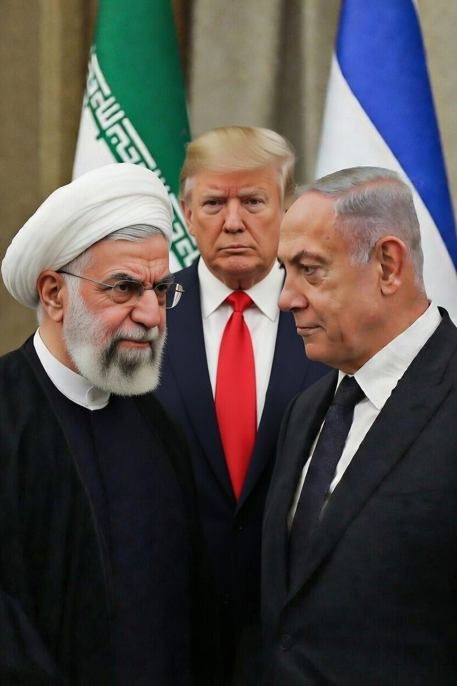

# Iran, Israel, dan Logika Proxy Warfare dalam Sistem Keamanan Timur Tengah

*Ilustrasi konflik (pic: Grok AI).*

  
***Dalam sistem internasional, moralitas jarang menjadi variabel dominan. Kepentingan dan keamanan jauh lebih keras kepala***
  

Secara formal, tidak ada deklarasi perang.
Namun dalam literatur keamanan, ada konsep: extended deterrence.

AS menjaga Israel sebagai sekutu utama. Jika Israel merasa terancam eksistensial, AS cenderung memberi dukungan militer atau diplomatik.

Iran dipandang sebagai ancaman karena:

•	Program nuklirnya

•	Dukungan terhadap kelompok seperti Hezbollah, Hamas, Islamic Revolutionary Guard Corps (IRGC).

Dalam kacamata Washington, ini bukan soal Palestina saja. Ini soal balance of power regional.

## Apakah Iran hanya “membela Palestina”?

Ini narasi yang kuat secara moral.
Tapi dalam analisis kali ini, kita lihat kepentingan strategis.

Iran menggunakan dukungan pada Palestina untuk:

•	memperluas pengaruh regional

•	menekan Israel tanpa perang langsung

•	memperkuat legitimasi domestik dan regional

Konsepnya disebut: proxy deterrence strategy.

Iran tahu perang langsung dengan Israel dan AS akan mahal. Maka ia membangun jaringan “tentakel”.

Ini bukan sekadar solidaritas. Ini strategi negara rasional.

## Ketakutan AS soal nuklir Iran

Apakah Iran sudah punya senjata nuklir?
Belum ada bukti publik bahwa Iran memiliki senjata operasional.

Namun Iran memperkaya uranium pada level tinggi.
Itu menciptakan: nuclear ambiguity.

Ambiguitas itu sendiri sudah cukup menciptakan tekanan.

Israel sendiri memiliki kebijakan ambigu nuklir, sering disebut “nuclear opacity”. Jadi kedua pihak bermain dalam bayangan.

## Apakah Solusi Sesederhana “Israel Hormati Hak Palestina”?

Secara normatif, penghormatan terhadap hak Palestina jelas mengurangi legitimasi perlawanan bersenjata.

Namun konflik ini bukan satu variabel.

Ada faktor:

•	Identitas religius

•	Politik domestik Israel

•	Politik domestik Iran

•	Fragmentasi Palestina (Fatah vs Hamas)

•	Kepentingan AS

•	Kepentingan Saudi dan Teluk

Konflik ini sudah menjadi: sistem konflik terlembagakan

Ia bertahan bukan hanya karena ketidakadilan, tetapi karena banyak aktor mendapatkan keuntungan politik dari keberlangsungannya.

Pahit, tapi realistis.

## Apakah Proksi Iran hanya Defensif?

Tidak selalu.

Beberapa serangan proksi:

•	juga bertujuan meningkatkan leverage Iran

•	menunjukkan kemampuan gangguan regional

•	menekan AS secara tidak langsung

Dalam literatur hubungan internasional, ini disebut: asymmetric escalation management.

## Jadi Siapa “Penjahatnya”?

Pendekatan kali ini tidak mencari villain.
Kita mencari struktur.

Strukturnya adalah:

•	Israel mengamankan superioritas militer

•	Iran mencegah dominasi Israel

•	AS menjaga sekutu

•	Palestina terjebak dalam pertarungan kekuatan besar.

Palestina bukan hanya korban. Ia juga menjadi arena simbolik.

Dan ya, kebijakan Israel terhadap wilayah Palestina, termasuk ekspansi permukiman, adalah faktor yang memperpanjang konflik dan memberi bahan bakar legitimasi bagi aktor seperti Iran.

Itu fakta politik, bukan slogan.

## Apakah AS Takut Iran Menyerang dengan Nuklir?

Secara strategis, ya.
Bukan karena serangan langsung pasti terjadi, tetapi karena kemungkinan itu mengubah kalkulasi keamanan regional.

Dalam teori keamanan, ini disebut: security dilemma spiral.

Setiap langkah defensif satu pihak terlihat ofensif bagi pihak lain.

Konflik ini bukan soal:

•	Israel jahat vs Iran baik
atau

•	Iran jahat vs Israel baik

Ini adalah: kompetisi hegemonik regional dengan Palestina sebagai pusat legitimasi moral.

Dan selama:

•	Israel mempertahankan kebijakan yang dianggap represif

•	Iran memanfaatkan isu Palestina sebagai instrumen geopolitik

•	AS mempertahankan dominasi regional

maka konflik akan terus berulang.

Solusi memang mungkin terlihat sederhana secara moral. Namun dalam sistem internasional, moralitas jarang menjadi variabel dominan. Kepentingan dan keamanan jauh lebih keras kepala.

  
**Referensi**

Cananti, P. P. A. (2023).
Dampak keterlibatan Iran dalam proxy war Yaman melalui kelompok Houthi terhadap instabilitas regional (2015–2020). Global Insight Journal: Jurnal Mahasiswa Hubungan Internasional. https://doi.org/10.36859/gij.v1i2.2620  

Choirun Nisa, A. Z. (2025).
Konflik Iran–Israel: analisis faktor-faktor yang mempengaruhi dinamika hubungan dan dampaknya. Syntax Literate: Jurnal Ilmiah Indonesia. https://doi.org/10.36418/syntax-literate.v10i7.60741  

Fahruddin & Nurhakim Habib, H. A. (2020).
Proxy war dalam konflik Yaman: keterlibatan negara asing dan kepentingannya. Istoria: Jurnal Pendidikan dan Ilmu Sejarah. https://doi.org/10.21831/istoria.v18i1.42360  

Iran’s proxy war strategy. (2024).
Orbis, 68(3), 416–437. https://doi.org/10.1016/j.orbis.2024.05.006  

Retian, E. (2011).
Perang proxy pada keterlibatan Iran dalam konflik Lebanon–Israel (2006–2010). S1 thesis, Universitas Muhammadiyah Yogyakarta.  

Axis of Resistance. (2026).
Wikipedia entry on the informal Iranian-led military coalition in West Asia.  
