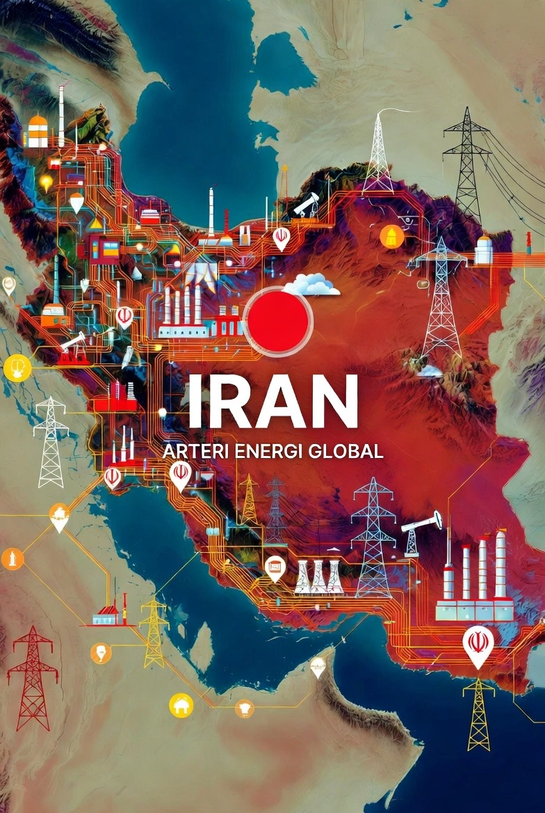

# Iran sebagai Arteri Energi Global: Mengapa Konflik Regional Berubah Menjadi Krisis Ekonomi Dunia

*Ilustrasi Iran arteri energi global (pic: Grok AI).*

  
***Konflik yang melibatkan Iran memiliki dimensi global karena posisinya dalam jaringan distribusi energi internasional***
  

Konflik yang melibatkan Iran sering kali memicu reaksi geopolitik yang jauh melampaui kawasan Timur Tengah. 

Banyak diskusi publik masih ribut soal ideologi dan moral, sementara pipa minyak diam-diam menjadi naskah asli dari drama geopolitik dunia. Sehingga dapat dipahami bahwa konflik ini ujungnya minyak dan kontrol jalur strategis.

Artikel ini berargumen bahwa posisi geografis Iran dalam sistem energi global, khususnya kedekatannya dengan Selat Hormuz, menjadikan setiap eskalasi konflik di kawasan tersebut berdampak langsung terhadap stabilitas ekonomi internasional. 

Dengan pendekatan ekonomi-politik internasional dan geopolitik energi, studi ini menunjukkan bahwa diskursus “stabilitas regional” yang sering digunakan oleh negara besar sebenarnya berkaitan erat dengan upaya menjaga keamanan jalur distribusi energi global. 

Analisis ini menyimpulkan bahwa konflik Iran bukan sekadar isu keamanan regional, melainkan juga mekanisme kontrol terhadap arteri energi dunia.

## Pendahuluan

Dalam studi hubungan internasional, konflik Timur Tengah sering dijelaskan melalui narasi ideologis seperti keamanan, terorisme, atau rivalitas agama. 

Namun perspektif ekonomi politik internasional menunjukkan bahwa faktor energi memiliki peran yang sangat menentukan.

Iran terletak di dekat Selat Hormuz, jalur maritim strategis yang menghubungkan Teluk Persia dengan Samudra Hindia. 

Selat ini merupakan jalur utama ekspor minyak dari negara-negara produsen utama seperti Arab Saudi, Irak, Kuwait, Qatar, dan Uni Emirat Arab.

Karena itu, setiap konflik yang melibatkan Iran berpotensi mengganggu rantai pasok energi global, sehingga memicu respons cepat dari kekuatan besar dunia.

## Geopolitik Energi

Konsep geopolitik energi menjelaskan bagaimana distribusi sumber daya energi memengaruhi strategi negara.

Menurut teori ini, negara yang mengendalikan jalur energi strategis memiliki pengaruh besar terhadap stabilitas ekonomi global.

## Teori Interdependensi Ekonomi

Dalam sistem ekonomi global yang saling terhubung, gangguan pada satu titik distribusi dapat memicu efek domino terhadap pasar global.

## Realisme dalam Hubungan Internasional

Pendekatan realis menekankan bahwa negara bertindak berdasarkan kepentingan nasional, terutama terkait keamanan dan sumber daya strategis. Energi menjadi salah satu kepentingan utama tersebut.

## Iran dan Selat Hormuz sebagai Titik Strategis

Selat Hormuz merupakan salah satu chokepoint energi paling penting di dunia.

Data menunjukkan:

•	sekitar 20 juta barel minyak per hari melewati selat ini

•	sekitar 20% perdagangan minyak global bergantung pada jalur tersebut

•	sekitar seperlima perdagangan LNG dunia juga melewati kawasan ini

Gangguan terhadap jalur ini dapat menyebabkan lonjakan harga energi secara global dan meningkatkan ketidakstabilan ekonomi internasional.

Dengan demikian, Iran berada pada posisi strategis yang memungkinkan negara tersebut memengaruhi sistem energi global secara signifikan.

## Dampak Konflik Iran terhadap Ekonomi Global

Konflik yang melibatkan Iran memiliki beberapa konsekuensi utama:

1. Lonjakan Harga Energi

Ketegangan militer di Teluk Persia sering diikuti oleh kenaikan harga minyak karena pasar memperkirakan kemungkinan gangguan distribusi.

2. Ketidakpastian Pasar Global

Ketegangan geopolitik meningkatkan volatilitas pasar keuangan dan energi.

3. Tekanan terhadap Negara Importir Energi

Negara seperti China, India, Jepang, dan Korea Selatan sangat bergantung pada minyak dari kawasan Teluk Persia.

Gangguan distribusi energi dapat memengaruhi pertumbuhan ekonomi mereka secara langsung.

## Diskursus “Stabilitas Regional” dalam Politik Global

Dalam banyak pernyataan diplomatik, negara besar sering menekankan pentingnya menjaga stabilitas Timur Tengah.

Namun analisis ekonomi politik menunjukkan bahwa stabilitas yang dimaksud sering kali berkaitan dengan keamanan distribusi energi.

Dengan kata lain, konflik yang menyentuh Iran tidak hanya dipandang sebagai ancaman keamanan, tetapi juga sebagai ancaman terhadap arteri energi global.

## Implikasi Geopolitik Jangka Panjang

Posisi Iran dalam sistem energi global menghasilkan beberapa implikasi strategis:

1.	Iran akan tetap menjadi pusat perhatian geopolitik dunia.

2.	Setiap eskalasi konflik berpotensi memicu respons internasional cepat.

3.	Selat Hormuz akan terus menjadi titik sensitif dalam keamanan energi global.

Karena itu, stabilitas kawasan Teluk Persia merupakan salah satu faktor utama dalam menjaga kestabilan ekonomi dunia.

Analisis ini menunjukkan bahwa konflik yang melibatkan Iran memiliki dimensi global karena posisinya dalam jaringan distribusi energi internasional. 

Selat Hormuz sebagai jalur utama perdagangan energi menjadikan kawasan tersebut sebagai arteri vital bagi ekonomi dunia.

Oleh karena itu, setiap eskalasi konflik di sekitar Iran tidak hanya berdampak pada keamanan regional, tetapi juga berpotensi memengaruhi stabilitas ekonomi global secara luas.

  
**Referensi**

BP Statistical Review of World Energy. (2024). Global energy markets and oil flows.

Colgan, J. (2013). Petro-aggression: When oil causes war. Cambridge University Press.

International Energy Agency. (2024). World Energy Outlook.

Klare, M. (2012). The race for what’s left: The global scramble for the world’s last resources. Metropolitan Books.

O’Sullivan, M. (2017). Windfall: How the new energy abundance upends global politics. Simon & Schuster.

U.S. Energy Information Administration. (2023). The Strait of Hormuz is the world’s most important oil transit chokepoint.
