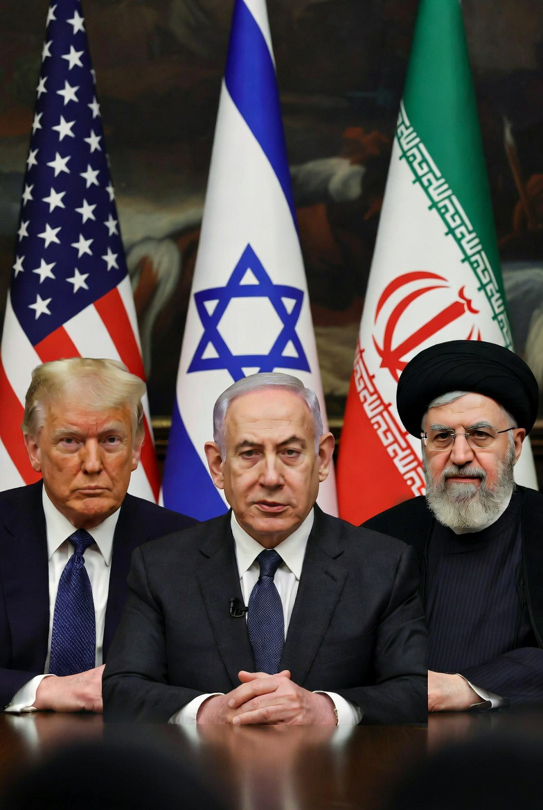

# Iran vs Israel–AS 2026: Perang Berakhir  atau “Perang Beku” yang Menunggu Meledak Lagi?

*Ilustrasi (pic: Grok AI).*

  
***Fase paling menyeramkan dalam geopolitik bukan saat bom jatuh melainkan saat semua orang tersenyum diplomatis sambil diam-diam tetap mengisi ulang misilnya***
  

Pasca-ceasefire 7 April 2026 antara Iran dan koalisi Israel–AS, situasi Timur Tengah memasuki fase ambigu: perang resmi berhenti, tetapi blokade, pengerahan militer, dan konflik politik terus berlangsung. 

Sementara itu, Menteri Pertahanan AS Pete Hegseth menghadapi tekanan besar di Kongres terkait legalitas perang, biaya konflik, dan pemecatan pejabat militer senior. 

Tulisan ini menganalisis apakah gencatan senjata tersebut benar-benar menuju perdamaian atau justru membentuk “frozen conflict” baru yang sewaktu-waktu bisa meledak kembali.

## Pendahuluan

Saat ini dunia masuk fase yang paling berbahaya:
bukan perang total, tapi “tidak benar-benar damai.”

Karena saat ini:
serangan besar berhenti,
tapi blokade masih ada,
armada perang masih berjaga,
sanksi tetap berjalan,
dan semua pihak masih saling ancam.

Trump bahkan mengklaim: “hostilities have terminated. Tapi banyak senator AS menjawab: “bullshit.” 

## Kenapa Menteri Pertahanan AS Dicecar Kongres?

Karena Kongres mulai melihat tiga masalah besar:

| Masalah | Intinya |
|------|-------|
| Legalitas | perang dimulai tanpa izin Kongres |
| Biaya | perang makin mahal |
| Strategi | tujuan akhirnya gak jelas |

Pete Hegseth diserang habis-habisan oleh Demokrat, bahkan sebagian Republik mulai gelisah.  

## Titik paling kontroversial

Hegseth mengklaim ceasefire “menghentikan jam War Powers Act.”
Artinya:
karena perang sedang pause,
Trump merasa belum perlu minta izin Kongres.

Banyak ahli hukum dan senator bilang: interpretasi itu akrobat politik, karena:
pasukan AS masih di Timur Tengah,
blokade Iran masih berjalan,
kapal perang masih aktif.

## Bagaimana dengan Anggaran Militernya?

Nah ini bagian yang bikin panas.

Pentagon mengakui perang Iran sudah menghabiskan sekitar US$25 miliar.

Dan Trump administration tetap mendorong anggaran pertahanan US$1,5 triliun, yang disebut sebagai salah satu proposal militer terbesar dalam sejarah AS.  

Tapi masalahnya, AS sekarang menghadapi:
harga minyak naik,
stok misil menipis,
biaya logistik membengkak,
tekanan domestik meningkat.

Bahkan ada kekhawatiran: perang Iran mengganggu kesiapan AS menghadapi China/Taiwan.

## Apakah Perang Akan Lanjut Lagi?

Kemungkinan terbesar sekarang adalah: “no war, no peace.”

Bukan damai sungguhan.

Tapi juga bukan perang terbuka penuh.

Kenapa?

Karena semua pihak sebenarnya kelelahan.

Iran:
ekonominya tertekan,
infrastrukturnya rusak,
tapi rezimnya masih bertahan.

AS:
biaya perang membesar,
Kongres mulai ribut,
publik AS tidak terlalu antusias perang panjang.

Israel:
masih agresif,
tapi juga mulai menghadapi tekanan global dan ekonomi.

Akibatnya:
semua pihak sekarang memilih tekanan bertahap dibanding perang total.

Bentuk “Perang Beku” yang Mungkin Terjadi

Kemungkinan ke depan:

| Bentuk | Kemungkinan |
|------|-------|
| blokade ekonomi | tinggi |
| perang siber | tinggi |
| operasi intelijen | tinggi |
| serangan proksi | tinggi |
| perang total langsung | lebih rendah (sementara) |

Jadi ceasefire sekarang terasa seperti:
pistol yang diletakkan di meja… tapi pelurunya masih di dalam.

## Faktor Penentu Terbesar: Hormuz

Selama:
Selat Hormuz belum normal,
Iran masih ditekan,
dan Israel terus operasi regional,
maka perdamaian sejati belum ada. Karena energi dunia masih jadi sandera geopolitik.

## Inti Terdalam

Yang sebenarnya sedang terjadi sekarang bukan cuma perang Iran tapi perebutan bentuk tatanan Timur Tengah baru.

AS ingin:
mempertahankan dominasi regional.

Israel ingin:
memastikan Iran tidak menjadi ancaman strategis.

Iran ingin:
tetap bertahan sebagai kekuatan regional independen.

Dan semuanya terjebak dalam situasi absurd, terlalu takut untuk perang total, tapi terlalu penuh dendam untuk damai sungguhan.

Ceasefire Iran–Israel–AS 2026 saat ini lebih tepat disebut “stabilitas semu” karena:
senjata besar memang diam,
tetapi tekanan ekonomi, militer, dan politik masih terus bergerak di bawah permukaan.

Kadang fase paling menyeramkan dalam geopolitik bukan saat bom jatuh… melainkan saat semua orang tersenyum diplomatis, sambil diam-diam tetap mengisi ulang misilnya.

  
**Referensi**

The Guardian. (2026). Trump claims hostilities have ended in Iran in letter to congressional leaders. 

The Washington Post. (2026). A deadline for the Iran war is here. What does the War Powers Act say?  

Defense News. (2026). Ceasefire ‘stops’ War Powers clock on Iran, Hegseth claims.  

Reuters. (2026). US bypasses congressional review for military sales of $8.6 billion to Middle East allies.  

Al Jazeera. (2026). Pentagon chief Hegseth first public hearing on Iran war: Key takeaways.  
