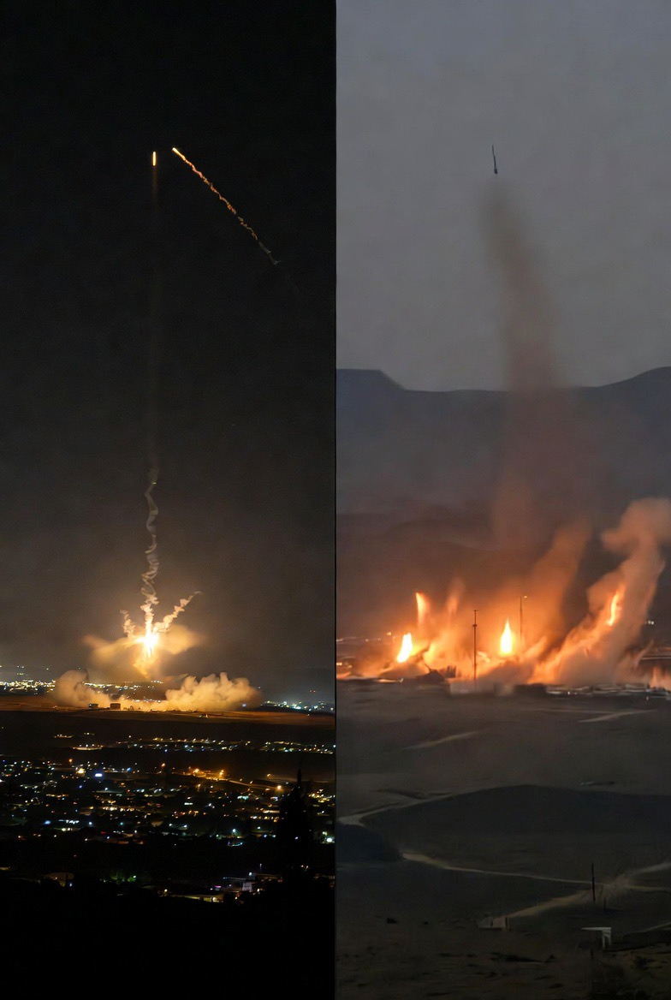

# Iran-Israel Kembali Membara: Gencatan Senjata Retak, Beirut sebagai Pemicu, & Timur Tengah Kembali Berdiri di Tepi Jurang 

*Ilustrasi (pic: Grok AI).*

  
***“Perdamaian paling berbahaya adalah perdamaian yang sebenarnya hanya jeda untuk mengisi ulang amunisi.”***
  

Peristiwa 8 Juni 2026 terasa sangat dekat dengan kalimat itu. Karena yang pecah bukan sekadar serangan udara atau rudal , namun kepercayaan minimum yang selama ini menopang gencatan senjata rapuh sejak April.  

Eskalasi Iran-Israel pada 8 Juni 2026 menjadi konfrontasi paling serius sejak gencatan senjata April. Rangkaian serangan Israel di Lebanon dan Iran memicu respons rudal Iran terhadap Israel. 

Presiden AS Donald Trump mendesak penghentian tembak-menembak dan mengklaim proses perdamaian masih berlangsung, sementara Iran memperingatkan bahwa serangan lebih lanjut terhadap Lebanon akan memicu respons yang lebih keras. 

Peristiwa ini memperlihatkan rapuhnya arsitektur perdamaian yang tidak menyelesaikan akar konflik.  

## Apa yang Sebenarnya Terjadi?

Menurut laporan yang muncul: Israel melakukan serangan terhadap target terkait Iran dan Hezbollah.
Serangan di sekitar Beirut menjadi pemicu utama kemarahan Tehran.
Iran membalas dengan gelombang rudal ke Israel.

Gencatan senjata yang telah bertahan sejak April praktis berada dalam kondisi kritis.  

Secara militer, ini bukan perang penuh. Tapi secara politik, ini hampir seperti alarm kebakaran yang mulai berbunyi lagi.

## Masalah Utama: Iran dan Israel Tidak Pernah Sepakat tentang Lebanon

Di sinilah letak bom waktunya. Iran sejak lama menganggap serangan terhadap Hezbollah adalah serangan terhadap jaringan perlawanan regional.

Sementara Israel berpendapat operasi terhadap Hezbollah adalah hak pertahanan diri dan tidak otomatis masuk dalam kesepakatan Iran-Israel.

Akibatnya, Israel melihat Lebanon dan Iran sebagai dua arena berbeda. Sedangkan Iran melihat keduanya sebagai satu medan konflik yang saling terhubung.  

Dan ketika dua pihak berbeda definisi tentang “perdamaian”, perdamaian itu sendiri menjadi rapuh.

## Mahshahr: Kenapa Target Ini Sensitif?

Kompleks petrokimia Mahshahr bukan sekadar fasilitas industri. Ia berkaitan dengan:ekspor, energi, devisa, dan kemampuan industri strategis Iran.

Ketika fasilitas seperti itu menjadi sasaran, pesan militernya bukan hanya “kami bisa menyerang.” Tetapi juga: “kami bisa menyentuh sumber daya yang menopang negara.”

Karena itu Tehran melihatnya sebagai eskalasi serius.  

## Trump Berada dalam Posisi Sulit

Menariknya, Trump justru terdengar seperti orang yang mencoba memadamkan api. Ia meminta kedua pihak berhenti menembak, mengklaim perundingan damai masih berjalan, dan menyatakan gencatan senjata segera mungkin dicapai.  

Namun ada paradoks besar, jika Israel tetap menyerang dan Iran tetap membalas, maka muncul pertanyaan: Seberapa besar sebenarnya pengaruh Washington terhadap sekutunya sendiri?

Beberapa laporan bahkan menggambarkan situasi di mana serangan Israel tetap berlangsung meskipun Trump menyerukan penahanan diri.  

## Axis of Resistance: Kenapa Iran Tidak Bisa Diam?

Iran tidak hanya berpikir tentang Iran. Negara ini berpikir tentang jaringan regional Hezbollah di Lebanon, kelompok-kelompok sekutu di Irak, Houthi di Yaman, serta berbagai aktor yang sering disebut sebagai “Axis of Resistance”

Dari sudut pandang Tehran jika Hezbollah dihantam tanpa respons, maka kredibilitas seluruh jaringan itu ikut rusak.

Karena itu, serangan terhadap Beirut sering dianggap lebih sensitif daripada sekadar serangan terhadap target Iran biasa.  

## Dampak yang Langsung Terasa: Minyak

Geopolitik Timur Tengah selalu punya bayangan besar bernama Energi. Setiap kali Iran, Israel, Hezbollah, Hormuz, serta Laut Merah muncul dalam satu berita yang sama…pasar langsung gugup.

Karena investor tidak bertanya “Siapa yang benar?” Mereka bertanya “Apakah kapal tanker masih bisa lewat?”

Laporan hari ini menunjukkan harga minyak kembali melonjak akibat kekhawatiran perluasan konflik.  

## Mengapa Ini Disebut Eskalasi Terburuk Sejak April?

Karena beberapa faktor muncul sekaligus tu, yaitu serangan lintas negara, keterlibatan Lebanon, rudal balistik Iran, ancaman Houthi terhadap pelayaran, serta t isiko runtuhnya proses diplomasi

Semua elemen itu hadir bersamaan hari ini.  

## Pelajaran Besar dari Krisis Ini

Banyak orang mengira gencatan senjata berarti konflik selesai. Padahal dalam studi konflik, gencatan senjata sering hanya berarti: konflik berhenti menembak sementara.

Jika isu Lebanon, isu Hezbollah, isu sanksi, isu keamanan Israel, dan isu pengaruh Iran tidak diselesaikan, maka perdamaian hanya menjadi jembatan kayu di atas jurang.

Peristiwa 8 Juni 2026 menunjukkan bahwa konflik Iran-Israel belum benar-benar berakhir.

Yang terjadi sejak April kemungkinan bukan perdamaian sejati, melainkan jeda strategis yang ditopang oleh diplomasi rapuh dan kepentingan sementara.

Serangan Israel terhadap target di Lebanon dan Iran memicu respons Tehran karena kedua pihak memiliki definisi yang berbeda mengenai batas gencatan senjata. Akibatnya, Timur Tengah kembali mendekati risiko perang regional yang lebih luas.  

Dan mungkin pelajaran paling pahitnya adalah perdamaian tidak runtuh ketika rudal pertama diluncurkan. Tapi Perdamaian runtuh jauh sebelumnya, ketika masing-masing pihak berhenti mempercayai bahwa pihak lain benar-benar menginginkannya.

  
**Referensi**

Reuters. (2026, June 8). Trump says Israel and Iran looking to do an immediate ceasefire.  

Reuters. (2026, June 8). Iran announces end to attacks on Israel after Trump says foes must stop shooting.  

The Guardian. (2026, June 8). Israel and Iran exchange strikes as Middle East crisis threatens to escalate.  

Los Angeles Times. (2026, June 8). New Iran and Israel strikes threaten ceasefire; Trump tells both sides to stop shooting.  

Al Jazeera. (2026, June 2). Trump says Israel, Hezbollah to stop fighting: What we know.  
