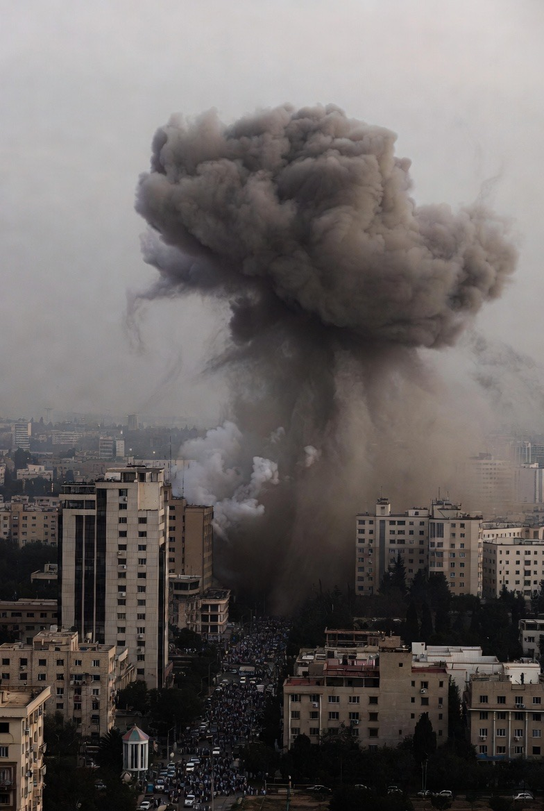

# Israel Menyerang Iran: Aliansi, Kapabilitas Militer, dan Perilaku Eskalasi Israel terhadap Iran

*Ilustrasi serangan rudal (pic: Grok AI).*

  
***Keberanian itu bukan euforia. Itu taruhan rasional dalam sistem anarkis yang keras dan tanpa wasit***
  

Menurut Glenn Snyder dalam Alliance Politics (1997):

Negara dalam aliansi menghadapi dua risiko:

•	Abandonment (ditinggalkan sekutu)

•	Entrapment (terseret konflik sekutu)

Israel memiliki hubungan keamanan strategis sangat erat dengan Amerika Serikat. Namun hubungan itu bukan cek kosong otomatis untuk perang besar.

Literatur menunjukkan: Aliansi kuat meningkatkan rasa aman, tetapi tidak otomatis meningkatkan kecenderungan perang besar jika biaya sistemik terlalu tinggi.

## Offensive Realism

John Mearsheimer berargumen bahwa negara akan memaksimalkan kekuatan relatif jika peluang struktural tersedia.

Israel menghadapi:

•	Ancaman eksistensial dari potensi nuklir Iran

•	Lingkungan regional yang volatil

Dalam logika ini, serangan preventif bisa dianggap rasional jika:

•	Ancaman dipersepsi mendekati titik tak bisa dibalik

•	Biaya menunggu lebih besar daripada biaya menyerang

## Preventive War Logic

Menurut James Fearon (1995), perang dapat terjadi karena masalah komitmen kredibel.

Jika Israel percaya:

•	Iran akan menjadi lebih kuat secara militer di masa depan

•	Iran tidak bisa dipercaya menahan diri

Maka serangan preventif menjadi opsi rasional dalam model bargaining.

## Kapabilitas Militer Israel

A. Superioritas Teknologi

Israel memiliki:

•	Sistem pertahanan udara multilayer seperti Israel Defense Forces dengan Iron Dome, David’s Sling, Arrow

•	Angkatan udara canggih dengan F-35I

•	Kapabilitas siber tingkat tinggi

B. Nuclear Ambiguity

Israel menerapkan kebijakan nuclear opacity
Tidak mengakui, tidak menyangkal.

Banyak analisis menyebut Israel memiliki deterrent nuklir terbatas.

Itu menciptakan: Asymmetric deterrence stability.

## Apakah “Bekingannya” Membuat Israel Berani?

Hubungan dengan Amerika Serikat memberi:

•	Bantuan militer tahunan miliaran dolar

•	Integrasi intelijen

•	Proteksi diplomatik di Dewan Keamanan PBB

Namun literatur aliansi menunjukkan: Sekutu besar tidak selalu otomatis ikut perang jika konflik dimulai secara preventif.

AS punya kepentingan global yang lebih luas:

•	Stabilitas energi

•	Menghindari perang regional besar

•	Menghindari konflik simultan multipolar

Jadi “bekingan kuat” ≠ jaminan blank cheque.

## Apakah Ini Kepedean atau Rasional?

Secara akademik, bukan soal percaya diri emosional.
Ini soal perhitungan rasional atas distribusi kekuatan dan risiko masa depan.

Israel kemungkinan menilai:

1.	Waktu berpihak pada Iran jika program nuklir berlanjut

2.	Serangan terbatas sekarang lebih murah daripada konflik besar nanti

3.	Dukungan AS cukup untuk mencegah isolasi total

Itu disebut dalam literatur sebagai: window of opportunity logic

## Risiko Eskalasi

Namun model security dilemma (Robert Jervis, 1978) mengingatkan:

•	Serangan preventif bisa memicu spiral balasan

•	Iran dapat merespons melalui proksi regional

•	Konflik bisa meluas tanpa niat awal kedua pihak

## Probabilistic Assessment

Berdasarkan teori dan distribusi kekuatan:

🟢 Israel percaya diri karena kapabilitas tinggi

🟢 Israel memiliki dukungan strategis AS

🟡 Namun perang regional penuh tetap mahal bagi semua pihak

🔴 Eskalasi luas masih bergantung pada respons Iran

Israel bukan sekadar “kepedean.”
Ia bertindak dalam kerangka:

•	Kalkulasi preventif

•	Dukungan aliansi kuat

•	Superioritas teknologi militer

Namun struktur internasional tetap membatasi ruang eskalasi penuh.

Keberanian itu bukan euforia.
Itu taruhan rasional dalam sistem anarkis yang keras dan tanpa wasit.

  
**Referensi:**

•	Glenn Snyder (1997). Alliance Politics. Cornell University Press.

•	Leeds, B. A. (2003). Alliance Reliability in Times of War. International Organization.

•	Kenneth Waltz (1979). Theory of International Politics.

•	John Mearsheimer (2001). The Tragedy of Great Power Politics.

•	James Fearon (1995). Rationalist Explanations for War. International Organization, 49(3).

•	Powell, R. (2006). War as a Commitment Problem. International Organization.

•	Robert Jervis (1978). Cooperation Under the Security Dilemma. World Politics.

•	Thomas Schelling (1966). Arms and Influence.

•	Snyder, G. (1961). Deterrence and Defense.

•	Kaye, D. D. (2012). Iran and the Challenge to Nonproliferation. Survival.

•	Maloney, S. (2015). The Roots of Iranian Foreign Policy. Survival.

•	Gause, F. G. (2014). Beyond Sectarianism: The New Middle East Cold War.

•	Stockholm International Peace Research Institute (SIPRI) Military Expenditure Database.

•	International Institute for Strategic Studies (IISS). The Military Balance.

•	RAND Corporation reports on U.S.–Iran and regional force balance.
