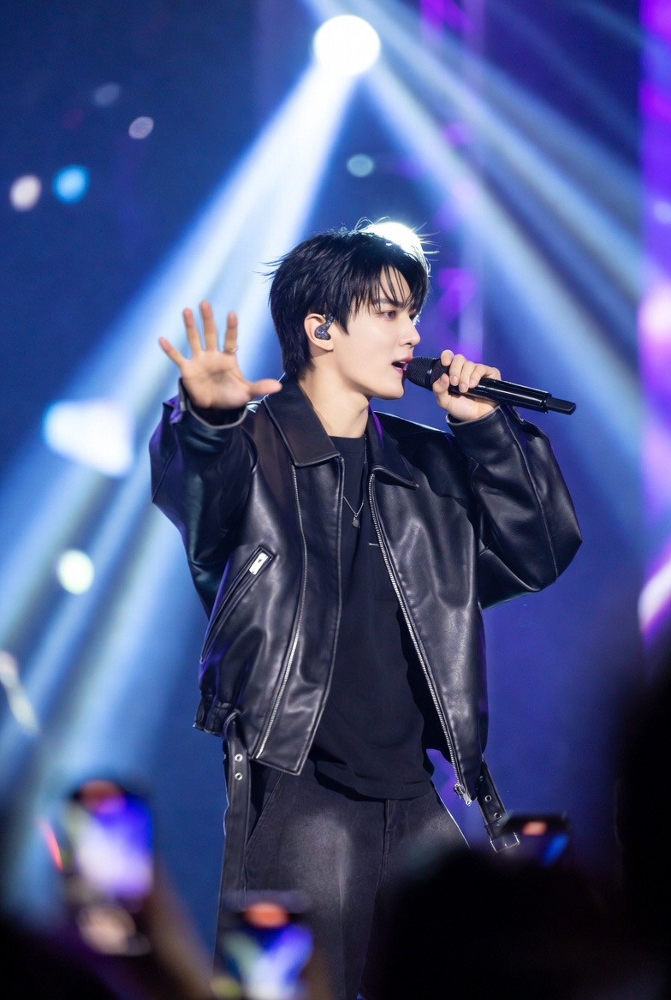

# Konflik “SEAblings vs Knetz”: Nasionalisme Digital, Ekonomi Budaya, dan Rasisme Siber

*Ilustrasi K-Pop (pic: Grok AI).*

  
***Konflik fandom itu seperti badai di akuarium kaca: ikan-ikan kecil bertarung seolah lautan sedang runtuh, padahal lautnya tetap tenang di luar sana***
  

Awal 2026 muncul konflik daring antara sebagian netizen Korea (Knetz) dan penggemar K-Pop Asia Tenggara (“SEAblings”). 

Konflik dipicu insiden kecil di konser K-Pop di Malaysia, lalu berkembang menjadi saling hina bernuansa rasial di media sosial. 

Fenomena ini menunjukkan bagaimana fandom global, identitas nasional, dan ekonomi budaya digital dapat berinteraksi secara konflikual.

## Pendahuluan

Globalisasi K-Pop menciptakan paradoks:
K-Pop adalah produk budaya global, tetapi komunitas penggemarnya tetap membawa identitas nasional masing-masing.

Ketika konflik muncul, fandom berubah menjadi arena politik identitas.

Awal konflik ini dilaporkan berasal dari insiden konser DAY6 di Malaysia pada awal 2026, ketika aturan venue tentang kamera profesional dilanggar dan memicu pertengkaran online antara penggemar Korea dan Malaysia.  

Konflik kemudian melebar menjadi debat tentang:

•	ketergantungan Asia Tenggara pada K-Pop

•	identitas budaya

•	stereotip rasial

## Metodologi

Analisis menggunakan:

•	observasi diskursus media sosial

•	studi fandom digital

•	teori nasionalisme budaya

•	ekonomi industri hiburan global

## Kronologi Konflik

Ringkasnya:

1.	Insiden konser di Malaysia (kamera profesional dilarang)

2.	Perdebatan online antara fans lokal dan fans Korea

3.	Sebagian netizen Korea menuduh Asia Tenggara “bergantung pada K-Pop”

4.	Fans Asia Tenggara bersatu (“SEAblings”) dan membalas

5.	Muncul komentar rasial dari kedua sisi  

Ini tipikal eskalasi konflik digital berbasis identitas.

## Kajian Teoretik

1. Nasionalisme budaya digital

K-Pop adalah soft power Korea Selatan.

Namun konsumsi budaya tidak selalu berarti kesetaraan relasi.

Ketika ada konflik, muncul hierarki implisit:

•	produsen budaya (Korea)

•	konsumen budaya (fans global)

Sebagian netizen Korea mengekspresikan superioritas budaya, sementara fans Asia Tenggara merespons dengan defensif kolektif.

2. Ekonomi fandom global

Asia Tenggara adalah pasar besar K-Pop:

•	penonton YouTube

•	pembeli album

•	penonton konser

•	streaming

Karena itu fans Asia Tenggara merasa punya legitimasi moral dalam industri tersebut. 

Konflik terjadi ketika: konsumen merasa tidak dihargai oleh produsen budaya.

3. Rasisme siber dua arah

Fenomena penting: rasisme tidak satu arah.

Contoh komentar rasis muncul dari:

•	netizen Korea terhadap Asia Tenggara

•	fans Asia Tenggara terhadap Korea  

Internet mempercepat eskalasi karena:

•	anonimitas

•	algoritma konflik

•	tribal fandom

4. Psikologi fandom kolektif

Fandom sering berfungsi seperti identitas nasional mini.

Ketika identitas diserang, responnya kolektif.

Seorang pengguna Reddit menggambarkannya seperti: “Southeast Asians suddenly performed a ‘fusing’ maneuver.”  

Artinya: konflik eksternal bisa menyatukan komunitas yang biasanya terpecah.

## Analisis Politik-Budaya

Konflik ini menunjukkan tiga hal penting:

A. Soft power tidak selalu menghasilkan rasa hormat

K-Pop sukses secara ekonomi, tetapi relasi budaya tetap hierarkis.

B. Internet memperbesar konflik kecil

Insiden konser kecil → konflik lintas negara.

C. Identitas Asia masih rapuh secara geopolitik

Alih-alih solidaritas regional Asia, yang muncul adalah kompetisi identitas.

Apakah benar “K-Pop menghina Asia Tenggara”?

Jawaban ilmiahnya: Tidak secara institusional, tetapi konflik fandom dan komentar rasis memang terjadi.

Ini bukan konflik negara Korea vs Asia Tenggara, melainkan:

•	konflik komunitas digital

•	konflik identitas budaya

•	konflik ekonomi fandom

Fenomena ini kemungkinan akan berulang selama:

•	fandom bersifat tribal

•	media sosial mendorong konflik

•	industri hiburan global tidak simetris.

Konflik fandom itu seperti badai di akuarium kaca: ikan-ikan kecil bertarung seolah lautan sedang runtuh, padahal lautnya tetap tenang di luar sana. 

  
**Referensi**

Channel NewsAsia. (2026, February 3). SEAblings and Knetz clash online after Day6 concert incident. CNA Lifestyle. https://cnalifestyle.channelnewsasia.com

PojokSatu. (2026, February 5). Viral di X: Kronologi perang digital Knetz vs Asia Tenggara dari konser Day6 hingga isu rasisme. https://www.pojoksatu.id

IndoPosOnline. (2026, February 10). Perang SEAblings vs Knetz di media sosial. https://indoposonline.co.id

Katadata. (2026, February 8). Viral netizen Korea Selatan vs Asia Tenggara saling ejek: Ini awal mulanya. https://katadata.co.id

Detik. (2026, February 9). SEAblings bersatu lawan komentar rasis K-netz di media sosial. https://www.detik.com

BatamNewsAsia. (2026, February 16). SEAblings vs Knetz: How Southeast Asia siblings turned a K-pop dispute into a digital war. https://batamnewsasia.com
