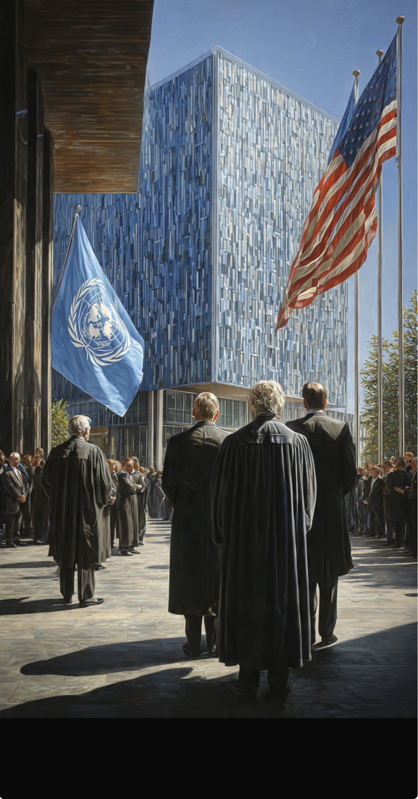

# Kalau ICC Mengincar Sohibku, Bongkar Pengadilannya!: Amerika Serikat vs ICC

*Ilustrasi (pic: Grok AI).*

  
***Kalau strategi itu berhasil, kita kembali ke dunia lama, bahwa negara kecil tunduk pada hukum, negara besar punya pengacara***
  

Amerika Serikat bukan anggota ICC. Jadi Washington sejak awal memang tidak menerima yurisdiksi ICC secara umum terhadap warga AS.

Tetapi ada masalah yang membuat Washington sangat tidak nyaman, ICC tidak selalu membutuhkan izin negara kewarganegaraan pelaku.

Dalam kondisi tertentu, ICC dapat memiliki yurisdiksi ketika kejahatan dilakukan di wilayah negara anggota atau ketika situasi dirujuk melalui mekanisme tertentu.

Nah, di sinilah persoalannya menjadi panas.

ICC mengeluarkan surat perintah penangkapan terhadap Benjamin Netanyahu dan Yoav Gallant pada November 2024 atas dugaan kejahatan perang dan kejahatan terhadap kemanusiaan terkait perang Gaza.

Dan kemudian pemerintahan Trump memperkeras tekanannya terhadap ICC. Hal ini menimbulkan pertanyaan: “Kok baru sohibnya mau ditangkap langsung pengadilannya mau dibongkar?”

Secara kronologis, memang ada korelasi politik yang sangat sulit diabaikan. 

## Argumen Hukum Washington

Washington mengatakan ICC memiliki yurisdiksi yang terlalu luas, mekanisme pengawasan yang tidak memadai, risiko penuntutan yang dianggap politis, dan potensi mengadili warga negara yang berasal dari negara non-party.

Rubio menggambarkan ICC sebagai ancaman terhadap kedaulatan Amerika dan personel AS. Pemerintahan Trump juga berargumen bahwa pengadilan internasional tidak boleh menggantikan pengadilan nasional. 

Argumen ini bukan omong kosong.

Ada debat akademik yang sah mengenai siapa yang seharusnya memiliki kewenangan mengadili prajurit suatu negara ketika negara asalnya sendiri menolak yurisdiksi pengadilan internasional?

Masalahnya, “kedaulatan” mulai terlihat selektif, di sinilah persoalannya.

## Kedaulatan Selektif 

Prinsip yang digunakan Washington: “Kami tidak menyerahkan kedaulatan hukum Amerika kepada lembaga internasional.”

Tetapi dunia internasional kemudian bertanya:“Kalau begitu mengapa negara lain harus menerima yurisdiksi lembaga internasional ketika mereka melakukan kejahatan terhadap warga negara mereka?”

Ini menghasilkan problem klasik sovereignty vs accountability. Kedaulatan mengatakan: Negara berhak mengadili sendiri warganya. Sementara akuntabilitas internasional mengatakan: Kalau negara tidak mau atau tidak mampu mengadili pelaku kejahatan paling berat, harus ada mekanisme lain.

ICC dibangun justru sebagai court of last resort untuk genocide, crimes against humanity, war crimes, dan aggression. 

Jadi kalau negara kuat berkata: “Jangan sentuh warga kami.” sementara korban berkata: “Negaramu sendiri tidak mau mengadili mereka.” Maka ICC berada tepat di tengah konflik tersebut.

## Muncul Kalimat Berbahaya

Rubio bukan sekadar mengatakan: “Kami tidak mengakui ICC.” Itu posisi lama Washington. Sekarang pemerintahannya berusaha mendorong negara-negara lain meninggalkan ICC.

Bahkan tekanan tersebut dikaitkan dengan sanksi, pembatasan visa, dan pengawasan terhadap negara yang membantu atau mendanai ICC. 

Nah, ini perubahan kualitatif. Ada perbedaan antara:

Posisi A

“Kami tidak ikut klub.”

dan

Posisi B

“Kami tidak ikut klub, dan kami akan berusaha membuat anggota lain keluar.”

Yang kedua bukan lagi sekadar non-participation. Itu sudah menjadi institutional sabotage menurut para pengkritiknya.

## Afrika Menjadi Medan Pertempuran Penting?

Ini bagian yang sangat menarik.

AS dilaporkan meningkatkan tekanan terhadap negara-negara Afrika agar keluar dari ICC. Chad dan Venezuela telah mengumumkan penarikan diri, sementara negara lain disebut mengalami tekanan. 

Dan ironinya, ICC selama bertahun-tahun memang dikritik karena dianggap terlalu berfokus pada Afrika.

Jadi Washington bisa menggunakan kritik tersebut: “Lihat? ICC memang bermasalah.” Tetapi para pendukung ICC membalikkan argumen: “Kalau memang bermasalah, reformasi. Mengapa justru dihancurkan ketika mulai menyentuh Israel dan kepentingan AS?”

Itulah titik benturannya.

## Ironi Sejarah yang Luar Biasa

Amerika Serikat pernah membantu membangun banyak institusi tatanan internasional berbasis aturan setelah Perang Dunia II.

Tetapi ketika sebuah institusi internasional mulai memiliki kemungkinan untuk menghasilkan konsekuensi hukum terhadap warga negara AS atau sekutu strategisnya, Washington berkata: “Sampai sini saja.”

Ini bukan fenomena unik Amerika, sebab negara besar pada umumnya menyukai rules-based order, selama aturan tersebut tidak terlalu mahal bagi dirinya.

Ketika biaya politik naik, muncul “Kedaulatan nasional!” Dan ini bukan hanya penyakit Washington, sebab Beijing, Moskwa, New Delhi, dan kekuatan lainnya juga memiliki bentuk selective commitment masing-masing.

## Perkembangan Menarik

Empat organisasi hak asasi manusia di Amerika Serikat, termasuk Human Rights Watch dan Center for Constitutional Rights, menggugat pemerintahan Trump di pengadilan federal karena sanksi terhadap pejabat ICC dan pihak yang bekerja sama dengan pengadilan tersebut. 

Jadi jangan dibaca bahwa Amerika satu suara, tidak. Ada konflik internal:

Gedung Putih:
“ICC mengancam kedaulatan.”

Kelompok HAM AS:
“Justru kalian sedang merusak akuntabilitas internasional dan hak kebebasan berbicara.”

ICC:
“Kami tetap bekerja.”

Negara anggota:
“Apakah kami harus bertahan atau pergi?”

Ini sudah menjadi pertempuran institusional, bukan sekadar pertengkaran Trump–ICC.

## Menggelikan sekaligus Berbahaya 

Trump sendiri pada 31 Juli 2026 mengatakan bahwa kampanye melawan ICC itu terutama dimaksudkan untuk membela Netanyahu dan sekutu lainnya, bukan dirinya sendiri. 

Nah, Kalau sebuah pemerintah sendiri mengatakan: “Ini untuk melindungi sekutu kami.” maka pertanyaan akademiknya otomatis: Apakah ICC sedang dihukum karena memang cacat secara hukum, atau karena menghasilkan putusan yang secara politik tidak nyaman bagi kekuatan besar dan sekutunya?

Itu pertanyaan yang tidak bisa dijawab dengan menyebut “ICC jahat.” atau “Amerika jahat.”

Kita harus melihat mekanisme yurisdiksi, bukti, prosedur, prinsip complementarity, dan independensi jaksa/hakimnya.

## Palestina Batu Ujian ICC

Ini inti paling pahitnya, kalau ICC hanya mengadili: orang dari negara kecil yang tidak punya teman kuat, maka kredibilitasnya akan hancur.

Tetapi kalau ICC benar-benar bisa mengatakan: “Kekuatan politik tidak menentukan siapa yang boleh dimintai pertanggungjawaban.” maka ia mulai menjalankan fungsi yang memang dirancang untuknya.

Karena itu kasus Netanyahu menjadi stress test institusional. Bukan cuma untuk Israel atau Palestina saja, tetapi untuk seluruh gagasan international criminal justice.

## Sohib akan Ditangkap lalu Koar-Koar? 

Kampanye pemerintahan Trump untuk melemahkan ICC memiliki hubungan temporal dan politik yang sangat kuat dengan tindakan ICC terhadap pejabat Israel, tetapi kritik AS terhadap ICC juga memiliki akar yang jauh lebih lama, terutama mengenai kedaulatan, yurisdiksi, dan kemungkinan penuntutan terhadap warga AS.

Artinya, bukan baru kemarin AS membenci ICC, tetapi Netanyahu membuat konflik lama itu meledak menjadi perang terbuka. 

Dan sekarang Washington bukan hanya berkata: “Kami tidak mengakui pengadilanmu.” Washington sedang mengatakan: “Kami akan berusaha membuat pengadilanmu kehilangan anggota, uang, dan kapasitas operasional.” 

Itu level yang berbeda.

ICC tidak sempurna. Ia boleh dikritik, bahkan harus dikritik kalau prosedurnya cacat atau politis. 

Tetapi ada pertanyaan yang lebih fundamental: Jika solusi terhadap pengadilan internasional yang dianggap bias adalah memperbaikinya, mengapa solusinya justru membuat negara-negara keluar, menghukum pejabatnya, mengancam mitranya, dan memutus sumber dayanya?

Karena kalau strategi itu berhasil, kita kembali ke dunia lama, bahwa negara kecil tunduk pada hukum, negara besar punya pengacara.

Dan itu, bukan supremasi hukum. Itu supremasi daya tawar.

  
**Referensi**

Reuters. (2026, July 31). Trump says ICC campaign aimed at defending Netanyahu, not himself.

The Guardian. (2026, July 13). Marco Rubio vows to dismantle International Criminal Court.

Human Rights Watch. (2026, August 11). Rights groups sue Trump administration over targeting ICC.

International Criminal Court. (2026). Situation in the State of Palestine.

U.S. Mission to the United Nations in Rome. (2026). Why we’re dismantling the ICC.
