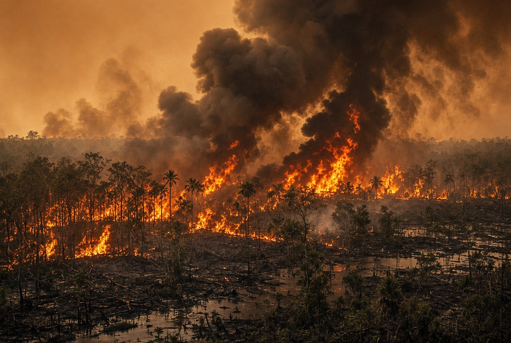

# Kalimantan 2026: Mengapa Hutan Terbakar, Barito Menyusut, dan Alam Mulai Mengirim Tagihan?
Politik

*Ilustrasi (pic: Grok AI).*

  
***Kalimantan sedang mengalami pertemuan antara iklim ekstrem dan lanskap yang telah dibuat semakin rentan oleh aktivitas manusia***
  

El Niño adalah pemantik kondisi kering. Tetapi lanskap menentukan apakah api menjadi percikan kecil atau berubah menjadi mesin asap.

Kalau hutan masih utuh, basah, dan terfragmentasi sedikit, api jauh lebih sulit menyebar dibanding lanskap yang sudah dipotong menjadi konsesi, jalan, tambang, perkebunan, lahan terbuka dan semak kering.

Jadi penyebabnya bukan hanya El Niño atau deforestasi. Melainkan El Niño dikali perubahan penggunaan lahan, dikali tata kelola, dikali sumber api. Dan perkalian itu yang bikin petaka. 

## Kabut Asap Kalimantan

Pada 21–22 Agustus, pemerintah menetapkan Kalimantan sebagai salah satu prioritas utama penanganan karhutla, bersama Sumatra. BNPB melaporkan 1.487 titik panas di Pulau Kalimantan pada 22 Agustus. 

Di Banjarbaru, kabut bahkan dilaporkan masuk ke rumah warga dan mengganggu aktivitas sehari-hari. Karhutla juga merembet ke kawasan Sekolah Rakyat Terpadu 9 Banjarbaru. 

Jadi ini bukan lagi “ada beberapa titik api jauh di dalam hutan.” Ini sudah menjadi masalah kualitas udara dan keselamatan masyarakat.

## Kebakaran Hutan  di Luar Negeri Tidak Selalu Berkabut seperti Kalimantan?

Kebakaran hutan tidak otomatis kabut asap pekat di kota. Kanada juga mengalami kebakaran sangat besar pada 2026. 

Asapnya bahkan menyeberangi wilayah Amerika Utara dan mengganggu kualitas udara Toronto, New York, Washington, Detroit dan Chicago. Jadi anggapan bahwa negara maju selalu bebas kabut asap tidak benar. 

Tetapi karakter asapnya berbeda tergantung jenis vegetasi yang terbakar, kadar air bahan bakar, jenis tanah, durasi pembakaran, kelembapan, angin, topografi, dan apakah api membakar biomassa permukaan atau material organik yang membara lama.

Kalimantan mempunyai satu monster ekologis tambahan yaitu lahan gambut. Gambut dapat terbakar di bawah permukaan, menghasilkan asap sangat banyak dan sulit dipadamkan.

Pemadamannya menjadi jauh lebih sulit karena api tidak selalu terlihat sebagai kobaran besar.

## Peralatan Indonesia Tidak Memadai?

Sebagian persoalan memang kapasitas, tetapi kalau kita menyalahkan alat saja, kita salah mendiagnosis penyakitnya.

Pemerintah sekarang mengerahkan pemadaman darat, udara, deteksi hotspot, dan modifikasi cuaca. Pemerintah juga telah menetapkan enam provinsi sebagai prioritas, termasuk Kalimantan Selatan. 

Masalahnya, pemadaman adalah fase terakhir. Kalau lanskapnya sudah kering, terfragmentasi , banyak lahan terbuka, banyak akses manusia, sumber api tersebar, maka pemadam harus mengejar ratusan atau ribuan potensi titik api.

Itu seperti mencoba mengeringkan rumah sambil kerannya masih terbuka.

Negara yang paling pintar menangani kebakaran bukan cuma punya helikopter lebih banyak. Ia punyalandscape management, early detection, fire prevention, enforcement, dan restoration.
Pemadam kebakaran adalah jaring pengaman, bukan fondasi.

## Faktor Iklim 

BMKG menyatakan 2026 menghadapi kondisi yang sangat kering, dengan El Niño kuat diperkirakan bertahan hingga awal 2027. BMKG juga memperingatkan risiko kekeringan dan karhutla meningkat. Jadi untuk 2026, alam memang sedang memasang mode oven. 

Tetapi ada persoalan, hutan yang sehat juga mengalami kemarau. Namun ekosistem yang telah mengalami deforestasi, fragmentasi, drainase, pembukaan lahan, dan degradasi mempunyai resiliensi berbeda.

Itulah mengapa cuaca menjelaskan kapan api mudah menyala, sementara tata guna lahan membantu menjelaskan mengapa api bisa menjadi besar dan sulit dikendalikan.

## Sawit 

Penelitian di Kalimantan menunjukkan sawit memang menggunakan air melalui evapotranspirasi, tetapi sebuah studi lapangan di Kalimantan Tengah menemukan penggunaan air sekitar 3,07–3,73 mm/hari, dan penulisnya justru menyimpulkan sawit bukan tanaman dengan penyerapan ekstrem dibandingkan vegetasi hutan pada lokasi tersebut. 

Tapi ada twist penting. Studi regional menunjukkan perkebunan sawit industri di Sumatra dan Kalimantan dapat mempunyai evapotranspirasi 15–20% lebih tinggi daripada hutan dataran rendah pada luasan yang sama dalam simulasi regional, dengan implikasi terhadap kelembapan tanah dan limpasan. 

Jadi yang lebih tepat bukan sawit adalah sedotan raksasa yang mengeringkan semua sungai. Melainkankonversi hutan menjadi perkebunan mengubah neraca air, terutama ketika dikombinasikan dengan perubahan tutupan tanah, drainase, pemadatan tanah, jalan, dan hilangnya fungsi ekosistem hutan.

## Problem Sebenarnya Bukan Cuma Pohon Sawit

Ini penting sekali.

Bayangkan hutan, kemudian diubah menjadi perkebunan. Yang berubah bukan hanya jenis tanaman, namun juga struktur akar, penutupan tanah, infiltrasi air, evapotranspirasi, kelembapan mikro, aliran permukaan, sedimentasi, habitat, konektivitas hutan, dan akses manusia.

Jadi yang kita hadapi adalah perubahan sistem hidrologi.

## Sungai Barito

Sungai Barito memang mengalami penyusutan debit yang sangat ekstrem, tetapi tidak berarti seluruh Sungai Barito “kering kerontang sampai habis”.

Pada 21 Agustus, Kementerian PU menyatakan alur utama Barito di sekitar Barito Selatan masih dapat dilalui kapal, dengan bagian alur yang masih memiliki kedalaman dan lebar sekitar 100 meter. Pada saat yang sama, kemarau ekstrem menyebabkan gosong pasir muncul dan debit menyusut drastis. 

Jadi Barito sedang sangat surut, bukan: Barito lenyap. Ini penting karena video dramatis sungai yang tampak seperti padang pasir gampang membuat kita mengambil kesimpulan terlalu jauh.

## Barito Surut karena Deforestasi?

Sebagian bisa berhubungan, tetapi tidak boleh kita jadikan satu-satunya sebab.

Debit sungai merupakan hasil interaksi: curah hujan, penyimpanan air tanah, kelembapan tanah, tutupan vegetasi, evaporasi/evapotranspirasi, karakter DAS, penggunaan air, dan iklim.

Tahun 2026 mempunyai faktor ekstrem El Niño, akibatnya curah hujan menjadi turun, recharge DAS berkurang, debit sungai turun. Tetapi perubahan DAS dapat memperburuk kemampuan ekosistem menyimpan dan mengatur air.

Kajian mengenai DAS Barito menunjukkan deforestasi dan degradasi hutan mengganggu keseimbangan hidrologis, antara lain melalui perubahan infiltrasi, limpasan dan erosi. 

Jadi apakah kerusakan DAS membuat Barito lebih rentan terhadap ekstrem hidrologis? Jawabannya:Ya, sangat masuk akal secara hidrologis dan memiliki dukungan penelitian.

## Paradoks Kalimantan yang Menyakitkan

Kita pernah melihat Kalimantan saat musim hujan banjir besar,  dan kini saat nusim kemarau, sungai menyusut ditambah karhutla.

Kok bisa?

Karena ekosistem yang sehat berfungsi seperti bank air. Hutan dan tanah menyimpan air ketika hujan lalu melepaskannya perlahan.

Jika fungsi itu rusak, maka saat hujan deras, air cepat mengalir, lalu banjir. Sedangkan saat kemarau panjang, cadangan air lebih cepat habis, dan sungai turun drastis.

Dengan kata lain, kita bisa mendapatkan terlalu banyak air ketika tidak membutuhkannya dan terlalu sedikit ketika membutuhkannya.

Itulah salah satu tanda buruknya pengelolaan DAS.

## Tambang

Tambang terbuka mengubah topografi dan hidrologi secara radikal.

Setelah aktivitas berhenti, masalahnya belum otomatis selesai. Kalau reklamasi gagal, lubang, genangan, perubahan kualitas air, erosi, habitat tidak pulih, bahaya bagi manusia.

Studi mengenai lubang tambang batu bara terbengkalai di Kalimantan Timur mencatat 40 orang, sebagian besar anak-anak, meninggal akibat tenggelam di lubang tambang pada periode 2011–2021 dalam data yang dikaji penulis. 

Studi tersebut juga menghubungkan lubang terbengkalai dengan degradasi lingkungan, pencemaran udara dan air, serta lemahnya reklamasi. 

Jadi lubang tambang bukan bekas aktivitas ekonomi. Ia dapat menjadi utang ekologis yang ditinggalkan kepada generasi berikutnya.

## Orangutan

Kualat sama orang hutan secara ilmiah bisa kita terjemahkan menjadi human-wildlife conflict akibat habitat loss.

Penelitian di Kalimantan menemukan konflik manusia-orangutan meningkat pada lanskap yang berdekatan dengan perkebunan, termasuk sawit. 

Ketika habitat hutan terfragmentasi, orangutan semakin sering berinteraksi dengan lahan pertanian/perkebunan. 

Dan ini menghasilkan tragedi yang sangat absurd:

Manusia: “Ini kebun saya.”

Orangutan: “Ini dulu hutan saya.”

Manusia: “Jangan makan sawit!”

Orangutan: “Rumah makan saya sudah kamu ubah menjadi kebun.” 

Itulah konflik ekologis yang sebenarnya. Bukan karena orangutan tiba-tiba menjadi “hama”. Melainkan karena batas habitat dan batas ekonomi manusia bertabrakan.

Saat orangutan mengambil buah sawit, apakah dia “mencuri”? Secara hukum mungkin pemilik kebun menyebutnya begitu, namun secara ekologis tidak sesederhana itu.

Kalau habitat asli sudah berkurang dan sumber makanan alami menurun, hewan akan mengeksploitasi sumber energi yang tersedia. Itulah perilaku adaptif.

Kita tidak bisa mengubah deforestasi, habitat hilang, orangutan masuk kebun, menjadi orangutan masuk kebun, orangutan adalah pengganggu. Itu membalikkan sebab dan akibat.

## Bekantan juga Terkena Pukulan 

Bekantan sangat bergantung pada habitat hutan rawa, mangrove dan vegetasi riparian.

Jadi ketika sungai berubah, tepian sungai dibuka, hutan riparian hilang, tambang/perkebunan masuk, yang hilang bukan cuma pohonnya, namun juga koridor ekologis.

Hewan tidak hidup dalam peta yang kita gambar dengan garis konsesi. Jika sungai bagi manusia adalah jalur transportasi., maka bagi satwa adalah koridor kehidupan.

## Mengapa “Tradisi Kabut Asap” Terus Berulang?

Bukan karena Indonesia tidak punya pemadam, bukan juga semua perusahaan sawit sengaja membakar hutan. Dan bukan semuanya gara-gara El Niño.

Melainkan kombinasi:

1. Iklim ekstrem

El Niño membuat vegetasi lebih mudah terbakar. 

2. Lanskap terdegradasi

Deforestasi, fragmentasi dan perubahan penggunaan lahan mengubah karakter ekologis.

3. Sumber api manusia

Pembukaan lahan dan pembakaran ilegal tetap menjadi faktor penting; pemerintah bahkan telah menahan tersangka terkait pembakaran dan pembukaan lahan ilegal dalam episode 2026. 

4. Tata kelola konsesi

Dan ini bagian yang sangat menarik.

Analisis WALHI Kalsel terhadap hotspot Mei–Juli 2026 menemukan sekitar 71% hotspot berada di wilayah konsesi, termasuk ratusan titik dalam konsesi pertambangan dan sebagian di konsesi sawit. 

Catatan penting: hotspot satelit bukan otomatis bukti bahwa pemegang konsesi menyebabkan kebakaran. Tetapi angka tersebut adalah red flag tata kelola yang layak diperiksa.

Kalau sebuah negara setiap tahun membeli helikopter, mobil pemadam, water bombing, sistem deteksi hotspot, pasukan pemadam, tetapi tidak secara serius memperbaiki tutupan hutan, DAS reklamasi tambang, tata ruang perkebunan, praktik pembukaan lahan, dan penegakan hukum, maka kita sedang melakukanbusiness model pemadam kebakaran.

Kita mengeluarkan uang untuk mengobati gejala, sementara sumber kerentanan tetap hidup.

Sedemikian Sulitkah Ditangani?

Secara teknis, sulit. Bahkan secara politik jauh lebih sulit. Karena pencegahan ekologis menyentuh izin konsesi, keuntungan komoditas, pajak, pekerjaan, investasi, tambang, sawit, infrastruktur, kepentingan daerah, dan kekuasaan politik.

Memadamkan api itu mudah dijelaskan kepada publik: “Lihat! Kami bekerja.”

Tetapi mengatakan: “Kita harus membatasi pembukaan lahan di wilayah tertentu, memperketat konsesi, menutup lubang tambang, memulihkan DAS, dan mungkin mengorbankan sebagian keuntungan jangka pendek.” Itu sudah masuk wilayah politik ekonomi ekologis.

Dan di situlah biasanya bulldozer lebih kuat daripada buku teks konservasi. 

## Kalimantan Bukan Kekurangan Alam

Ini yang paling menyedihkan. 

Kalimantan memiliki hutan, sungai, orangutan, bekantan, mineral, komoditas, energi, dan air. Tetapi kita sering memperlakukan semuanya sebagai stok yang bisa diekstraksi. 

Hutan menghasilkan kayu/lahan, tanah ditanami sawit, bawah tanah menghasilkan batu bara, sungai sebagai transportasi, lalu satwa dianggap masalah ketika mengganggu produksi.

Kemudian ketika sistem ekologis mulai kolaps, barulah muncul pertanyaan “Kenapa banjir?”, “Kenapa kekeringan?”, “Kenapa asap?”, “Kenapa orangutan masuk kebun?”. Padahal semuanya adalah bagian dari sistem yang sama.

Kalimantan 2026 bukan sedang dihukum oleh alam. Kalimantan sedang mengalami pertemuan antara iklim ekstrem dan lanskap yang telah dibuat semakin rentan oleh aktivitas manusia.

El Niño menyalakan korek ketika tata guna lahan yang buruk menumpuk bensin, lalu sumber api menjatuhkan bara, ditambah penegakan hukum yang lemah membuat bara tidak selalu membuat pelakunya takut.

Dan masyarakat menerima asapnya, sementara orangutan kehilangan hutan, bekantan kehilangan koridor, sungai kehilangan fungsi ekologisnya, lubang tambang ditinggalkan, dan generasi berikutnya menerima tagihan.

Sedangkan kita? Masih bisa duduk sambil bilang: “Kok Kalimantan tiap tahun kebakaran lagi, ya?” 

Padahal pertanyaan yang lebih tepat adalah “Mengapa kita terus menciptakan lanskap yang mudah terbakar, sulit memulihkan air, dan mahal sekali untuk diselamatkan?”

Itulah pertanyaan yang jauh lebih berbahaya bagi para pemburu fulus daripada sekadar bertanya siapa yang membawa korek. 

  
**Referensi**

Badan 
Meteorologi, Klimatologi, dan Geofisika. (2026). Musim kemarau di bawah normal dan El Niño kuat: Mitigasi cuaca dan karhutla. BMKG.

BNPB. (2026). Pemerintah prioritaskan penanganan karhutla di Kalimantan dan Sumatera. BNPB.

Reuters. (2026, July 17). Why is Canada’s wildfire smoke blanketing parts of North America?

WRI Indonesia. (2026). Forest, land-use change and fire risk in Indonesia.

Venter, O., et al. (2018). Sixteen years of change in the global terrestrial human footprint and implications for biodiversity conservation. Nature Communications, 9, 1250.

Merten, J., et al. (2016). Water use of oil palm in Indonesia. Hydrology and Earth System Sciences, 20, 431–449.

Ancrenaz, M., et al. (2015). Current status and conservation of orangutans in Malaysia and Indonesia. Biological Conservation, 186, 1–8.

Suhartini, N. M., et al. (2025). The socio-ecological crisis of abandoned coal mining pits in East Kalimantan.
