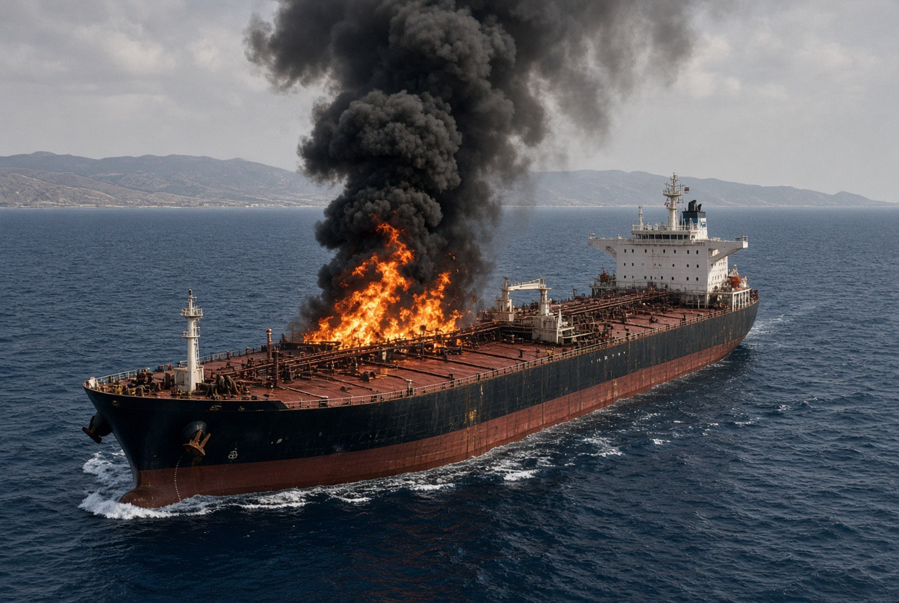

# Kapal Menjadi Senjata Diplomasi: UEA–Iran, Hormuz, dan Politik Kecurigaan

*Ilustrasi (pic: Grok AI).*

  
***Insiden maritim tersebut mempunyai konsekuensi strategis yang jauh lebih besar daripada kerusakan terhadap satu kapal***
  

Pada 13 Agustus 2026, UEA mengatakan dua kapal yang terkait dengan perusahaan minyak negara ADNOC diserang ketika melewati Selat Hormuz. 

Meskipun tidak ada korban jiwa, namun UEA secara langsung menuduh Iran dan menyebut tindakan tersebut sebagai bentuk pembajakan. 

Iran belum memberikan tanggapan terhadap tuduhan terbaru itu. Reuters juga mencatat bahwa ini merupakan insiden kedua terhadap kapal terkait ADNOC dalam waktu kurang dari seminggu. 

Jadi sampai titik ini, serangan dilaporkan terjadi, kapal terkait ADNOC, pelaku menurut UEA adalah Iran, atribusi independen belum bisa kita anggap final.

Dan ini penting sekali.

## Bersekutu dengan Israel Membuat UEA Makin Anti-Iran?

Sebagai hipotesis geopolitik, itu bisa dirumuskan, namun sebagai fakta, belum.

Karena untuk mengatakan false flag kita membutuhkan bukti mengenai siapa yang melakukan serangan, siapa yang merencanakannya, siapa yang memperoleh manfaat, dan terutama hubungan kausal antara manfaat tersebut dan pelaku.

## Ketegangan Iran–UEA Menguntungkan Aktor yang Ingin Iran Semakin Terisolasi

UEA memang mempunyai hubungan strategis yang sangat dekat dengan Israel sejak Abraham Accords.

Hubungan tersebut mencakup diplomasi, perdagangan, teknologi, keamanan, dan kerja sama strategis.

Jadi ketika Iran menyerang atau diduga menyerang kapal UEA, konsekuensi politiknya bukan cuma “Iran mengganggu kapal Emirat. Tetapi dapat berkembang menjadi “Iran adalah ancaman terhadap kepentingan ekonomi dan keamanan kita.”

Dan di sinilah persepsi ancaman dapat memperkuat hubungan UEA dengan Israel dan Amerika. Bukan karena seseorang harus duduk di ruangan gelap sambil menggambar peta dengan tinta merah. 

Ini bisa muncul secara struktural.

Mekanismenya begini, bayangkan rantainya: Iran  dianggap ancaman maritim, akibatnya UEA merasa rentan, kebutuhan pertahanan meningkat, sehingga kerja sama dengan Israel/AS semakin bernilai, ujung-ujungnya ketergantungan keamanan meningkat.

Lalu terjadi feedback loop: kerja sama keamanan meningkat, Iran melihat UEA semakin dekat dengan lawannya, Iran semakin curiga, ketegangan meningkat, akibatnya UEA semakin membutuhkan perlindungan.

Inilah yang disebut Security dilemma. Tidak perlu ada satu dalang yang mengendalikan seluruh proses, sistemnya sendiri dapat menghasilkan eskalasi.

## Hormuz “Urat Nadi” Politik

UEA mempunyai kepentingan ekonomi yang sangat besar terhadap stabilitas Hormuz. Sementara ADNOC adalah perusahaan energi negara, jadi serangan terhadap kapal ADNOC memiliki nilai simbolik dan ekonomi sekaligus.

Kalau lalu lintas Hormuz semakin terganggu, maka terjadi lonjakan shipping insurance, freight cost, risiko energi, harga minyak, serta tekanan ekonomi.

Reuters melaporkan lalu lintas kapal melalui Hormuz memang telah jatuh jauh di bawah rata-rata akibat eskalasi terbaru. 

Dengan demikian, sebuah serangan terhadap kapal bukan cuma insiden militer, ia bisa menjadi instrumen tekanan ekonomi global.

## Ironi Besar

Iran sedang berusaha menggunakan Hormuz sebagai leverage terhadap AS. Tetapi semakin banyak kapal negara Teluk yang terkena serangan, semakin mudah Washington mengatakan:“Lihat? Iran mengancam keamanan navigasi internasional.”

Dan narasi itu secara otomatis memperkuat legitimasi politik bagi blokade AS, sanksi, operasi maritim, pengerahan kapal perang, dan pembentukan koalisi keamanan.

Reuters melaporkan Washington kini mengatakan blokade laut terhadap Iran dapat dipertahankan tanpa batas waktu, sementara tekanan ekonomi terhadap Teheran akan ditingkatkan. 

Jadi secara strategis terdapat paradoks, bahwa tindakan yang dimaksudkan Iran untuk meningkatkan leverage dapat sekaligus memberi lawannya alasan untuk meningkatkan tekanan.

Itulah mengapa strategic signaling dalam perang sangat berbahaya.

## Kepentingan Strategis Israel

Israel mempunyai kepentingan strategis yang jelas agar Iran tetap dipersepsikan sebagai ancaman regional. Sebab semakin tinggi persepsi ancaman Iran, maka semakin bernilai kerja sama keamanan Israel–negara Arab.

Dan ini salah satu konsekuensi besar Abraham Accords.

Dulu, Israel adalah musuh bagi sebagian besar sistem politik Arab. Sekarang sebagian negara Arab mulai berpikir “Iran adalah ancaman yang lebih dekat dan konkret.”

Akibatnya, musuh bersama dapat menjadi perekat aliansi. Itu fenomena klasik dalam hubungan internasional.

## Kasus Makin Rumit

UEA tidak otomatis menjadi boneka Israel hanya karena bekerja sama dengan Israel sebab Abu Dhabi mempunyai kepentingannya sendiri.

Dan kepentingan UEA terhadap Iran bahkan sangat kompleks. UEA punya hubungan dagang dengan Iran, kepentingan pelabuhan, kepentingan energi, kepentingan keamanan Teluk, dan kepentingan menjaga stabilitas regional.

Bahkan sebelumnya UEA mengambil langkah yang justru menunjukkan bahwa hubungan tersebut tidak sesederhana “anti-Iran”. Reuters melaporkan pada Juni bahwa UEA berencana membuka akses terhadap miliaran dolar dana Iran sebagai bagian dari proses diplomatik yang lebih luas. 

Jadi Abu Dhabi bisa melakukan dua hal sekaligus, mendekati Iran secara ekonomi/diplomatik, dan bekerja sama dengan Israel serta AS secara keamanan.

Itulah yang disebut strategic hedging.

## Tuduhan False Flag Harus Ekstra Hati-Hati

Kalau kita menemukan bukti bahwa serangan dilakukan oleh aktor A, tetapi kemudian dimanfaatkan oleh aktor B, itu bukan berarti B adalah pelaku. Ini kesalahan atribusi yang sering terjadi dalam analisis geopolitik.

Pelaku bisa Iran, kelompok yang berafiliasi dengan Iran, aktor non-negara, pihak lain, atau bahkan operasi yang sengaja dirancang agar atribusinya ambigu. Tanpa bukti forensik dan intelijen, kita belum bisa menentukan.

Tetapi pertanyaan paling pedasnya justru ini: Siapa yang memperoleh keuntungan politik dari sebuah kapal UEA yang diserang?

Jawabannya bisa banyak:

Iran
untuk meningkatkan tekanan terhadap UEA/AS dan mengontrol akses Hormuz.

AS
untuk memperkuat argumen mempertahankan blokade dan tekanan terhadap Iran.

Israel
karena ancaman Iran dapat memperkuat hubungan keamanan dengan negara-negara Arab.

UEA
karena dapat memperoleh legitimasi domestik dan internasional untuk memperkuat pertahanan.

Industri pertahanan
karena ancaman menghasilkan permintaan keamanan.

Nah, lihat?

Satu kapal bisa menghasilkan lima kepentingan sekaligus.

Itulah sebabnya geopolitik jauh lebih rumit daripada: “Siapa yang paling untung? Berarti dia pelakunya.”

Tidak selalu.

Serangan terhadap kapal UEA, jika terbukti dilakukan Iran, dapat memperkuat kecenderungan Abu Dhabi untuk memperdalam kerja sama keamanan dengan Israel dan Amerika, sekaligus memperkuat narasi bahwa Iran merupakan ancaman terhadap keamanan Teluk. 

Karena itu, insiden maritim tersebut mempunyai konsekuensi strategis yang jauh lebih besar daripada kerusakan terhadap satu kapal.

Dan kalau suatu hari muncul bukti bahwa serangan itu ternyata false flag, implikasinya akan luar biasa besar. Sebab yang terbongkar bukan cuma siapa yang menyerang kapal. Yang terbongkar adalah arsitektur politik yang sengaja dibangun melalui manipulasi persepsi ancaman.

Tapi hari ini kita belum punya bukti itu. Yang kita punya adalah tuduhan UEA terhadap Iran, dua kapal ADNOC yang diserang, belum ada korban pada insiden terbaru, dan eskalasi Hormuz yang memang nyata. 

Kalau memang ada bukti nanti, kita tidak perlu berteriak.

  
**References**

Associated Press. (2026, August 13). 2 UAE tankers attacked while transiting Strait of Hormuz. AP News⁠

Reuters. (2026, August 13). UAE says Iran attacked two ADNOC vessels in Strait of Hormuz; no injuries. Reuters⁠

Reuters. (2026, August 14). Hormuz shipping traffic capped amid competing claims from US and Iran. Reuters⁠

Reuters. (2026, June 12). UAE to unlock billions of dollars for Iran, sources say. Reuters⁠

Reuters. (2026, May 25). Trump links Abraham Accords to any Iran deal. Reuters⁠

Reuters. (2026, May 4). UAE accuses Iran of attacking empty ADNOC oil tanker in Strait of Hormuz. Reuters⁠

Al-Suwaidi, M. (2025). Analyzing UAE-Israel security and defense cooperation: The Abraham Accords and beyond. Armed Forces & Society. SAGE Journals⁠

