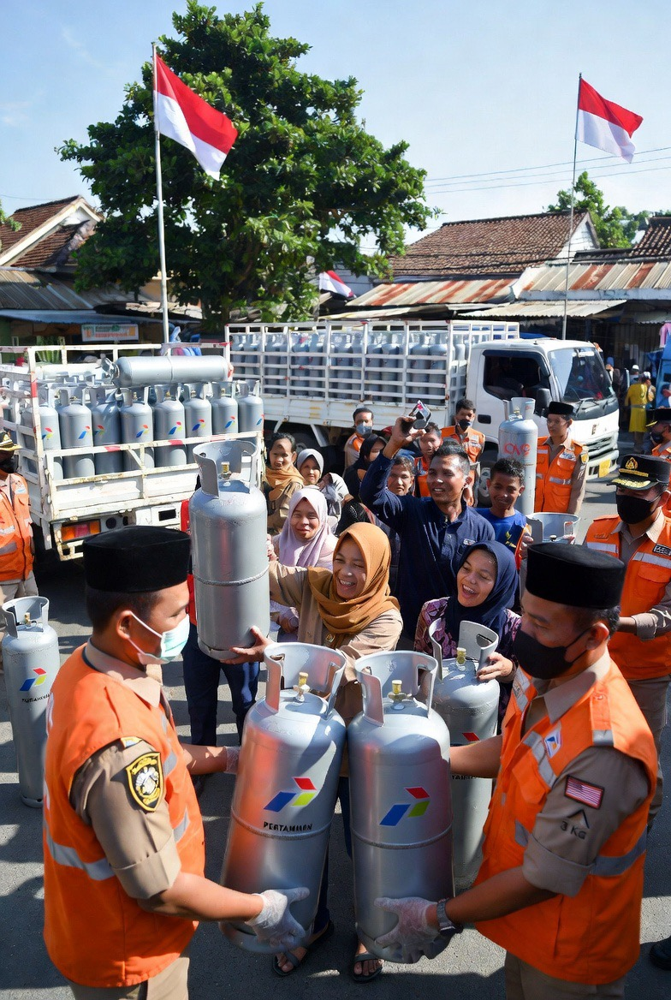

# Karakteristik dan Problematik Metana sebagai Komponen Utama CNG

*Ilustrasi CNG (pic: Grok AI).*

  
***Metana itu semacam molekul kecil dengan ego geopolitik besar dengan pemanasan bisa puluhan kali lebih kuat dibanding CO₂***
  

Metana adalah gas paling sederhana dalam keluarga hidrokarbon.

Rumus kimianya CH₄. 

Artinya:

1 atom karbon

4 atom hidrogen.

Bentuknya simpel banget.

Kalau molekul lain kayak gedung apartemen…
metana tuh kayak rumah mungil minimalis tapi gampang kebakar.

## Metana Datangnya Dari Mana?

Metana banyak banget di alam.

Sumbernya:
gas bumi / natural gas,
rawa-rawa,
kotoran hewan,
tambang batu bara,
sawah,
sampah membusuk,
bahkan… kentut sapi.

Makanya kadang metana dijuluki “marsh gas” atau “biogas”.

## Kenapa Metana Penting?

Karena dia:
gampang terbakar,
menghasilkan energi tinggi,
relatif “lebih bersih” dibanding batu bara.

Saat dibakar: 

CH₄ + O₂ → CO₂ + H₂O + energi

hasilnya:
karbon dioksida,
uap air,
panas.

Makanya metana dipakai untuk:
kompor gas,
pembangkit listrik,
industri,
CNG,
LNG.

## Problematis Metana

Nah ini bagian rumitnya.
Walau pembakarannya lebih bersih… metana yang bocor ke atmosfer sangat kuat sebagai gas rumah kaca.

Bahkan dalam jangka pendek, efek pemanasan metana bisa puluhan kali lebih kuat dibanding CO₂.

Makanya dunia sekarang panik soal:
kebocoran pipa gas,
emisi peternakan,
tambang.

## Metana vs LPG

| Aspek | Metana | LPG |
|--------|--------|--------|
| utama pada  | CNG/LNG  | LPG  |
| berat  | lebih ringan dari udara  | lebih berat  |
| kalau bocor | naik ke atas | ngendap di bawah |
| tekanan penyimpanan | tinggi | lebih rendah |
| bahan utama | CH₄ | propana/butana |

## Kenapa Metana Bisa Jadi CNG?

Karena metana:
bentuknya gas,
tidak mudah dicairkan di suhu normal.

Jadi untuk menyimpan banyak metana harus:
ditekan tinggi (CNG),
atau
didinginkan ekstrem jadi cair (LNG).

## Inti Terdalam

Lucunya…
zat kecil sederhana bernama CH₄ ini:
bisa masak mie instan,
menggerakkan bus,
memicu perang energi,
sampai mempengaruhi iklim bumi.

jadi metana itu semacam molekul kecil dengan ego geopolitik besar.

  
**Referensi**

Methane
IPCC. (2021). Climate change 2021: The physical science basis. Cambridge University Press.

Organic Chemistry
McMurry, J. (2015). Organic chemistry (9th ed.). Cengage Learning.

International Energy Agency
International Energy Agency. (2023). Global methane tracker 2023.

