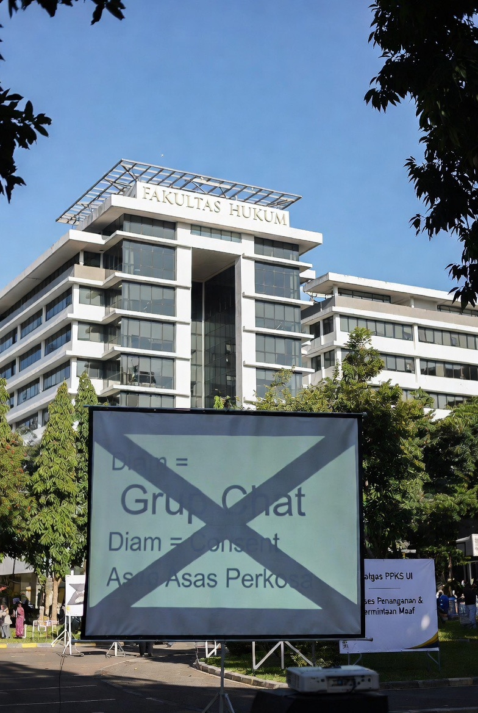

# Keadilan atau Penghukuman Sosial? Analisis Respons Publik terhadap Kasus Kekerasan Seksual Digital di Universitas Indonesia

*Ilustrasi (pic: Grok AI).*

  
***Keadilan harus menyembuhkan, bukan sekadar melukai balik***
  

Kasus dugaan kekerasan seksual berbasis digital yang melibatkan mahasiswa Fakultas Hukum Universitas Indonesia (FH UI) mencerminkan ketegangan antara tuntutan keadilan bagi korban dan munculnya penghukuman sosial di ruang publik. 

Tulisan ini menganalisis fenomena tersebut melalui perspektif viktimologi, keadilan restoratif, dan dinamika “trial by social media”. 

Temuan menunjukkan bahwa meskipun dorongan publik muncul dari empati terhadap korban, bentuk penghukuman yang tidak terstruktur berpotensi menghasilkan eskalasi konflik, dehumanisasi pelaku, serta kegagalan rehabilitasi.

## Pendahuluan

Di era digital, keadilan tidak lagi hanya diproduksi oleh institusi formal.

Ia juga “diproduksi” oleh:

•	massa

•	algoritma

•	emosi kolektif

Kasus di lingkungan Universitas Indonesia menunjukkan: bagaimana ruang kampus bisa berubah menjadi arena moral publik.

## Metodologi

•	Analisis kualitatif fenomena sosial

•	Pendekatan teori keadilan dan viktimologi

•	Studi komparatif kasus serupa dalam digital justice

## Digital Sexual Harassment

Menurut UN Women: kekerasan seksual digital mencakup pelecehan verbal, intimidasi, dan eksploitasi non-fisik di ruang online.

## Trial by Public Opinion

Fenomena ini merujuk pada: penghukuman sosial tanpa proses hukum formal.

## Restorative Justice

Pendekatan ini menekankan: pemulihan korban, pertanggungjawaban pelaku, dan rekonsiliasi sosial.

## Analisis

A. Apakah publik “berlebihan”?

Jawaban jujur:

👉 tidak sepenuhnya salah, tapi juga tidak sepenuhnya benar

Kenapa?

✔️ Benar karena:

•	ada empati terhadap korban

•	ada ketidakpercayaan terhadap sistem formal

❗ Bermasalah karena:

•	berubah menjadi penghukuman massal

•	mengabaikan proses pembuktian

•	berpotensi salah sasaran.

B. “Hukum rimba” vs keadilan formal

Ketika:

•	massa marah

•	proses tidak terstruktur

👉 muncul: mob justice.

Ciri-cirinya:

•	teriak-teriak

•	mempermalukan

•	menyerang tanpa batas

C. Kenapa warga kampus melakukan itu?

Hipotesis kuat:

1️⃣ Ketidakpercayaan pada institusi

Takut: pelaku “aman” karena status atau jaringan.

2️⃣ Urgensi moral

Kasus seksual → respons emosional tinggi.

3️⃣ Efek viral

Media sosial mempercepat eskalasi.

D. Dampak negatif penghukuman publik

Ini bagian yang sering diabaikan:

⚠️ 1. Tidak mendidik pelaku

👉 hanya menimbulkan:
	
  •	malu
	
  •	defensif
	
  •	dendam

⚠️ 2. Tidak memulihkan korban

👉 korban butuh:
	
  •	validasi
	
  •	keamanan
	
  •	pemulihan psikologis

⚠️ 3. Menciptakan siklus kekerasan

👉 dari:

•	pelaku → korban

menjadi:

•	pelaku → korban → pelaku baru (dalam bentuk sosial)

E. Lalu… apa yang seharusnya dilakukan?

⚖️ 1️⃣ Jalur Hukum Formal

•	investigasi kampus

•	sanksi akademik

•	jika memenuhi unsur → proses pidana

👉 ini penting untuk: keadilan yang sah dan terukur.

🤝 2️⃣ Pendekatan Restoratif

•	pelaku mengakui kesalahan

•	korban mendapat ruang aman

•	ada mediasi terstruktur

👉 tujuan: bukan membebaskan pelaku, tapi memperbaiki kerusakan sosial.

🧠 3️⃣ Edukasi Sistemik

•	literasi digital

•	etika komunikasi

•	kesadaran consent

🧬 4️⃣ Perlindungan Korban

•	kerahasiaan identitas

•	pendampingan psikologis

•	jaminan keamanan.

## Diskusi

Kasus ini menunjukkan konflik utama: antara keadilan emosional dan keadilan rasional.

Keadilan emosional:
	
  •	cepat
	
  •	memuaskan
	
  •	tapi destruktif

Keadilan rasional:
	
  •	lambat
	
  •	prosedural
	
  •	tapi berkelanjutan

Menghukum tanpa sistem bukanlah keadilan.

Itu hanya: pelampiasan kolektif.

Jika hasilnya hanya dendam dan perundungan, maka kita tidak sedang memperbaiki dunia— kita hanya mengganti siapa yang terluka.

Keadilan harus menyembuhkan, bukan sekadar melukai balik.

  
**Referensi**

UN Women. (2021). Online violence against women and girls: A global study.

Zehr, H. (2002). The little book of restorative justice. Good Books.

Braithwaite, J. (1989). Crime, shame and reintegration. Cambridge University Press.
