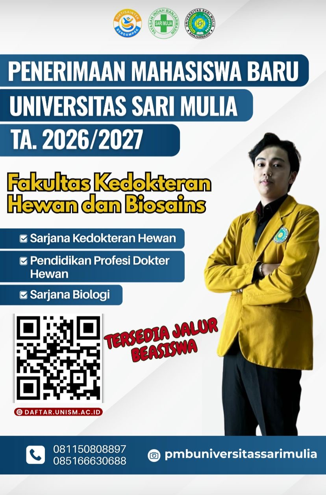

# Kebangkitan Pendidikan Veteriner di Kalimantan: Universitas Sari Mulia dan Masa Depan One Health Indonesia

*Kebangkitan pendidikan veteriner di Kalimantan (pic: istimewa).*

  
***Membuka pendidikan veteriner di Kalimantan bukan hanya kebutuhan akademik, tetapi kebutuhan strategis nasional**
  

Baru-baru ini ramai pembicaraan publik tentang pembukaan program kedokteran hewan oleh Universitas Sari Mulia di Kalimantan Selatan. Dan itu memang menarik sekali karena kampus tersebut sebelumnya sudah dikenal berkembang di bidang kesehatan dan medis.

Pembukaan program kedokteran hewan di Universitas Sari Mulia bukan sekadar penambahan jurusan baru. Ia merepresentasikan perubahan besar desentralisasi pendidikan medis dan veteriner Indonesia.

Selama puluhan tahun, pendidikan dokter hewan sangat terpusat di Jawa. Akibatnya:
mahasiswa Kalimantan harus merantau jauh,
biaya pendidikan meningkat,
dan kebutuhan dokter hewan daerah tidak seimbang dengan jumlah lulusan.
mPadahal Kalimantan adalah wilayah yang sangat penting secara biologis:
biodiversitas tinggi,
habitat satwa endemik,
pusat peternakan berkembang,
wilayah rawan zoonosis,
serta kawasan penyangga IKN.
Sehingga membuka pendidikan veteriner di Kalimantan sebenarnya bukan hanya kebutuhan akademik, tetapi kebutuhan strategis nasional.

## Mengapa Universitas Sari Mulia Dipandang Memiliki Modal Kuat?

Yang membuat langkah Universitas Sari Mulia menarik adalah mereka tidak memulai dari nol dalam budaya pendidikan kesehatan.

Kampus ini sebelumnya telah berkembang dalam:
ilmu kesehatan,
keperawatan,
kebidanan,
farmasi,
dan bidang medis lainnya.

Artinya mereka sudah memiliki:
kultur akademik kesehatan,
pengalaman laboratorium,
pendekatan klinis,
dan manajemen pendidikan medis.

Membuka kedokteran hewan dari basis seperti itu jauh lebih realistis dibanding membangun tanpa fondasi kesehatan sama sekali.

Secara institusional, ini penting sekali. Karena kedokteran hewan modern bukan cuma soal hewan, tetapi biomedical science yang terhubung dengan:
patologi,
mikrobiologi,
epidemiologi,
farmakologi,
hingga kesehatan masyarakat.

## Veteriner Modern: Dokter Hewan atau Penjaga Peradaban Biologis?

Ini bagian yang sering diremehkan publik.

Dokter hewan modern punya peran besar dalam:

1. Pencegahan pandemi

Sebagian besar penyakit baru berasal dari hewan.

2. Ketahanan pangan

Mereka menjaga:
kesehatan ternak,
kualitas daging,
susu,
telur,
hingga biosecurity.

3. Konservasi satwa liar

Kalimantan adalah jantung ekologi dunia:
orangutan,
bekantan,
macan dahan,
beruang madu.

Semua membutuhkan tenaga veteriner.

4. Animal welfare

Kesadaran masyarakat terhadap kesejahteraan hewan meningkat tajam.

Hewan kini dipandang:
makhluk hidup berperasaan,
bukan sekadar objek ekonomi.

Dan itu perubahan moral besar dalam peradaban modern.

## Mengapa Prospek Kerja Veteriner Sangat Cerah?

Karena Indonesia sedang mengalami ledakan kebutuhan veteriner, sementara jumlah tenaga profesional masih terbatas.

Peluang kerjanya luas:
klinik hewan,
rumah sakit hewan,
pet food industry,
laboratorium,
konservasi,
karantina,
perusahaan farmasi,
peternakan,
riset penyakit,
hingga satwa eksotik.

Ditambah lagi tren “pet parenting” meningkat.

Banyak orang kini memperlakukan:
kucing,
anjing,
bahkan reptil,
sebagai anggota keluarga.

Jadi sektor kesehatan hewan ikut tumbuh seperti galaksi ekonomi baru.

## Mengapa Kalimantan Sangat Membutuhkan Dokter Hewan?

Karena Kalimantan menghadapi kombinasi unik:
urbanisasi,
pembangunan IKN,
perdagangan satwa,
deforestasi,
interaksi manusia-satwa liar,
dan perubahan ekosistem.

Semua itu meningkatkan risiko zoonotic spillover, yaitu perpindahan penyakit dari hewan ke manusia.

Sehingga dokter hewan di Kalimantan nanti bisa menjadi:
penjaga kesehatan publik,
pelindung satwa,
sekaligus benteng biologis masa depan Indonesia.

Pembukaan program kedokteran hewan di Universitas Sari Mulia adalah langkah penting bagi Kalimantan dan Indonesia.

Keunggulannya terletak pada:
pengalaman institusi dalam bidang kesehatan,
kebutuhan regional yang besar,
serta relevansi global profesi veteriner di era One Health.

Veteriner hari ini bukan profesi pinggiran. Mereka berada di garis depan:
pandemi,
konservasi,
keamanan pangan,
kesejahteraan hewan,
dan masa depan hubungan manusia dengan makhluk hidup lain.

Dan jujur saja, peradaban yang mulai serius merawat hewan biasanya sedang belajar menjadi lebih manusiawi juga.

  
**Referensi**

Universitas Sari Mulia. (2025). Profil dan pengembangan program studi kesehatan. Universitas Sari Mulia.

World Health Organization. (2024). One Health approach. WHO.

World Organisation for Animal Health. (2024). Veterinary workforce and animal welfare. WOAH.

Food and Agriculture Organization. (2023). Zoonotic diseases and veterinary public health. FAO.

Kementerian Pendidikan Tinggi Sains dan Teknologi Republik Indonesia. (2025). Data pendidikan kedokteran hewan Indonesia. Kemendiktisaintek RI.
