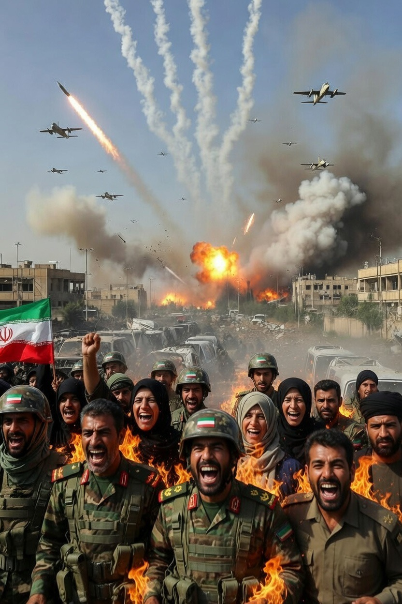

# Keberanian Strategis Negara Lemah: Analisis Ketahanan Iran dalam Konflik Asimetris Melawan Kekuatan Militer Superior

*Ilustrasi semangat keberanian Iran(pic: Grok AI).*

  
***Dalam perang panjang, kadang yang menentukan bukan siapa yang paling kuat. Tapi siapa yang paling tahan menderita lebih lama***
  

Konflik antara Iran dan koalisi yang dipimpin Amerika Serikat serta Israel menunjukkan fenomena klasik dalam studi perang modern: negara dengan kapasitas militer lebih kecil tetap mampu menantang kekuatan superior. 

Artikel ini menganalisis faktor-faktor yang menjelaskan ketahanan strategis Iran melalui kerangka teori perang asimetris, ketahanan politik, dan leverage geopolitik energi. 

Penelitian menunjukkan bahwa keberanian Iran bukan semata faktor militer, tetapi hasil kombinasi doktrin pertahanan terdesentralisasi, strategi perang asimetris, mobilisasi ideologis, serta kemampuan menciptakan biaya ekonomi global bagi lawan.

## Pendahuluan

Dalam paradigma tradisional hubungan internasional, negara dengan kekuatan militer dan teknologi superior diperkirakan memiliki peluang kemenangan lebih besar dalam konflik bersenjata.

Namun konflik kontemporer sering menunjukkan paradoks: negara yang relatif lebih lemah mampu bertahan bahkan menantang kekuatan besar.

Kasus Iran menjadi contoh menarik. Meskipun menghadapi tekanan militer dan ekonomi dari Amerika Serikat dan sekutunya, negara tersebut tetap menunjukkan resistensi tinggi terhadap intervensi eksternal.

Pertanyaan utama penelitian ini adalah:
Mengapa Iran tetap berani menghadapi kekuatan militer yang jauh lebih besar?

## Teori Perang Asimetris

Perang asimetris terjadi ketika dua pihak memiliki perbedaan besar dalam kapasitas militer.

Dalam situasi ini, pihak yang lebih lemah tidak mencoba meniru kekuatan musuh, tetapi:

•	menyerang kelemahan struktural lawan

•	memperpanjang konflik

•	meningkatkan biaya perang bagi musuh.

Strategi ini bertujuan bukan untuk menang cepat, tetapi membuat perang menjadi terlalu mahal bagi lawan.  

## Doktrin Pertahanan Mosaic Defense

Iran mengembangkan doktrin yang dikenal sebagai “Mosaic Defense.”

Doktrin ini menyebarkan komando militer ke banyak unit regional sehingga:

•	jika pusat komando dihancurkan

•	perang tetap bisa berlanjut melalui unit-unit independen.  

Strategi ini dirancang khusus untuk menghadapi serangan udara dan “decapitation strike” yang sering digunakan oleh militer Barat.

Akibatnya, bahkan ketika pemimpin tinggi terbunuh atau fasilitas militer hancur, struktur pertahanan tidak langsung runtuh.

## Strategi Asimetris: Senjata Murah Melawan Teknologi Mahal

Iran memanfaatkan ketidakseimbangan biaya perang.

Contoh:

•	drone murah

•	rudal balistik

•	ranjau laut

•	kapal cepat kecil.

Satu drone dapat berharga puluhan ribu dolar, sementara rudal pencegat lawan bisa bernilai jutaan dolar.  

Logika strateginya sederhana: buat musuh menghabiskan lebih banyak uang daripada yang kita keluarkan.

## Leverage Geopolitik Energi

Salah satu sumber kekuatan Iran bukan hanya militernya, tetapi geografinya.

Iran berada di dekat Strait of Hormuz, jalur strategis yang dilewati sekitar 20% perdagangan minyak dunia.

Dengan kemampuan mengganggu jalur ini, Iran dapat menciptakan tekanan ekonomi global bahkan tanpa memenangkan perang militer secara langsung.  

Ini memberi Iran alat geopolitik yang sangat kuat.

## Ketahanan Politik Internal

Laporan intelijen Amerika sendiri menunjukkan bahwa:

•	struktur politik Iran cukup stabil

•	perubahan rezim akibat serangan militer eksternal dianggap tidak mudah terjadi.  

Hal ini disebabkan oleh:

•	peran kuat militer elit

•	struktur kekuasaan yang berlapis

•	mobilisasi nasional saat menghadapi ancaman eksternal.

Serangan luar sering justru memperkuat solidaritas domestik.

## Strategi Perang Ketahanan (War of Endurance)

Strategi Iran sering digambarkan sebagai war of attrition atau perang ketahanan.

Tujuannya bukan menghancurkan lawan secara cepat, tetapi:

•	memperpanjang konflik

•	meningkatkan biaya ekonomi dan politik

•	menunggu kelelahan musuh.  

Sejarah menunjukkan strategi ini pernah berhasil melawan kekuatan besar, seperti di:

•	Vietnam

•	Afghanistan

•	Irak.

Keberanian Iran menghadapi kekuatan militer superior tidak dapat dipahami hanya melalui ukuran militer konvensional.

Ketahanan Iran berasal dari kombinasi:
1.	doktrin pertahanan terdesentralisasi
2.	strategi perang asimetris
3.	leverage geopolitik energi
4.	mobilisasi ideologis dan nasionalisme
5.	strategi perang ketahanan jangka panjang.

Dengan kata lain, Iran tidak mencoba memenangkan perang dengan cara yang sama seperti Amerika Serikat atau Israel.

Iran mencoba mengubah aturan permainan perang itu sendiri.

Negara kecil jarang menang karena lebih kuat. Mereka bertahan karena lebih sabar.

Dan dalam perang panjang, kadang yang menentukan bukan siapa yang paling kuat.
Tapi siapa yang paling tahan menderita lebih lama.

  
**Referensi**

International Institute for Strategic Studies. (2025). The Military Balance 2025. London: IISS.

United States Institute of Peace. (2024). Iran’s Military Doctrine and Asymmetric Warfare Strategy. Washington, DC.

International Crisis Group. (2024). Iran’s Revolutionary Guards and Regional Power Projection. Brussels.

Stockholm International Peace Research Institute. (2025). Arms Transfers and Military Expenditure Database. Stockholm.

Council on Foreign Relations. (2024). Iran’s Military Capabilities and Strategic Posture. New York.

RAND Corporation. (2023). Iran’s Strategy in the Middle East: Asymmetric Warfare and Regional Influence. Santa Monica.

U.S. Energy Information Administration. (2025). The Strait of Hormuz and Global Oil Flow. Washington, DC.
