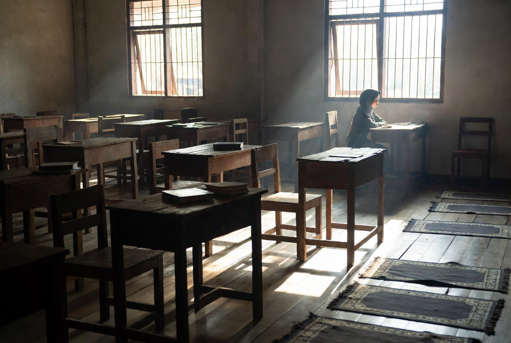

# Ketaatan yang Tersesat: Otoritas Religius, Koersi Psikologis & Distorsi Ajaran dalam Kasus Kekerasan Seksual di Lembaga Keagamaan

*Ilustrasi (pic: Grok AI).*

  
***Tidak ada ketaatan kepada makhluk dalam kemaksiatan kepada Sang Pencipta***
  

Kasus pelecehan oleh figur otoritas di lingkungan pesantren menyingkap persilangan berbahaya antara kharisma religius, relasi kuasa yang timpang, dan kerentanan psikologis santri. 

Tulisan ini menganalisis mengapa korban bisa “tampak patuh”, bagaimana ajaran tentang ketaatan disalahpahami, dan apa koreksi normatif dalam Islam serta standar hukum modern untuk mencegah dan menindak pelanggaran.

## Mengapa Korban Bisa “Patuh”? (Bukan Karena Mereka Setuju)

Dalam psikologi sosial, perilaku itu dijelaskan oleh beberapa mekanisme:

a. Authority Bias

Manusia cenderung mematuhi figur berotoritas, terlebih bila dibungkus simbol religius.

b. Coercive Control (Koersi terselubung)

Ancaman implisit:
“kalau melawan, berdosa”
takut dikeluarkan, dipermalukan, atau disanksi sosial

c. Grooming

Pelaku membangun kepercayaan bertahap:
memberi perhatian khusus,
mengisolasi korban,
lalu melanggar batas secara perlahan.

d. Learned Helplessness

Korban merasa tidak punya jalan keluar setelah tekanan berulang.

Jadi, “taat” di sini bukan pilihan bebas, melainkan hasil manipulasi + ketimpangan kuasa.

## Di mana Letak Kesalahpahaman Agama?

Dalam Islam, prinsipnya jelas:

“Lā ṭā‘ata li makhlūqin fī ma‘ṣiyatil Khāliq.”

Tidak ada ketaatan kepada makhluk dalam kemaksiatan kepada Sang Pencipta.

Artinya:
ketaatan kepada ustadz/kyai bersyarat,
jika menyuruh maksiat → wajib ditolak.

Distorsi yang sering terjadi
ketaatan absolut pada guru,
sakralisasi figur (“kyai tidak mungkin salah”),
rasa takut yang dibungkus dalil,
Ini bukan ajaran Islam yang lurus,
melainkan penyalahgunaan agama untuk kontrol.

## Perspektif Hukum (Indonesia & Internasional)

Hukum Nasional (Indonesia)

Tindakan tersebut masuk:
tindak pidana kekerasan seksual,
diperberat karena: pelaku figur otoritas, korban di bawah pengasuhan.
Prinsip Hukum Internasional,
perlindungan anak & perempuan,
larangan eksploitasi seksual,
standar “consent” tidak sah jika ada relasi kuasa.

Dalam konteks ini, “persetujuan” korban tidak dianggap valid.

## Kenapa Kasus Seperti ini Bisa Berulang?

Faktor struktural:
hierarki ketat tanpa pengawasan,
budaya “jangan melawan guru”,
minim kanal pengaduan aman,
stigma terhadap korban.

## Analisis

ketika otoritas tidak diawasi,
ketaatan berubah dari ibadah menjadi alat dominasi

## Apa yang Seharusnya Terjadi (Secara Normatif)?

Reformasi penting:
pendidikan literasi agama yang kritis,
mekanisme pengaduan independen,
transparansi lembaga pendidikan,
perlindungan korban tanpa stigma.

  
**Referensi**

American Psychological Association. (2013). Guidelines for psychological practice with trauma survivors. American Psychological Association.

Bandura, A. (1977). Social learning theory. Prentice Hall.

Finkelhor, D. (1984). Child sexual abuse: New theory and research. Free Press.

Herman, J. L. (1992). Trauma and recovery. Basic Books.

Milgram, S. (1974). Obedience to authority: An experimental view. Harper & Row.

World Health Organization. (2017). Responding to children and adolescents who have been sexually abused. WHO.

Undang-Undang Republik Indonesia Nomor 12 Tahun 2022 tentang Tindak Pidana Kekerasan Seksual.

Al-Nawawi. (1999). Riyadhus Shalihin. Dar al-Salam.
(Hadits: “Tidak ada ketaatan kepada makhluk dalam maksiat kepada Allah”)

Al-Qur’an. (QS. An-Nisa: 59)
(Taat kepada Allah, Rasul, dan ulil amri—dengan batas kebenaran)
