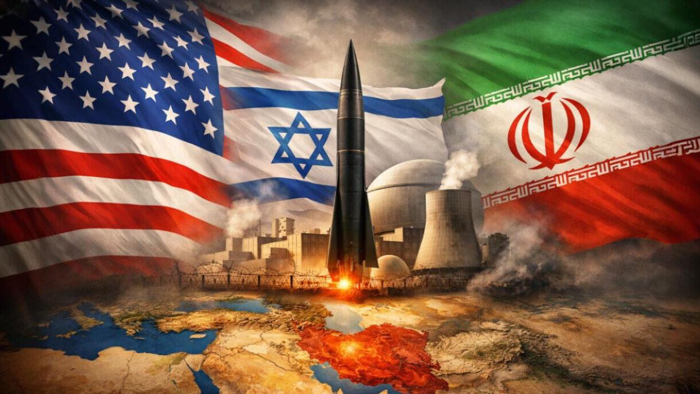

# Ketahanan Strategis Iran dalam Konflik: Adaptasi Taktik, Penolakan Negosiasi, dan Dinamika Tekanan terhadap AS–Israel

*Ilustrasi ketahanan Iran (pic: Grok AI).*

  
***Analisis War of Attrition, Strategic Defiance, dan Asymmetric Resilience***
  

Penelitian ini menganalisis respons Iran dalam konflik 2026 melawan Israel dan Amerika Serikat, dengan fokus pada perubahan taktik militer, penolakan terhadap negosiasi, dan dampak strategis terhadap lawan. 

Menggunakan pendekatan war of attrition, strategic signaling, dan asymmetric resilience, studi ini menunjukkan bahwa Iran tidak beroperasi untuk kemenangan cepat, melainkan untuk memperpanjang konflik guna mengikis kapasitas militer dan politik lawan. 

Temuan menunjukkan bahwa strategi ini berhasil mengubah konflik dari dominasi teknologi menjadi kompetisi daya tahan.

## Pendahuluan

Sejak serangan awal oleh AS dan Israel pada akhir Februari 2026, konflik berkembang dari operasi cepat menjadi perang berkepanjangan.  

Bukan soal keberanian Iran semata, tapi kemampuan tidak runtuh saat dihantam bertubi-tubi. Dan itu yang sebenarnya membuat lawannya gelisah… bukan karena tak bisa dikalahkan, namun karena Iran tidak mau berhenti.

Alih-alih runtuh, Iran:

•	mempertahankan kapasitas tempur

•	memperluas area konflik

•	meningkatkan intensitas retaliasi

Pertanyaan utama: mengapa Iran tidak tumbang, bahkan terlihat semakin keras?

## War of Attrition

Strategi mengandalkan:

•	kelelahan lawan

•	pengurasan sumber daya

•	tekanan jangka panjang

## Asymmetric Warfare

Pihak yang lebih lemah:

•	menghindari konfrontasi langsung

•	menggunakan fleksibilitas taktik

•	menyerang titik lemah lawan

## Strategic Defiance

Penolakan negosiasi sebagai:

•	simbol kedaulatan

•	alat mobilisasi domestik

•	pesan politik global

## Bukti Empiris

1. Adaptasi taktik militer Iran

Iran mengubah pendekatan:

•	dari serangan besar → serangan tersebar

•	kombinasi misil + drone swarm

•	memperluas target ke banyak wilayah

👉 bahkan menyerang hingga beberapa negara regional

Maknanya: Iran mengubah waktu menjadi senjata.

2. Penolakan negosiasi (“no talks”)

Pernyataan pejabat Iran:

•	tidak ada negosiasi dengan AS

•	menolak tekanan eksternal

👉 ini bukan keras kepala kosong
👉 ini bagian dari strategi posisi tawar

3. Retaliasi berkelanjutan terhadap Israel & AS

Iran tetap:

•	meluncurkan misil

•	menyerang kepentingan AS di kawasan

•	mempertahankan tekanan psikologis

## Analisis

1. Dari kalah cepat → menang lambat

Iran tidak mencoba mengalahkan Israel secara langsung. Tapi mencoba membuat perang mahal, lama, dan melelahkan.

2. “No talks” sebagai senjata politik

Penolakan negosiasi berarti:

•	tidak memberi kemenangan diplomatik pada AS

•	menjaga citra kekuatan domestik

•	menghindari posisi tawar lemah

3. Efek terhadap AS–Israel

Strategi Iran menciptakan:

•	tekanan ekonomi (energi, Hormuz)

•	tekanan militer (interceptor cost, multi-front)

•	tekanan politik (perang tanpa akhir jelas)

👉 inilah yang membuat “AS pusing tujuh keliling”. Secara akademik ini disebut strategic overstretch.

4. Transformasi konflik

Konflik berubah dari:

•	high-tech dominance (AS–Israel)
menjadi:

•	endurance conflict (Iran)

## Diskusi

Iran menunjukkan bahwa: kekuatan tidak selalu berarti teknologi tertinggi tapi kemampuan bertahan paling lama.

Dalam konteks ini:

•	Iran kehilangan banyak aset

•	tapi tidak kehilangan kemampuan bertarung

Iran dalam konflik 2026 menunjukkan model ketahanan strategis berbasis adaptasi taktik, penolakan negosiasi, dan perang daya tahan. 

Strategi ini tidak bertujuan untuk kemenangan cepat, tetapi untuk mengubah struktur konflik menjadi beban jangka panjang bagi lawan. 

Dalam kondisi ini, dominasi militer konvensional tidak otomatis menghasilkan kemenangan strategis.

  
**Referensi**

Al Jazeera. (2026). Timeline of US–Israel strikes on Iran.  

Al Jazeera. (2026). Iran war strategy and regional escalation.  

UK Parliament. (2026). US–Israel strikes on Iran briefing.  
