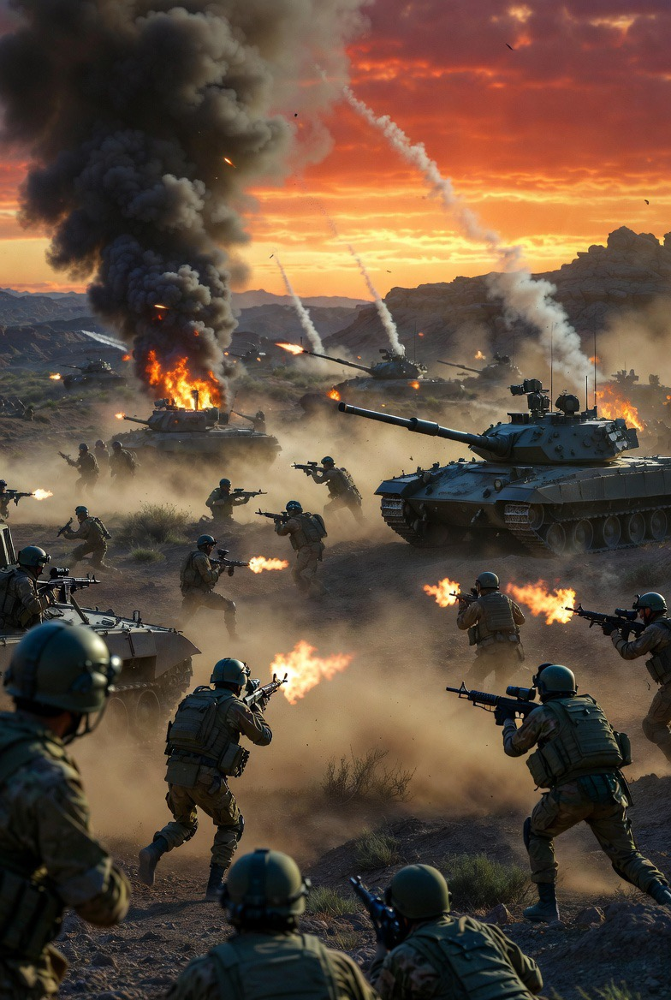

# Ketegangan Israel–Iran 2026: Eskalasi Militer, Politik Eliminasi, dan Risiko Perang Regional Total

*Ilustrasi perang (pic: Grok AI).*

  
***Ketegangan Israel–Iran 2026 adalah perang tanpa nama yang sudah berjalan seperti perang besar***
  

Konflik antara Israel dan Iran pada 2026 telah berkembang dari rivalitas tidak langsung menjadi konfrontasi militer terbuka dengan keterlibatan Amerika Serikat. 

Studi ini menganalisis dinamika eskalasi, termasuk strategi “decapitation strike”, perang proxy, serta implikasi ekonomi global. 

Temuan menunjukkan bahwa konflik ini tidak lagi bersifat regional terbatas, melainkan berpotensi menjadi perang sistemik dengan dampak global.

## Pendahuluan

Hubungan Israel–Iran telah lama bermusuhan sejak Revolusi Iran 1979. Namun, tahun 2026 menandai fase baru:

➡️ dari proxy war

➡️ menjadi direct confrontation

Operasi militer besar seperti Operation Epic Fury menjadi titik balik eskalasi.

## Kronologi Eskalasi 2026

1. Serangan awal

•	±900 serangan udara dalam 12 jam pertama

•	target: militer, nuklir, dan kepemimpinan Iran  

➡️ termasuk kematian pemimpin tertinggi Iran

2. Balasan Iran

•	ratusan rudal & drone ke wilayah regional

•	serangan ke infrastruktur energi & militer

➡️ konflik meluas ke kawasan Teluk

3. Strategi eliminasi elite

Israel:

•	melakukan ratusan operasi pembunuhan terarah

•	menggunakan AI untuk targeting pemimpin Iran  

➡️ ini bukan perang biasa

➡️ ini perang penghancuran struktur kekuasaan.

## Analisis Strategis

1. “Decapitation Warfare”

Strategi utama: menghancurkan kepemimpinan untuk melumpuhkan negara.

Namun:

➡️ sering gagal jangka panjang

➡️ karena struktur kekuasaan bisa regeneratif

2. Proxy War → Direct War

Sebelumnya:

•	Iran → Hezbollah, milisi Irak

•	Israel → operasi rahasia

Sekarang:

➡️ konflik langsung negara vs negara

3. Eskalasi tanpa batas jelas

Tidak ada:

•	deklarasi perang formal

•	garis front jelas

➡️ tapi intensitasnya setara perang besar.

## Peran Amerika Serikat

AS tidak lagi sekadar pendukung.

➡️ ikut serangan langsung

➡️ mengancam menghancurkan infrastruktur energi Iran  

➡️ mempertimbangkan operasi militer lanjutan.

## Dampak Global

1. Ekonomi dunia

•	harga minyak melonjak

•	jalur perdagangan terganggu

•	ekonomi Israel sendiri terdampak konflik  

2. Risiko perang regional

Konflik menyebar ke:
	
  •	Lebanon
	
  •	Suriah
	
  •	Teluk

➡️ potensi regional war

3. Normalisasi kekerasan ekstrem

•	pembunuhan elite jadi “alat rutin”

•	infrastruktur sipil jadi target potensial

➡️ batas moral perang makin kabur.

## Analisis Teoretis

🧠 Realisme (Hard Power)

➡️ negara bertindak untuk bertahan dan dominasi

➡️ kekuatan militer jadi alat utama

🌐 Teori Eskalasi

Konflik ini menunjukkan: escalation ladder tanpa rem.

Setiap aksi:
➡️ memicu balasan lebih besar

🌌 “Security Dilemma”

Israel:

•	menyerang untuk keamanan

Iran:

•	membalas untuk keamanan

➡️ hasilnya: kedua pihak justru makin tidak aman.

## Diskusi Kritis

Konflik ini bukan sekadar:
	
  •	nuklir
	
  •	keamanan
	
  •	atau ideologi

Tapi juga:

➡️ perebutan dominasi regional

➡️ legitimasi politik domestik

➡️ dan permainan kekuasaan global

Dan ironi terbesar: setiap pihak mengklaim “bertahan” tapi semua bertindak ofensif.

Ketegangan Israel–Iran 2026 adalah: perang tanpa nama yang sudah berjalan seperti perang besar.

Dengan karakter:

•	tidak stabil

•	tidak simetris

•	dan sangat berbahaya

Jika tidak dikendalikan: berpotensi menjadi konflik regional besar dengan dampak global.

  
**Referensi**

Britannica. (2026). 2026 Iran conflict.  

Reuters. (2026). Israel economy outlook amid Iran war.  

Washington Post. (2026). AI-assisted targeting in Israel-Iran conflict.  

The Guardian. (2026). US threats toward Iran infrastructure.  
