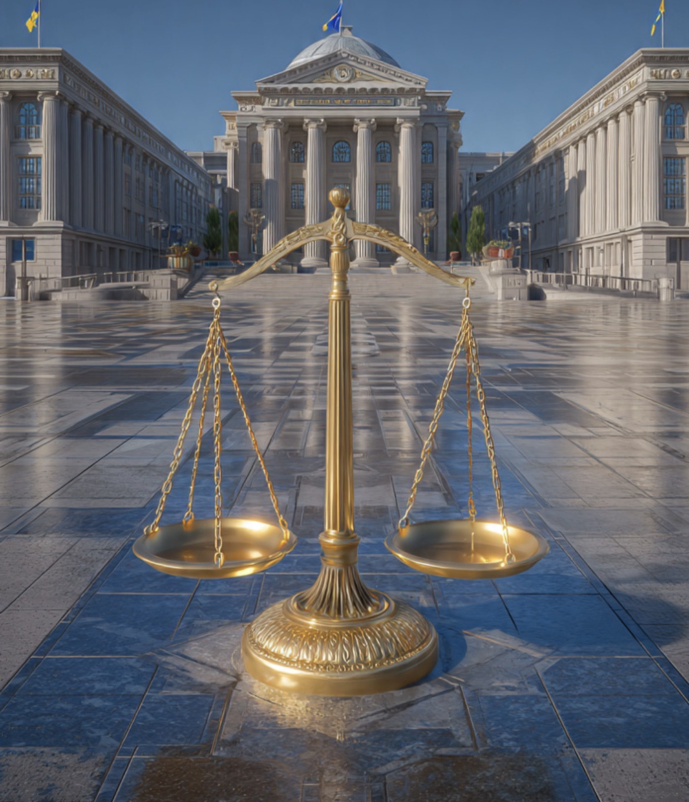

# Ketika Dua Penegak Hukum Saling Menguji: Apakah Ini Penegakan Hukum atau Perebutan Ruang Kekuasaan?

*Ilustrasi (pic: Grok AI).*

  
***“Negara diuji bukan ketika semua lembaga sepakat, melainkan ketika lembaga-lembaga kuat saling mengawasi tanpa saling menghancurkan.”***
  

Kejaksaan dalam beberapa tahun terakhir sangat agresif menangani perkara korupsi besar.

Di sisi lain, Polri kini menangani perkara yang menyentuh salah satu pejabat paling berpengaruh di Kejaksaan.

Urutan peristiwa seperti ini mudah membentuk persepsi adanya “balas-membalas”. Tetapi urutan waktu bukanlah bukti sebab-akibat.

## Apakah Ini Bisa Disebut “Perang Lembaga”?

Belum tentu.

Dalam ilmu politik dikenal konsep inter-institutional rivalry. Artinya, dua lembaga yang sama-sama kuat dapat mengalami gesekan karena perbedaan kewenangan, persaingan prestise, perebutan legitimasi publik, atau memang karena masing-masing menjalankan fungsi pengawasan.

Gesekan tidak otomatis berarti ada permusuhan.

## Hipotesis yang Mungkin

Ada beberapa kemungkinan.

**Hipotesis pertama**

Semuanya murni penegakan hukum. Kalau memang ada dugaan tindak pidana, siapa pun harus diperiksa. Kalau terbukti tidak bersalah, proses selesai.

**Hipotesis kedua**

Ada unsur persaingan kelembagaan. Bukan berarti kasusnya palsu, tetapi momentum dan cara penanganannya dipengaruhi dinamika hubungan antarinstansi.

**Hipotesis ketiga**

Keduanya benar sekaligus. Kasus hukumnya nyata, namun eskalasinya diperbesar oleh ketegangan antarorganisasi.

Dalam praktik politik birokrasi, skenario seperti ini bukan sesuatu yang mustahil.

## Mengapa Pengamanan TNI Menjadi Sorotan?

Karena secara visual, kehadiran personel TNI di rumah seorang pejabat penegak hukum memberikan kesan luar biasa.

Namun penjelasan resmi Mabes TNI adalah bahwa pengamanan tersebut merupakan permintaan institusi Kejaksaan berdasarkan aturan perlindungan terhadap jaksa, bukan untuk menghalangi penyidikan Polri.  

Apakah publik akan menerima penjelasan itu? Itu persoalan lain, sebab dalam politik, simbol sering kali lebih kuat daripada penjelasan.

Yang paling berbahaya bukan jika Polri memeriksa pejabat Kejaksaan. Bukan pula jika Kejaksaan memeriksa anggota Polri.

Justru itu bisa menjadi tanda bahwa tidak ada lembaga yang kebal hukum, asalkan prosesnya objektif.

Yang berbahaya adalah jika masyarakat mulai percaya bahwa setiap penyidikan hanyalah balas dendam institusi.

Kalau persepsi itu menguat, maka setiap putusan nanti akan dibaca bukan sebagai kemenangan hukum, melainkan kemenangan kubu. Dan itu mengikis kepercayaan publik terhadap negara hukum.

Sebagian masyarakat  menilai “Polisi menggigit balik karena sebelumnya digigit Kejaksaan.”

Tetapi sampai hari ini belum ada bukti publik yang menunjukkan adanya koordinasi balas dendam antarlembaga.

Yang perlu diawasi justru adalah: apakah penyidikan berjalan transparan, apakah prosedur dipatuhi, apakah tidak ada intervensi, dan apakah standar pembuktian diterapkan sama kepada semua pihak.

Kalau prinsip-prinsip itu terjaga, maka siapa pun yang diperiksa, hasilnya akan lebih mudah diterima publik.

Dalam negara hukum yang sehat, lembaga penegak hukum boleh saling memeriksa. Yang tidak boleh adalah saling memeriksa demi memenangkan pertarungan institusi, bukan demi menemukan kebenaran.

  
**Referensi**

ANTARA. (2026, 9 Juli). TNI buka suara soal rumah Jampidsus dijaga tentara.  

ANTARA. (2026, 10 Juli). Jampidsus buka suara soal temuan uang dan emas di rumah Sentul.  

Detik. (2026, 10 Juli). Pernyataan Jampidsus tentang pemilik 74 kg emas dalam brankas di rumahnya.  

Bureaucratic Politics and Foreign Policy. (2006). Brookings Institution Press.
