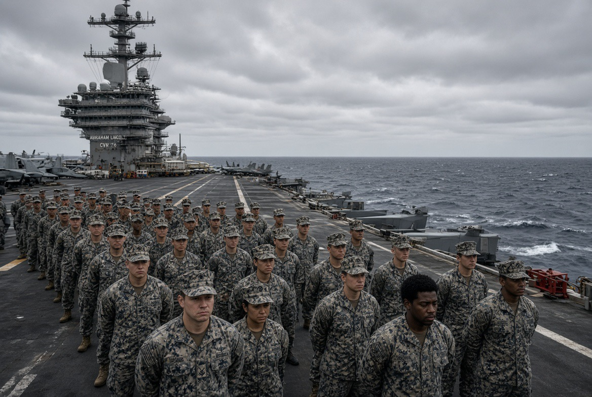

# Ketika Kapal Perang Menjadi Penjara Terapung: Harga Psikologis Perang yang Tak Kunjung Usai

*Ilustrasi (pic: Grok AI).*

  
***Negara dapat menghitung kapal induk, rudal, pesawat, dan jam operasi dengan sangat presisi. Tetapi manusia yang mengoperasikan semuanya tidak memiliki baterai tak terbatas***
  

USS Abraham Lincoln membawa sekitar 5.000 personel dan telah mengalami deployment yang luar biasa panjang. 

Kapal tersebut berada di laut sejak November 2025, dengan sangat sedikit kesempatan berlabuh, sementara pengerahan ke Timur Tengah diperpanjang akibat perang dengan Iran. 

AP melaporkan kapal itu telah berada di laut lebih dari 260 hari. Sementara Military Times dan Stars and Stripes melaporkan adanya beberapa percobaan melompat ke laut oleh pelaut selama deployment tersebut. 

Keluarga personel bahkan datang menemui pimpinan Angkatan Laut karena khawatir terhadap kondisi psikologis dan fisik anggota keluarga mereka. 

Jadi, adanya krisis kesejahteraan dan percobaan bunuh diri memiliki dasar pemberitaan kuat.

## Lingkungan Psikologis Kapal Induk 

Kapal induk bukan sekadar tempat kerja. Ia adalah ruang tertutup dengan ribuan manusia yang tidak bisa pulang ketika mereka mau.

Tidak ada halaman rumah, keluarga, kamar pribadi yang benar-benar pribadi, perjalanan pulang setelah shift, ataupun kebebasan keluar gedung ketika pekerjaan selesai.

Sebaliknya, ketika mereka bangun  tidur langsung menghadapi tugas, kemudian latihan/operasi, berhenti untuk makan, tidur, lalu bangun lagi. Dan semuanya berlangsung dalam lingkungan logistik yang sangat terbatas.

Ketika deployment terus diperpanjang, psikologi manusia menghadapi persoalan yang disebut loss of temporal predictability. Manusia bukan cuma membutuhkan istirahat, mereka membutuhkan kepastian kapan penderitaan berakhir.

Sehingga kalimat “Sebentar lagi pulang” berbeda secara psikologis dari “Kami tidak tahu kapan pulang.”

## Extended Deployment Berbahaya

Dalam literatur kesehatan militer, deployment panjang dikaitkan dengan berbagai tekanan, seperti kurang tidur, kelelahan, isolasi sosial, separation from family, stres operasional, gangguan ritme sirkadian, dan meningkatnya risiko masalah kesehatan mental.

Yang terjadi pada USS Lincoln menjadi semakin berat karena bukan sekadar deployment panjang.

Deployment tersebut berlangsung dalam perang aktif. Artinya otak personel tidak sepenuhnya memperoleh kesempatan untuk keluar dari mode kewaspadaan.

## Faktor yang Sering Dilupakan: Moral Injury

Ini berbeda dari PTSD.

Moral injury dapat muncul ketika seseorang mengalami atau menyaksikan sesuatu yang bertentangan dengan nilai moralnya, atau merasa dirinya dipaksa berpartisipasi dalam sesuatu yang bertentangan dengan keyakinannya.

Dalam perang berkepanjangan, pertanyaan seperti: “Kenapa kami masih di sini?” “Berapa lama lagi?” Apa sebenarnya tujuan operasi ini?” dapat menjadi semakin berat apabila jawaban institusional tidak memuaskan.

Apalagi jika personel merasa keputusan politik terus memperpanjang deployment, sementara konsekuensi psikologisnya mereka yang tanggung.

## Kritik terhadap Trump Menjadi Pertanyaan Kebijakan Publik

Apakah keputusan memperpanjang operasi militer meningkatkan beban psikologis personel yang menjalankannya?

Jawabannya secara teori dan pengalaman militer adalah sangat mungkin, dan laporan mengenai kondisi Lincoln membuat pertanyaan itu semakin relevan. 

Reuters melaporkan bahwa deployment kapal tersebut sudah melampaui durasi normal dan bahwa penggantinya, USS George Washington, sedang dipersiapkan untuk mengambil alih. 

## Paradoks Militer yang Sangat Kejam

Negara membutuhkan tentara yang siap bertempur kapan saja. Tetapi manusia membutuhkan waktu untuk berhenti menjadi tentara.

Kalau negara terus memperpanjang keadaan darurat, batas antara “deployment sementara” dan “kehidupan normal” mulai menghilang.

Dan di situlah burnout bisa berubah menjadi sesuatu yang jauh lebih serius.

## Keluarga Mulai Menjadi Indikator Penting

Ini menarik secara sosiologis.

Sekitar 200 anggota keluarga menghadiri pertemuan dengan pimpinan Angkatan Laut di San Diego untuk menyampaikan kekhawatiran mengenai kondisi para pelaut. 

Mereka mempertanyakan persoalan pasokan, komunikasi, kondisi fasilitas, dan kesehatan mental. 

Artinya masalahnya sudah keluar dari kapal. Ia berubah menjadi institutional trust crisis. Keluarga mulai mempertanyakan apakah institusi militer benar-benar menjaga manusia yang mereka kirim ke medan perang.

## Pentagon Menyangkal 

Menteri Pertahanan Pete Hegseth mengatakan laporan mengenai kondisi buruk di USS Lincoln sangat dilebih-lebihkan atau salah digambarkan. Pentagon juga menegaskan bahwa sistem dukungan bagi personel tersedia. 

Jadi terdapat dua sumber informasi, yakni keluarga dan laporan media militer vs. pimpinan Pentagon/Navy.

Itu berarti beberapa detail masih harus diverifikasi melalui investigasi resmi. Tetapi keberadaan perbedaan narasi itu sendiri sudah merupakan masalah institusional.

Karena kalau keluarga mengatakan: “Anak kami sedang hancur.” sedangkan institusi mengatakan: “Tidak ada masalah besar.” maka pertanyaan berikutnya adalah: siapa yang sebenarnya memiliki mekanisme independen untuk memeriksa keadaan tersebut?

## Tujuh Tentara Tewas?

CENTCOM telah membantahnya, sementara sumber kredibel yang ditemukan justru melaporkan percobaan bunuh diri, kondisi deployment ekstrem, kekurangan pasokan, dan krisis moral/mental. 

Kalau nanti investigasi resmi membuktikan tujuh kematian itu, tentu analisisnya berubah. 

Tetapi jangan membuat angka yang belum terverifikasi menjadi fondasi argumen, karena itu justru memberi Pentagon kesempatan mengatakan: “Lihat, semuanya propaganda.” Padahal bukti mengenai problem deployment panjang sudah ada tanpa angka tujuh tersebut.

Yang kita lihat sekarang bukan sekadar “tentara capek karena kerja.” Ini adalah kombinasi deployment ekstrem akibat perang berkepanjangan, isolasi sosial ketidakpastian kepulangan, tekanan operasional, keterbatasan ruang hidup, kekhawatiran keluarga, serta ketidakpercayaan terhadap kepemimpinan.

Dan ketika beberapa pelaut sampai mencoba melompat dari kapal, alarmnya sudah berbunyi sangat keras. 

Jadi ada ironi yang cukup pahit, negara dapat menghitung kapal induk, rudal, pesawat, dan jam operasi dengan sangat presisi. Tetapi manusia yang mengoperasikan semuanya tidak memiliki baterai tak terbatas.

Kapal bisa terus berlayar, manusia tidak. 

Dan kalau Washington ingin mempertahankan perang yang panjang, pertanyaan strategisnya bukan cuma “berapa banyak rudal yang kita punya?” Tetapi: “Berapa lama manusia yang mengoperasikan rudal itu dapat bertahan sebelum mesin perang mulai menggerus orang-orang yang menjalankannya?”.

  
**References**

Associated Press. (2026, August 14). New aircraft carrier heads toward Mideast after reports of issues on long-deployed USS Lincoln. AP News⁠

Military Times. (2026, August 11). Multiple USS Abraham Lincoln sailors have tried to go overboard amid extended deployment, families say. Military Times⁠

Reuters. (2026, August 13). Hegseth says reports about poor conditions aboard carrier are misrepresented. Reuters⁠

Stars and Stripes. (2026, August 11). USS Abraham Lincoln families press Navy leaders over sailors’ mental health. Stars and Stripes⁠

Al Jazeera. (2026, August 14). US threatens ‘indefinite’ blockade against Iran: How long can it last? Al Jazeera⁠
