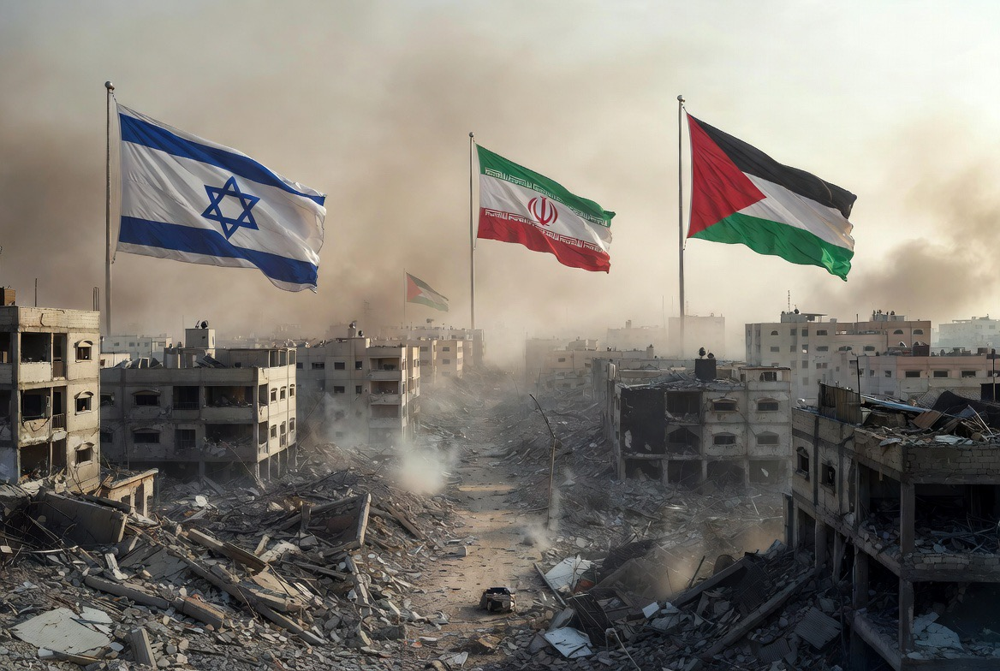

# Ketika Keadilan Tidak Datang: Mengapa Pendudukan, Perlawanan, dan Standar Ganda Terus Melahirkan Kekerasan?

*Ilustrasi (pic: Grok AI).*

  
***“Memahami akar perlawanan bukan berarti membenarkan semua bentuk kekerasan. Namun mengabaikan akar perlawanan hampir selalu membuat kekerasan terus berulang.”***
  

Perdebatan mengenai Israel dan Palestina hampir selalu berhenti pada pertanyaan: “Siapa yang lebih dahulu menembak?”

Padahal pertanyaan ilmiah yang lebih penting adalah: “Mengapa penembakan itu terus terjadi selama beberapa generasi?”

Dalam studi konflik, peristiwa seperti serangan bersenjata hanyalah episode, sebab akar persoalannya jauh lebih dalam.

Konflik tidak lahir di ruang kosong. Ia tumbuh dari sejarah, distribusi kekuasaan, pendudukan, ketidakadilan yang dirasakan, serta kegagalan politik selama puluhan tahun.

## Perlawanan Tidak Pernah Lahir dari Ruang Kosong

Hampir semua konflik berkepanjangan memiliki pola serupa, diantaranya adalah pendudukan, perampasan tanah, penggusuran, pembatasan hidup, juga korban sipil.

Lalu muncul perlawanan. Semakin lama pendudukan berlangsung, semakin besar kemungkinan sebagian masyarakat menganggap jalur damai tidak lagi efektif.

Fenomena ini tidak hanya ditemukan di Palestina. Ia muncul dalam berbagai perjuangan antikolonial di Asia, Afrika, Amerika Latin, bahkan Eropa.

Ini bukan pembenaran tetapi penjelasan ilmiah mengenai bagaimana konflik berkembang.

## Memahami Tidak Sama dengan Membenarkan

Kalimat ini sering disalahpahami. Ketika seorang ilmuwan mengatakan: “Pendudukan melahirkan radikalisasi.” Ia tidak sedang berkata: “Semua tindakan radikal dibenarkan.” Ia hanya menjelaskan hubungan sebab-akibat sosial.

Sama seperti mengatakan: Kemiskinan meningkatkan risiko kriminalitas. Itu bukan berarti kriminalitas dibenarkan.

Ilmu pengetahuan menjelaskan mekanisme, sementara etika menilai tindakan.

 
## Paradoks Moral yang Sulit Diabaikan

Jika hukum internasional melarang menyerang warga sipil, mengapa ketika ribuan warga sipil Palestina menjadi korban, mekanisme internasional tampak jauh lebih lambat bekerja?

Pertanyaan ini bukan milik satu kelompok politik. Ia telah lama menjadi kritik dari pakar hukum internasional, organisasi kemanusiaan, sebagian pejabat PBB, hingga banyak negara di Global South.

Mereka mempertanyakan apakah hukum internasional benar-benar diterapkan secara setara.

## Standar Ganda dan Krisis Legitimasi

Dalam teori hubungan internasional, hukum memperoleh legitimasi ketika diterapkan secara konsisten.

Sebaliknya, ketika masyarakat melihat pelanggaran tertentu dihukum keras, tetapi pelanggaran lain tidak, muncul persepsi adanya double standards.

Masalahnya bukan hanya soal keadilan, tetapi juga kepercayaan.

Ketika masyarakat kehilangan kepercayaan terhadap hukum, mereka mulai kehilangan kepercayaan terhadap jalur damai.

## Mengapa Israel Tetap Mendapat Dukungan Kuat?

Jawabannya tidak cukup dengan mengatakan: “Karena benar.” Atau: “Karena salah.”

Hubungan Israel-Amerika dibangun oleh kombinasi kepentingan strategis, kerja sama militer, politik domestik, sejarah, teknologi, serta keseimbangan kekuatan regional.

Artinya, politik internasional tidak hanya digerakkan oleh moralitas. Ia juga digerakkan oleh kepentingan.

Inilah salah satu pelajaran paling penting dari realisme politik.

## Apakah Iran Hanya Menciptakan Masalah?

Pandangan dunia mengenai Iran juga terbelah. Sebagian melihat Iran sebagai negara yang memperpanjang konflik melalui dukungannya kepada kelompok bersenjata.

Sebagian lain melihat Iran sebagai satu-satunya kekuatan regional yang secara konsisten mendukung perjuangan Palestina ketika banyak negara memilih normalisasi hubungan dengan Israel.

Kedua narasi tersebut hidup berdampingan. Analisis ilmiah tidak menghapus salah satunya, tetapi menjelaskan mengapa keduanya ada.

## Kesalahan Terbesar Dunia

Kesalahan terbesar bukan hanya kekerasan, melainkan kegagalan menyelesaikan akar konflik. Diantaranya adalah pendudukan yang berkepanjangan, ekspansi permukiman, ketidakamanan warga sipil, ketiadaan solusi politik yang dipercaya kedua belah pihak.

Selama persoalan-persoalan ini tetap ada, setiap gencatan senjata hanya akan menjadi jeda, bukan penyelesaian.

## Ketika Hukum Kehilangan Wibawa

Hukum internasional bukan kehilangan arti karena isinya buruk. Ia kehilangan wibawa ketika penerapannya dipersepsikan tidak konsisten.

Jika dunia ingin mempertahankan legitimasi hukum internasional, maka perlindungan terhadap warga sipil harus berlaku tanpa memandang agama, etnis, kewarganegaraan, maupun kekuatan politik.

Kalau tidak, hukum akan dipandang bukan sebagai pelindung, melainkan sebagai alat yang lebih mudah bekerja terhadap yang lemah daripada terhadap yang kuat.

Keadilan yang terlambat bukan sekadar kegagalan hukum. Dalam konflik berkepanjangan, ia dapat berubah menjadi bahan bakar bagi sejarah berikutnya.

Konflik Israel-Palestina mengajarkan satu pelajaran yang pahit, bahwa Perdamaian tidak akan lahir hanya dari kemenangan militer.

Negara dapat menguasai wilayah, tentara dapat memenangkan pertempuran, diplomat dapat memenangkan perdebatan.

Namun selama satu masyarakat merasa hidupnya terus berada di bawah ancaman, kehilangan tanah, keluarga, atau masa depan, rasa ketidakadilan akan tetap menjadi bahan bakar bagi generasi berikutnya.

Sebaliknya, perlawanan yang mengabaikan perlindungan warga sipil juga berisiko memperpanjang siklus penderitaan dan memperkeras posisi politik lawannya.

Karena itu, inti persoalannya bukan sekadar siapa yang lebih kuat, melainkan apakah sistem internasional mampu menegakkan prinsip yang sama kepada semua pihak.

Selama jawaban atas pertanyaan itu masih diperdebatkan, tuduhan tentang standar ganda akan terus menghantui politik global, dan Timur Tengah akan tetap menjadi cermin yang memantulkan kegagalan dunia dalam menyelaraskan kekuasaan, hukum, dan kemanusiaan.

  
**Referensi**

The Tragedy of Great Power Politics. (2014). W. W. Norton.

Politics Among Nations. (2005). McGraw-Hill.

United Nations. (1945). Charter of the United Nations.

International Court of Justice. (2024-2026). Proceedings concerning the Occupied Palestinian Territory.

International Committee of the Red Cross. International Humanitarian Law.

