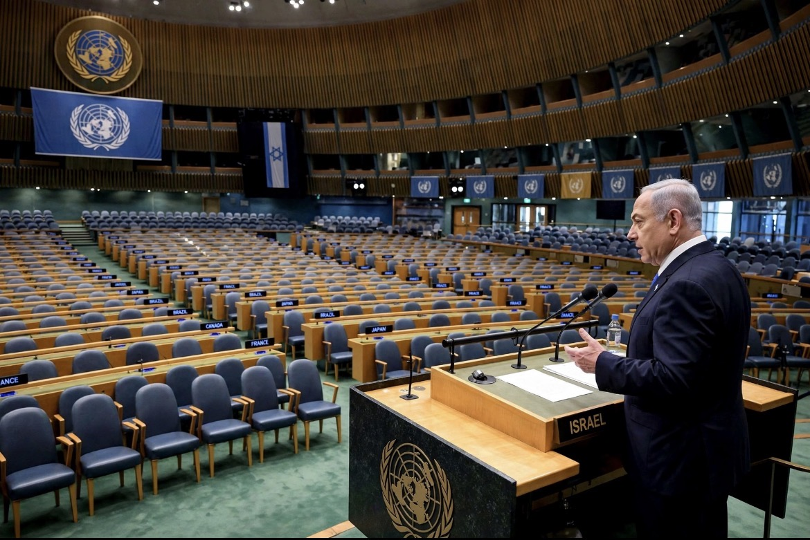

# Ketika Kursi Kosong Menjawab Netanyahu

*Ilustrasi (pic: Grok AI).*

  
***100 orang ditangkap di New York, 77 delegasi walkout, dan perang kata-kata tentang siapa yang berhak disebut “bermoral”***
  

Pada 24 September 2026, saat Netanyahu berpidato di Sidang Umum PBB ke-81, demonstrasi besar berlangsung di Manhattan.

CBS New York melaporkan sumber kepolisian memperkirakan sekitar 100 orang dibawa ke tahanan, dengan jumlah final dan dakwaan masih diproses. Para demonstran melakukan sit-in dan memblokir lalu lintas menuju gedung PBB. 

Dan yang membuat berita ini jadi lebih “Hollywood daripada Hollywood” adalah Susan Sarandon dan Hannah Einbinder, aktris Hacks, termasuk yang ditahan. 

Ada pula sejumlah nama publik lain yang hadir dalam aksi tersebut, termasuk Cynthia Nixon, Elliot Page, Indya Moore, Lucy Dacus, dan Julien Baker, menurut laporan Los Angeles Times. 

Jadi, Hollywood bukan cuma memberikan pernyataan dari sofa rumah. Beberapa benar-benar turun ke jalan dan berakhir dibawa polisi. 

Tapi tentu saja, ditangkap bukan berarti otomatis terbukti melakukan tindak pidana. Itu status proses hukum, bukan vonis.

## Angka walkout: 70 atau 77?

Angka yang paling spesifik dalam laporan terbaru adalah 77 delegasi.

Ahram Online dan SBS, dengan merujuk laporan AP/AFP, menyebut 77 delegasi meninggalkan ruang sidang ketika Netanyahu mulai berbicara. 

Tetapi Anadolu menghitungnya sebagai “nearly 70 countries”, berdasarkan peninjauan rekaman dan memperhitungkan delegasi yang meninggalkan kursi atau membiarkan kursinya kosong. 

Jadi bukan kontradiksi besar, 77 adalah jumlah delegasi yang dilaporkan, sedangkan 70 adalah cara lain menghitung negara/delegasi yang ikut aksi.

Dan ada nuansa penting: beberapa delegasi keluar sebelum Netanyahu benar-benar mulai berbicara, sementara beberapa negara tidak mengambil kursi sama sekali. Karena itu angka bisa berbeda tergantung metodologi penghitungan.

## Apa Sebenarnya yang Netanyahu Katakan?

Ketika delegasi mulai meninggalkan ruangan, Netanyahu mengatakan: “If there are any other moral cowards who haven’t left this hall, please do so now.”

Jadi kata yang dia gunakan adalah: MORAL COWARDS, artinya pengecut moral.

## Kata “Moral Cowards” Menarik Banget

Netanyahu sedang melakukan sesuatu yang sangat klasik dalam retorika politik, yaitu membalik posisi moral antara pembicara dan pengkritik.

Strukturnya: Mereka mengkritik saya, mereka meninggalkan ruangan, berarti mereka pengecut, saya yang berani berdiri dan menghadapi mereka, maka saya berada di posisi moral yang lebih tinggi.

Ini bukan argumen mengenai apakah Israel melakukan genocide. Ini adalah reframing moral.

Dia tidak menjawab: “Apakah tuduhan genocide benar?”

Dia menjawab: “Orang yang menuduh saya adalah pengecut.”

Itu dua pertanyaan yang berbeda.

## Netanyahu Bahkan Punya Kalimat Lebih Ekstrem

Dalam pidatonya, dia menyebut tuduhan bahwa Israel melakukan genocide sebagai “the biggest lie of the century.” Dia kemudian mengatakan Israel justru “prevented genocide.” 

Nah, di sini retorikanya menjadi sempurna secara politi, tuduhan bahwa Israel melakukan genocide dijawab Netanyahu: Justru Israel mencegah genocide. Sehingga kritik terhadap Israel dianggap tidak bermoral, dan walkout adalah moral cowardice.

Jadi dia bukan sekadar mempertahankan kebijakan Israel. Dia sedang berusaha merebut kembali posisi sebagai pihak yang bermoral.

Reuters pada 22 September mengutip otoritas kesehatan Gaza yang melaporkan lebih dari 73.000 warga Palestina tewas sejak perang dimulai, sementara Israel membantah tuduhan genocide dan mengatakan operasinya diarahkan terhadap Hamas. 

Los Angeles Times, mengutip Gaza Health Ministry, menyebut 73.922 Palestina tewas pada saat Netanyahu berpidato. 

Proporsi korban perempuan dan anak memang sangat besar, dan badan-badan PBB terus mendokumentasikan kematian perempuan dan anak dalam jumlah besar. Misalnya UN Women melaporkan 246 perempuan dan anak perempuan Palestina terbunuh sejak ceasefire Oktober 2025 hingga 28 Juli 2026. 

Jadi secara moral, bagaimana seseorang bisa mengklaim monopoli atas “moralitas” ketika pemerintah yang dipimpinnya bertanggung jawab secara politik atas operasi militer yang telah menewaskan puluhan ribu manusia?

## Ironi besar: Yang keluar Pengecut, yang Tetap Berdiri Dianggap Berani

Sekarang lihat gambarannya. Di luar gedung, orang-orang melakukan protes. Di dalam, delegasi negara keluar, sementara Netanyahu tetap berdiri di podium. Kemudian dia menyebut mereka “moral cowards.”

Secara retoris, ini adalah usaha mengubah walkout sebagai kelemahan, sedangkan berdiri sendiri adalah keberanian.

Masalahnya?

Keberanian fisik tidak otomatis menghasilkan kebenaran moral.

Seseorang bisa berdiri sendirian di ruangan dan tetap salah, atau seseorang juga bisa keluar dari ruangan dan tetap salah. Atau sebaliknya.

Kursi kosong tidak membuktikan genocide. Tetapi kursi penuh juga tidak membuktikan Israel tidak melakukan genocide. Yang menentukan adalah bukti dan hukum, bukan jumlah kursi. 

## 77 Delegasi Punya Makna Politik Nyata

77 delegasi meninggalkan ruangan bukan bukti hukum. Tetapi sebagai political signal, itu sangat besar, karena PBB adalah ruang legitimasi internasional.

Kalau puluhan delegasi memilih tidak mendengarkan seorang kepala pemerintahan ketika ia mulai bicara, pesan politiknya cukup jelas: Ada tingkat ketidaksetujuan internasional yang sangat besar terhadap kebijakan pemerintah tersebut.

Anadolu mencatat sejumlah negara yang ikut walkout antara lain Türkiye, Palestina, Tunisia, Suriah, Aljazair, Yaman, Mesir, Irak, Arab Saudi, Yordania, Iran, Qatar, Lebanon, Malaysia, Indonesia, dan Kuwait, sementara AS, Jerman, dan sejumlah negara Eropa tetap berada di ruangan. 

Jadi ini juga bukan seluruh dunia vs Israel, karena AS dan Jerman, antara lain, tetap berada di dalam ruangan.

Lebih tepatnya, Majelis Umum PBB memperlihatkan pembelahan diplomatik yang sangat tajam mengenai Israel dan Gaza.

## Netanyahu Menyerang Zohran Mamdani

Netanyahu tidak cuma menyerang negara-negara yang walkout.

Dia juga menyerang Zohran Mamdani, wali kota New York, yang sebelumnya menyebut Netanyahu sebagai war criminal dan mengatakan akan mempertimbangkan penegakan surat perintah penangkapan ICC jika Netanyahu datang ke New York, meskipun Mamdani sendiri mengakui pemerintah kota tidak memiliki kewenangan untuk melaksanakannya. 

Netanyahu bahkan menyerang para demonstran Hollywood. Menurut AP, dia menyebut mereka “phony” dan mempertanyakan mengapa mereka tidak melakukan protes ketika pasukan keamanan Iran menewaskan demonstran dalam aksi Januari. 

Jadi strategi retoriknya konsisten, kritik terhadap Israel dibalas dengan pertanyaan tentang kemunafikan pihak pengkritik.

Ini teknik whataboutism, tetapi ada sedikit perbedaan penting, whataboutism tidak otomatis membuktikan kritik awal salah.

Kalau Iran melakukan pelanggaran, itu harus diperiksa, demikian juga kalau Israel melakukan pelanggaran, itu juga harus diperiksa.

Kejahatan satu pihak tidak menjadi penghapus kejahatan pihak lain.

Netanyahu dalam pidatonya juga membela keputusan Israel bergabung dengan AS menyerang Iran, dan menyebut keputusan tersebut sebagai salah satu keputusan termudah yang pernah dia ambil. Dia juga mengatakan, jika Israel tidak melakukannya, “we’d all be dead.” 

Jadi, Netanyahu menyebut Israel menyerang Iran demi keselamatan. Sedangkan tentang Gaza, Israel mencegah genocide, tentang pengkritiknya, mereka disebut pengecut moral, tentang walkout, dianggap tidak sanggup menghadapi kebenaran. Itu adalah arsitektur retorika yang sangat konsisten.

## Siapa Sebenarnya Pengecut Moral?

Ini bagian paling menarik.

Kalau kita pakai standar ilmiah, kita tidak akan menyebut 77 delegasi itu pengecut atau pahlawan. Mereka melakukan aksi diplomatik simbolik untuk menolak legitimasi politik atas pidato Netanyahu.

Dan Netanyahu melakukan tindakan retoris untuk membalik makna walkout tersebut menjadi bukti kelemahan moral para pengkritiknya.

Dua-duanya adalah tindakan politik.

Yang harus kita nilai bukan keberanian mereka berjalan keluar atau keberanian Netanyahu berdiri di podium.

Yang harus kita nilai adalah: Apa yang terjadi di lapangan? Siapa yang terbunuh? Siapa yang bertanggung jawab? Apakah tindakan tersebut memenuhi unsur kejahatan internasional? Dan apakah klaim “self-defense”, “genocide”, “war crime”, atau “moral cowardice” didukung bukti?

Itulah cara membongkar propaganda tanpa menjadi propaganda tandingan.

Dan satu hal terakhir, Netanyahu boleh menyebut 77 delegasi “moral cowards”. Tetapi kata “moral” tidak bisa diberikan kepada seseorang seperti medali oleh pemilik podium.

Moralitas bukan hak istimewa mikrofon, dan kursi kosong memang tidak otomatis membuat orang yang keluar menjadi benar. 

Tetapi kursi kosong sebanyak itu juga membuat satu pertanyaan menjadi sangat sulit disingkirkan dari ruangan: Kalau begitu banyak negara tidak mau duduk mendengarkan pembelaan, mungkin persoalannya bukan bahwa mereka semua tiba-tiba kehilangan keberanian. Mungkin dunia sedang meminta pertanggungjawaban atas sesuatu yang jauh lebih besar daripada satu pidato.

  
**Referensi**

CBS New York, 24 Sep 2026: ~100 orang ditahan dalam protes anti-Netanyahu.

Los Angeles Times, 24 Sep 2026: Susan Sarandon & Hannah Einbinder termasuk yang ditangkap.

Ahram Online, 26 Sep 2026: melaporkan 77 delegasi walkout saat Netanyahu mulai bicara.

SBS, 25 Sep 2026: juga melaporkan angka 77 delegasi.

KPBS/AP, 25 Sep 2026: Netanyahu menyebut mereka “moral cowards” dan menolak tuduhan genosida.
