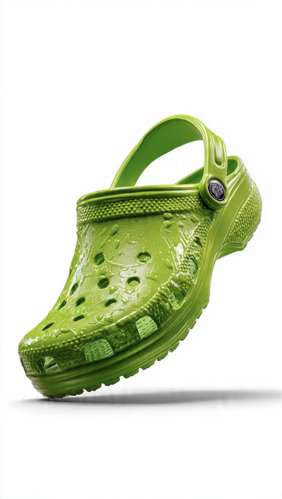

# Ketika Nyawa Lebih Murah dari Sandal: Krisis Moral Anak Bangsa di Era Kemarahan Instan

*Ilustrasi (pic: Meta AI).*

  
***Yang lebih menakutkan adalah bagaimana sebuah masyarakat perlahan terbiasa melihat kemarahan lebih penting daripada kemanusiaan***
  

Indonesia kembali diguncang kasus kekerasan antarremaja yang berujung kematian. Di Surabaya, seorang remaja tewas diduga akibat pengeroyokan yang dipicu perselisihan soal sandal Crocs yang hilang. 

Di kasus lain, seorang anak dikabarkan koma setelah dipalak dan berusaha menghindari pelaku hingga tersengat listrik. 

Peristiwa semacam ini menimbulkan pertanyaan yang mengusik: Apa yang sedang terjadi pada moral masyarakat Indonesia? Apakah ini sekadar kriminalitas biasa? Atau gejala yang lebih dalam berupa krisis empati, kegagalan pendidikan karakter, dan budaya kekerasan yang makin dinormalisasi?

## Kronologi yang Membuat Orang Waras Geleng Kepala

Kasus Surabaya bermula dari hilangnya sandal Crocs yang diklaim bernilai sekitar Rp1,5 juta. 

Perselisihan itu kemudian berkembang menjadi pengeroyokan yang menyebabkan seorang remaja, Thomas Julius Kristianto (19), meninggal dunia. Empat pelaku telah diamankan dan ditahan polisi.  

Mari kita berhenti sejenak.

Sandal. Bukan tanah warisan, bukan perebutan nyawa, juga bukan perang.

Dan yang hilang bukan cuma sandal. Yang hilang adalah kemampuan mengendalikan emosi, rasa iba, serta kesadaran bahwa di depan kita ada manusia.

## Ini Bukan Soal Crocs

Jangan salah, masalahnya bukan merek sandal. Masalahnya mengapa konflik kecil bisa meledak menjadi kekerasan mematikan?

Psikologi sosial menyebut beberapa faktor:

1. Regulasi emosi yang buruk

Sebagian remaja sulit menerima rasa malu, sulit mengendalikan marah, dan menganggap kekerasan sebagai cara mempertahankan harga diri.

2. Budaya maskulinitas toksik

Ada anggapan: “Kalau dihina, harus balas,”“Kalau kalah, harga diri hancur.”
Akibatnya, konflik kecil berubah menjadi arena pembuktian ego.

3. Desensitisasi terhadap kekerasan

Media sosial penuh dengan video tawuran, prank brutal, penghinaan viral, serta budaya “biar rame”.
Akibatnya, kekerasan perlahan kehilangan aura mengerikannya.

## Dari Sudut Pandang Hukum

Dalam hukum pidana Indonesia, kalau pengeroyokan menyebabkan kematian, pelaku dapat dijerat Pasal 170 KUHP tentang pengeroyokan, Pasal penganiayaan berat yang menyebabkan kematian, atau pasal lain sesuai peran masing-masing pelaku.

Artinya, negara tidak melihat “itu cuma gara-gara sandal.” Karena sekecil apa pun penyebabnya, kalau akibatnya nyawa melayang, yang dipertanggungjawabkan adalah hilangnya nyawa manusia.

## Dari Sudut Moral

Nah ini yang lebih menyakitkan.

Kita sering berkata Indonesia religius, masjid ramai, gereja ramai, tempat ibadah penuh. Tapi lalu muncul pertanyaan yang menusuk: Mengapa orang yang hafal doa kadang gagal menghargai hidup manusia?

Karena, agama bisa diajarkan, tetapi empati harus dibentuk.

Moral bukan sekadar tahu mana halal, tahu mana haram. Tetapi merasakan penderitaan orang lain sebelum penderitaan itu terjadi.

## Perspektif Islam

Dalam Islam, nyawa manusia memiliki kedudukan yang luar biasa tinggi.

Al-Qur’an:

“Barang siapa membunuh satu jiwa tanpa alasan yang benar, seakan-akan ia telah membunuh seluruh manusia.”

(QS. Al-Ma’idah: 32)

Perhatikan, bukan membunuh seribu orang, tetapi satu orang saja. Mengapa? Karena setiap manusia punya ibu, punya ayah, punya mimpi, dan punya masa depan.

Membunuh satu orang berarti menghancurkan seluruh dunia yang ia miliki.

## Apa yang Sedang Terjadi di Indonesia?

Yang sedang terjadi bukan Indonesia tiba-tiba menjadi bangsa jahat. Melainkan Indonesia sedang menghadapi krisis pengendalian emosi, orang makin cepat marah.

**Krisis perhatian**

Segala sesuatu harus cepat, instan, serta viral.

**Krisis makna**

Anak muda banyak informasi, sedikit teladan, sering merasa kosong.

Dan ketika keluarga melemah, sekolah sibuk mengejar nilai, dan media sosial menjadi guru,
maka karakter sering tumbuh tanpa kompas moral.

## Kasus Pemalakan Anak

Anak dipalak sampai berusaha menghindar dan akhirnya kesetrum, itu juga menyedihkan.
Karena pemalakan lahir dari dominasi, intimidasi, dibarengi rasa superior palsu.

Ironinya, pelaku sering ingin terlihat kuat. Padahal orang yang benar-benar kuat tidak membutuhkan korban yang lebih lemah.

## Analisis

Kadang kita berkata:“Anak zaman sekarang rusak.”

Ini tidak sepenuhnya benar. Karena anak tidak tumbuh di ruang hampa. Mereka melihat: orang dewasa saling menghina, politik penuh kebencian, korupsi, kekerasan verbal, serta berita perang setiap hari.

Lalu kita terkejut ketika mereka belajar kekuatan adalah kemampuan memaksa.

Padahal, anak-anak sering tidak meniru nasihat. Mereka meniru contoh.

Mungkin pertanyaan: “Kenapa orang bisa membunuh gara-gara sandal?” bukan pertanyaan yang paling menakutkan.

Yang lebih menakutkan adalah: bagaimana sebuah masyarakat perlahan terbiasa melihat kemarahan lebih penting daripada kemanusiaan.

Kalau hari ini sandal lebih berharga daripada nyawa, ego lebih penting daripada belas kasih, dan gengsi lebih besar daripada penyesalan, maka yang sedang krisis bukan hukum, bukan ekonomi, bukan teknologi.

Yang sedang krisis adalah kemampuan manusia untuk melihat manusia lain sebagai sesama manusia.

Dan kalau bangsa ini ingin sembuh, mungkin kita harus mulai mengajarkan lagi sesuatu yang tampaknya sederhana, tetapi justru paling sulit: bahwa tidak ada sandal, tidak ada penghinaan, tidak ada ego, yang pantas dibayar dengan satu nyawa manusia. 

  
**Referensi**

tvOne.News.  Kasus pengeroyokan di Surabaya dipicu perselisihan soal sandal Crocs yang hilang dan menyebabkan korban meninggal dunia.

Detik.com. Kasus tersebut mendapat perhatian publik dan DPRD Surabaya meminta proses hukum berjalan tegas untuk memberi efek jera. 

Al-Qur’an. (QS. Al-Ma’idah: 32).

Lawrence Kohlberg. (1981). The Philosophy of Moral Development. Harper & Row.

Albert Bandura. (1977). Social Learning Theory. Prentice Hall.
