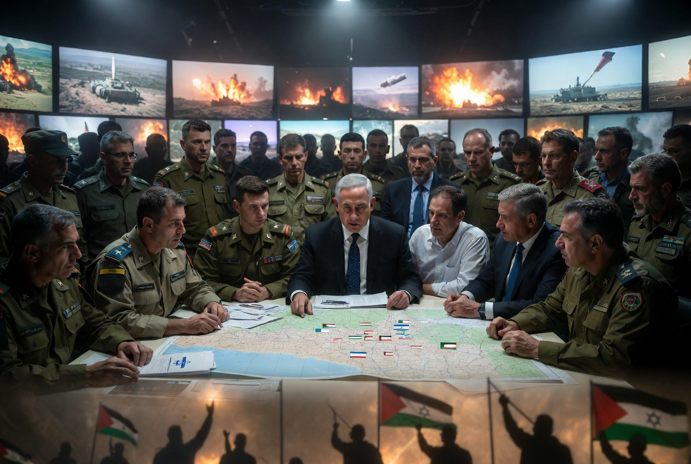

# Ketika Pajak Membiayai Perang: Siapa Paling Diuntungkan dari Konfrontasi AS-Iran?

*Ilustrasi (pic: Grok AI).*

  
***“Dalam geopolitik, negara jarang berperang karena satu alasan. Yang lebih sering terjadi adalah satu perang melayani beberapa kepentingan sekaligus, dengan tingkat keuntungan yang berbeda bagi tiap aktor.”***
  

Ketika Kongres AS membahas anggaran pertahanan yang sangat besar, muncul pertanyaan klasik dari ilmu politik: “Keamanan untuk siapa?”

Apakah anggaran itu terutama untuk melindungi rakyat Amerika? menjaga posisi global AS? membantu sekutu? atau kombinasi semuanya?

Pertanyaan ini sah secara akademik, karena dalam demokrasi, uang yang dipakai adalah uang pembayar pajak.

Maka publik berhak bertanya: Apakah manfaat strategisnya sebanding dengan biayanya?

# Mengapa AS Sangat Memperhatikan Iran?

Dalam literatur hubungan internasional, ada beberapa kepentingan yang sering disebut, diantaranya adalah mencegah Proliferasi Nuklir

Posisi resmi pemerintah AS selama beberapa dekade adalah mencegah Iran memperoleh kemampuan senjata nuklir. Alasannya meliputi keseimbangan kekuatan kawasan, perlindungan sekutu, dan kekhawatiran akan perlombaan senjata regional.

Namun di sini muncul pertanyaan: Siapa yang paling langsung merasakan ancaman jika Iran memiliki senjata nuklir?

Secara geografis, jawabannya jelas: Israel dan negara-negara Teluk berada jauh lebih dekat dibanding daratan utama Amerika Serikat.

Artinya, dampak keamanan langsung memang lebih besar dirasakan kawasan Timur Tengah daripada warga AS di Kansas, Texas, atau California.

# Menjaga Posisi Strategis AS

Bagi Washington, Timur Tengah bukan hanya soal Israel. Ia juga menyangkut jalur energi dunia, pangkalan militer, hubungan dengan negara-negara Teluk, serta kredibilitas aliansi.

Dengan kata lain, bahkan jika tidak ada Israel, Amerika Serikat kemungkinan tetap memiliki kepentingan strategis di kawasan, meskipun bentuk kebijakannya bisa berbeda. 

Ini adalah analisis kontrafaktual yang sering diperdebatkan, bukan kepastian sejarah.

# Siapa yang Paling Banyak Mendapat Manfaat?

Seandainya tujuan operasi adalah benar-benar melemahkan kemampuan militer Iran, lalu siapa yang memperoleh manfaat paling besar?

Bagi Israel, potensi manfaatnya adalah ancaman militer dari Iran berkurang, tekanan dari kelompok-kelompok yang didukung Iran dapat berkurang, dan ruang strategis menjadi lebih longgar.

Dari sudut keamanan regional, Israel memang termasuk pihak yang berpotensi memperoleh manfaat langsung jika kapasitas militer Iran melemah.

Sedangkan bagi Amerika Serikat, akan memperoleh manfaat potensial mempertahankan pengaruh di kawasan, menunjukkan komitmen kepada sekutu, mempertahankan kredibilitas kebijakan luar negeri, serta melindungi kepentingan strategis yang dipandang penting oleh pemerintah AS.

Namun manfaat ini bersifat lebih tidak langsung bagi kehidupan sehari-hari warga AS dibandingkan manfaat keamanan yang dirasakan oleh sekutu regional.

Di sisi lain, biaya bagi AS juga nyata, meliputi anggaran pertahanan, risiko korban personel, beban fiskal, serta potensi dampak ekonomi jika konflik meluas.

# Analisis

Pertanyaan krusial sebenarnya bukan “Mengapa AS membantu Israel?” Tetapi “Apakah manfaat yang diterima pembayar pajak Amerika sebanding dengan biaya yang mereka keluarkan?”

Ini adalah pertanyaan yang juga diajukan oleh banyak akademisi dan sebagian politisi di Amerika sendiri.

Di Washington terdapat perdebatan nyata antara mereka yang menilai dukungan kuat kepada sekutu merupakan investasi strategis, dan mereka yang menilai AS terlalu sering memikul beban konflik luar negeri.

# Lalu Bagaimana dengan Selat Hormuz?

Alasan “demi menjaga Selat Hormuz” terasa tidak memadai karena penyebab eskalasi harus ditelusuri lebih jauh.

Dari sudut analisis konflik, memang penting membedakan pemicu langsung (trigger), akar konflik (root causes), dan faktor yang memperluas eskalasi (escalating factors).

Banyak konflik internasional tidak memiliki satu penyebab tunggal.

Sebuah aksi militer dapat dipahami berbeda oleh pihak-pihak yang terlibat: satu pihak menyebutnya pencegahan, pihak lain menyebutnya agresi. 

Tugas analisis ilmiah adalah menjelaskan berbagai perspektif itu tanpa menyederhanakan hubungan sebab-akibat.

# Israel, Palestina, dan Standar Ganda

Terdapat kritik yang luas dari kalangan akademisi, organisasi HAM, dan sejumlah negara bahwa penegakan hukum internasional sering dipersepsikan tidak konsisten, terutama ketika menyangkut kekuatan besar atau sekutu mereka.

Sebaliknya, ada pula argumen bahwa proses hukum internasional dipengaruhi oleh kompleksitas politik dan yurisdiksi, bukan semata-mata keberpihakan.

Kedua pandangan ini terus menjadi perdebatan dalam studi hukum internasional.

Jika pertanyaannya adalah: “Siapa yang kemungkinan memperoleh manfaat keamanan paling langsung jika kemampuan militer Iran melemah?”

Maka dari perspektif geografis dan strategis, Israel termasuk pihak yang paling jelas berkepentingan terhadap perubahan keseimbangan militer tersebut.

Jika pertanyaannya: “Apakah Amerika Serikat juga memiliki kepentingan sendiri?”

Jawabannya juga ya.

Tetapi kepentingan itu lebih luas daripada satu isu, meliputi posisi global, jaringan aliansi, keamanan kawasan, dan kredibilitas kebijakan luar negeri.

Apakah manfaat tersebut sepadan dengan biaya yang ditanggung pembayar pajak Amerika?

Itu bukan pertanyaan yang memiliki jawaban ilmiah tunggal. Ia adalah pertanyaan kebijakan publik yang terus diperdebatkan di Amerika sendiri, di Kongres, media, universitas, dan masyarakat.

Dalam politik internasional, sekutu sering berbagi ancaman, tetapi tidak selalu berbagi biaya secara seimbang. 

Karena itu, pertanyaan yang paling tajam bukanlah ‘siapa musuhnya?’, melainkan ‘siapa yang membayar, siapa yang mengambil keputusan, dan siapa yang memetik manfaat terbesar?’. 

Menjawab pertanyaan itu membutuhkan data, bukan sekadar slogan, karena di situlah letak inti akuntabilitas dalam sebuah demokrasi.

  
**Referensi**

The Israel Lobby and U.S. Foreign Policy. Mearsheimer, J. J., & Walt, S. M. (2007). The Israel Lobby and U.S. Foreign Policy. Farrar, Straus and Giroux.

The Tragedy of Great Power Politics. Mearsheimer, J. J. (2014). The Tragedy of Great Power Politics. W. W. Norton & Company.

Congressional Budget Office. Budget analyses on U.S. defense spending.

Stockholm International Peace Research Institute. SIPRI Yearbook (edisi terbaru).
