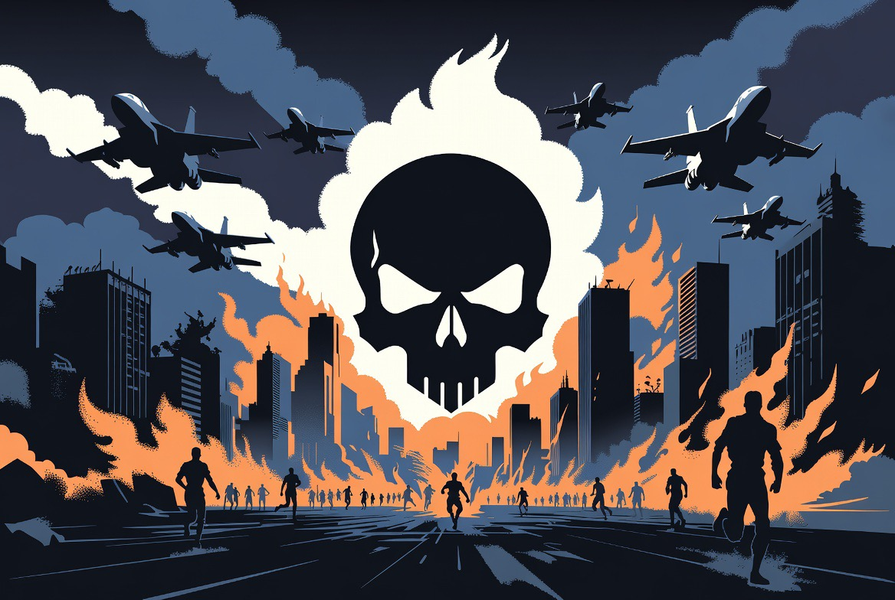

# Ketika Perang Kehilangan Wajah Manusia: Eskalasi AS-Iran dari Perspektif Kemanusiaan Internasional

*Ilustrasi (pic: Grok AI).*

  
***Warga sipil, apa pun kewarganegaraannya, tidak boleh menjadi harga yang dibayar untuk ambisi geopolitik***
  

Perang modern sering dijelaskan dengan bahasa yang terdengar rasional seperti “Menjaga stabilitas.” “Melindungi sekutu” atau pun “Mencegah ancaman.”

Namun bagi keluarga yang kehilangan rumah, anak yang kehilangan orang tua, atau pasien yang kehilangan listrik di rumah sakit akibat serangan terhadap jaringan energi, istilah-istilah strategis itu nyaris tidak memiliki makna.

Dalam perspektif kemanusiaan, pertanyaan pertama bukanlah “Siapa yang lebih kuat?”Melainkan: “Siapa yang menanggung harga paling mahal?”

Dan jawabannya hampir selalu sama, yakni Warga sipil.

# Kemenangan Militer Tidak Selalu Berarti Kemenangan Kemanusiaan

Dalam sejarah perang modern, keberhasilan menghancurkan sasaran militer tidak otomatis berarti keberhasilan melindungi manusia.

Bahkan ketika sebuah target memiliki nilai militer, hukum humaniter internasional tetap mengharuskan penyerang mempertimbangkan apakah kerugian sipil dapat diminimalkan, apakah ada alternatif lain, dan apakah dampaknya proporsional dengan keuntungan militer yang diperoleh.

Semakin luas perang berlangsung, semakin besar kemungkinan warga sipil menjadi korban tidak langsung melalui terputusnya listrik, terganggunya air bersih, rusaknya layanan kesehatan, serta lumpuhnya transportasi.

# Infrastruktur Sipil: Korban yang Sering Terlupakan

Jembatan, pelabuhan, pembangkit listrik, dan jalan raya sering dipandang sebagai objek strategis. Namun bagi masyarakat biasa, infrastruktur tersebut adalah denyut kehidupan sehari-hari.

Ketika sebuah jembatan runtuh, maka ambulans terlambat, distribusi pangan terganggu, aktivitas ekonomi berhenti, bahkan keluarga bisa terpisah.

Kerusakan seperti ini bisa menghasilkan penderitaan yang berlangsung jauh lebih lama daripada dentuman bom itu sendiri.

# Rakyat Tidak Memilih Menjadi Medan Tempur

Dalam setiap konflik besar selalu ada jutaan warga yang tidak membuat keputusan perang, tidak menyusun strategi militer, tidak memegang jabatan politik.

Tetapi justru merekalah yang paling rentan. Inilah sebabnya hukum humaniter internasional dibangun di atas prinsip bahwa manusia tetap harus dilindungi bahkan ketika negara-negara gagal menjaga perdamaian.

# Ketika Retorika Bertemu Realitas

Semua pihak biasanya menyatakan bahwa mereka bertindak demi keamanan. Namun ukuran moral sebuah operasi militer tidak hanya diukur dari niat yang dinyatakan, melainkan juga dari akibat nyata di lapangan.

Jika eskalasi menyebabkan meningkatnya korban sipil, pengungsian massal, atau kerusakan fasilitas yang menopang kehidupan masyarakat, maka komunitas internasional berhak mempertanyakan apakah prinsip proporsionalitas dan kehati-hatian telah benar-benar dijalankan.

Kritik semacam ini berlaku universal. Standarnya sama, apakah pelakunya Amerika Serikat, Iran, Israel, Rusia, Ukraina, atau negara mana pun.

# Mengapa Dunia Perlu Peduli?

Konflik besar tidak berhenti di garis depan. Dampaknya menjalar ke harga pangan, harga energi, stabilitas ekonomi, arus pengungsi, serta keamanan kawasan.

Karena itu, penderitaan warga sipil bukan hanya tragedi nasional, melainkan persoalan internasional.

Perang sering dinilai melalui peta wilayah, jumlah rudal, atau keberhasilan operasi militer. Tetapi kemanusiaan mengajukan ukuran yang berbeda, ia bertanya: Berapa banyak anak yang tidak bisa lagi bersekolah? Berapa banyak rumah sakit yang kesulitan beroperasi? Berapa banyak keluarga yang kehilangan tempat tinggal?

Selama pertanyaan-pertanyaan itu belum memperoleh jawaban yang memadai, tidak ada kemenangan yang benar-benar utuh.

  
**Referensi**

International Committee of the Red Cross. (1949). Geneva Conventions of 1949.

United Nations. (1977). Additional Protocol I to the Geneva Conventions.

International Court of Justice. (1996). Legality of the Threat or Use of Nuclear Weapons (Advisory Opinion).

United Nations Office for the Coordination of Humanitarian Affairs. Protection of Civilians in Armed Conflict.

International Committee of the Red Cross. Customary International Humanitarian Law Database.
