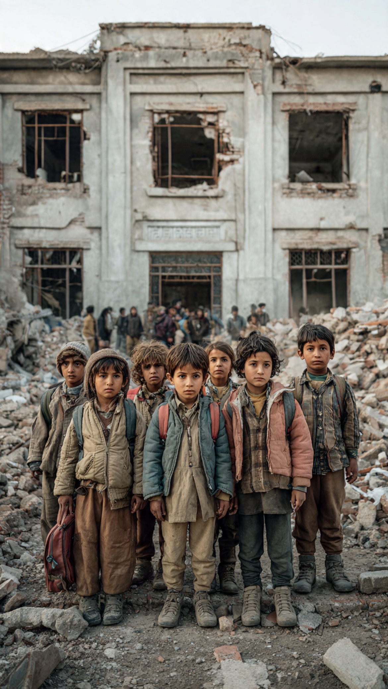

# Ketika Perang Tidak Hanya Membunuh Anak, tetapi Membombardir Masa Depannya

*Ilustrasi (pic: Meta AI).*

  
***Dunia selalu berkata anak-anak adalah masa depan, tetapi ketika perang berlangsung, masa depan itu justru yang paling mudah diledakkan***
  

Pada 9 September 2026, bertepatan dengan International Day to Protect Education from Attack, Education Cannot Wait memperingatkan bahwa sekitar 93 juta anak tidak berada di kelas, sementara 258 juta anak di 87 negara mengalami gangguan pendidikan berat akibat konflik, ketidakamanan, bencana dan krisis lainnya. 

Pada periode 2024-2025, Global Coalition to Protect Education from Attack (GCPEA) mencatat sedikitnya 8.566 serangan terhadap pendidikan dalam basis data awalnya, meningkat lebih dari 40% dibanding 2022-2023. 

Data yang kemudian diperbarui GCPEA mencapai 9.259 serangan/kasus penggunaan militer secara global. Lebih dari 10.600 siswa, guru dan tenaga pendidikan terbunuh, terluka, diculik atau mengalami bentuk bahaya lain. 

Jadi rumus sederhananya bukan 93 juta anak tidak sekolah berarti 93 juta korban pemboman sekolah. Melainkan karena  perang, pengungsian, kemiskinan, kehancuran infrastruktur, ketidakamanan, serangan terhadap sekolah, ekosistem pendidikan runtuh,  akibatnya jutaan anak kehilangan pendidikan.

Dan di antara jutaan itu terdapat anak-anak yang sekolahnya benar-benar menjadi lokasi serangan.

## Gaza adalah Contoh Ekstrem

Laporan Sekjen PBB tentang Children and Armed Conflict mencatat bahwa untuk periode 2025, PBB memverifikasi 2.668 anak Palestina terbunuh di Gaza, 2.223 anak Palestina mengalami mutilasi/cedera, 828 serangan terhadap sekolah, rumah sakit dan objek terkait, 609 sekolah/hospital attacks terjadi di Tepi Barat, dan 220 di Gaza, sekolah-sekolah di Gaza telah ditutup sejak 7 Oktober 2023, yang memengaruhi sekitar 637.500 anak. 

Dan ada satu kalimat yang sangat penting dari laporan PBB, bahwa sebagian besar insiden pembunuhan anak di Gaza yang terverifikasi berkaitan dengan penggunaan senjata peledak di kawasan berpenduduk. 

Jadi problem Gaza bukan sekadar anak tidak bisa sekolah. Problemnya sudah naik kelas menjadi anak kehilangan sekolah, rumah, guru, teman, mengalami displacement trauma, sebagian kehilangan anggota keluarga, dan kehilangan nyawanya sendiri.

Itu bukan lagi education disruption biasa. Itu kehancuran ekosistem perkembangan anak.

## Gaza Mengerikan secara Developmental Science 

Anak tidak hanya membutuhkan bangunan sekolah. Mereka membutuhkan sekolah, rutinitas, guru, teman, rasa aman, stimulasi kognitif, perkembangan sosial, identitas, dan harapan masa depan.

Ketika perang menghancurkan rantai itu secara bersamaan, efeknya bersifat kumulatif.

Misalnya: Bom menghancurkan sekolah, anak kehilangan ruang belajar, keluarga mengungsi, rutinitas hilang, tidur terganggu dan stres kronis, kemampuan konsentrasi dan regulasi emosi terganggu, pembelajaran tertunda, risiko putus sekolah meningkat, human capital turun, rekonstruksi masyarakat menjadi jauh lebih sulit.

Jadi sekolah yang hancur bukan hanya kehilangan gedung 500 m². Yang hilang adalah infrastruktur pembentukan manusia.

Itulah sebabnya serangan terhadap pendidikan memiliki efek lintas-generasi.

## Minab Iran Sangat Relevan

Pada 28 Februari 2026, sekolah Shajareh Tayyebeh di Minab, Iran, terkena serangan pada awal perang AS-Israel-Iran.

Investigasi Associated Press yang terbaru melaporkan setidaknya 168 orang tewas, mayoritas anak-anak. Otoritas Iran melaporkan 120 siswa dan 26 staf tewas, sementara tiga anak masih dinyatakan hilang. 

AP juga menemukan bukti bahwa setidaknya satu misil menghantam kompleks sekolah. Pemerintah AS hingga kini belum secara resmi mengakui tanggung jawab serangan tersebut atau mempublikasikan hasil investigasi Pentagon. 

Jadi untuk atribusi hukum-politik, kita harus berhati-hati, bahwa sekolah terkena serangan dan anak-anak terbunuh sangat kuat terdokumentasi. Namun siapa yang bertanggung jawab meskipun bukti publik sangat mengarah kepada serangan AS, tetapi pemerintah AS belum mengakui secara resmi dan investigasi Pentagon belum dipublikasikan. Itu dua proposisi berbeda.

## Minab memberi Pelajaran yang Jauh Lebih Besar

Bayangkan dua lokasi, di Gaza sekolah dihancurkan dalam perang berkepanjangan. Sementara Minab, anak-anak sedang berada di sekolah, kemudian sebuah serangan menghantam sekolah itu.

Secara geografis dan politik mereka berbeda.
Tetapi secara child protection science, ada pola yang sama, yaitu ruang yang secara sosial dirancang untuk melindungi dan membentuk anak berubah menjadi ruang kematian. Dan itu sangat serius.

Sekolah secara normatif adalah civilian object yang mendapatkan perlindungan khusus dalam hukum humaniter internasional, dengan pengecualian dan kompleksitas tertentu apabila digunakan untuk tujuan militer.

Karena itu GCPEA juga menemukan tren yang mengkhawatirkan: penggunaan sekolah/universitas untuk tujuan militer pada 2024-2025 mencapai sekitar 1.900 kasus, hampir dua kali periode sebelumnya. 

Penggunaan sekolah untuk kepentingan militer juga meningkatkan risiko sekolah menjadi sasaran atau berada di tengah pertempuran. 

Ada kecenderungan kita menghitung korban perang hanya dengan berapa orang mati? Padahal untuk anak, ukuran kehancuran jauh lebih besar, yaitu:

1. Mortality

Anak meninggal.

2. Morbidity

Anak hidup tetapi mengalami luka, amputasi, disabilitas atau penyakit.

3. Educational loss

Anak kehilangan bertahun-tahun pendidikan.

4. Psychological loss

Anak kehilangan rasa aman dan mengalami trauma.

5. Social loss

Teman, guru, keluarga dan komunitasnya hilang.

6. Human-capital loss

Kemampuan masyarakat menghasilkan dokter, guru, insinyur, ilmuwan dan profesional masa depan ikut tergerus.

7. Intergenerational loss

Kerugian pendidikan hari ini dapat menjadi kemiskinan dan keterbelakangan sosial-ekonomi puluhan tahun kemudian.

Jadi satu bom yang menghantam sekolah bisa memiliki radius kehancuran yang jauh lebih besar daripada diameter ledakannya.

Ledakannya selesai dalam detik tapi konsekuensinya dapat hidup selama satu generasi.

## Sesuatu yang Lebih Mengerikan 

GCPEA mencatat bahwa penggunaan senjata peledak di wilayah berpenduduk sangat menonjol dalam serangan terhadap pendidikan. 

Pada 2024-2025, sedikitnya 1.200 serangan individual terhadap pendidikan melibatkan senjata peledak di 21 dari 28 negara yang dianalisis. 

Ada pula sedikitnya 320 serangan yang melibatkan drone, yang menewaskan atau melukai hampir 300 siswa dan tenaga pendidikan. 

Ini berarti teknologi perang modern punya paradoks, senjata semakin presisi, tetapi ruang sipil yang menjadi tempat hidup manusia justru semakin sering menjadi medan konflik.

Maka klaim “precision strike” tidak otomatis berarti civilian protection. Presisi senjata tidak sama dengan presisi moral.

Presisi teknis hanya menjawab: di mana munisi diarahkan? Ia belum menjawab:
apakah targetnya sah, apakah proporsional, apakah tindakan pencegahan cukup, dan apa risiko terhadap anak-anak yang berada di sekitarnya?

Itulah inti hukum humaniter.

## Gaza: Tanpa Setiap Sekolah dibom, Pendidikan Tetap Bisa Dibunuh

Ini penting.

Sebuah sistem pendidikan bisa dihancurkan melalui bombardment, tetapi juga melalui: displacement, blockade, kehilangan guru, kehancuran universitas, kehilangan buku, kehilangan listrik, kehilangan internet, trauma, kematian orang tua, dan kemiskinan.

Karena itu konsep yang lebih tepat bukan hanya “school destruction” tetapi educational ecosystem destruction.

Dan ini menjelaskan mengapa angka 93 juta tidak boleh dibaca sebagai angka statistik dingin. Di belakangnya ada jutaan anak yang bukan hanya kehilangan kelas, tetapi kehilangan kontinuitas hidup.

Apakah 93 juta itu Serangan terhadap Pendidikan?

Jawabannya: tidak secara eksklusif. 93 juta adalah angka anak yang tidak bersekolah, sedangkan 9.259 adalah angka serangan/kasus penggunaan militer terhadap pendidikan.

Keduanya menggambarkan dua dimensi krisis yang saling beririsan:

| Fenomena | Maknanya |
|------|-------|
| 93 juta anak tidak berada di kelas | skala kehilangan akses pendidikan |
| 258 juta mengalami gangguan pendidikan berat | skala disruption dalam keadaan darurat |
| 9.259 serangan/kasus penggunaan militer | intensitas kekerasan terhadap ekosistem pendidikan |
| >10.600 siswa & tenaga pendidikan terdampak langsung | korban langsung serangan |
| Gaza: 637.500 anak kehilangan sekolah sejak 2023 | contoh ekstrem pendidikan yang lumpuh |
| Minab: ±120 siswa tewas dalam satu serangan | contoh ekstrem sekolah berubah menjadi lokasi kematian |

Angka-angka itu tidak boleh dijumlahkan, karena populasinya dan definisinya berbeda. Tapi kalau diletakkan berdampingan, mereka menunjukkan satu fenomena yang sangat jelas, bahwa perang modern semakin menghancurkan bukan hanya tubuh manusia, tetapi institusi yang seharusnya membangun manusia.

Beritanya justru lebih mengerikan daripada judul “93 juta anak tidak sekolah.” Karena kita sedang melihat perubahan fungsi ruang pendidikan, dari sekolah sebagai tempat belajar menjadi tempat berlindung.

Dalam perang yang semakin brutal, sekolah adalah reruntuhan, dan dalam kasus paling tragis, sekolah adalah kuburan anak-anak.

Gaza memperlihatkan bagaimana kehancuran pendidikan dapat berlangsung secara sistemik dan berkepanjangan. Minab memperlihatkan bagaimana satu serangan dapat memusnahkan satu komunitas anak dalam hitungan detik. Data global menunjukkan bahwa keduanya bukan fenomena terisolasi. 

Serangan terhadap pendidikan sedang meningkat, sementara kemampuan dunia untuk melindungi sekolah justru tampak melemah. 

Dan ada ironi yang pahit sekali, kita selalu berkata anak-anak adalah masa depan. Tetapi ketika perang berlangsung, masa depan itu justru yang paling mudah diledakkan.

  
**Referensi**

Global Coalition to Protect Education from Attack. (2026). Education under Attack 2026. 

United Nations. (2026). Children and armed conflict: Report of the Secretary-General (A/80/723-S/2026/357). 

United Nations Sustainable Development Group. (2026, September 9). Record number of attacks on education, global fund warns. 

UNICEF. (2026, August 28). Four children killed as separate attacks destroy humanitarian supplies and damage critical water infrastructure in Gaza. 

Associated Press. (2026, September). Families grieve in the ruins of an Iranian school where a U.S. strike killed dozens of children.
